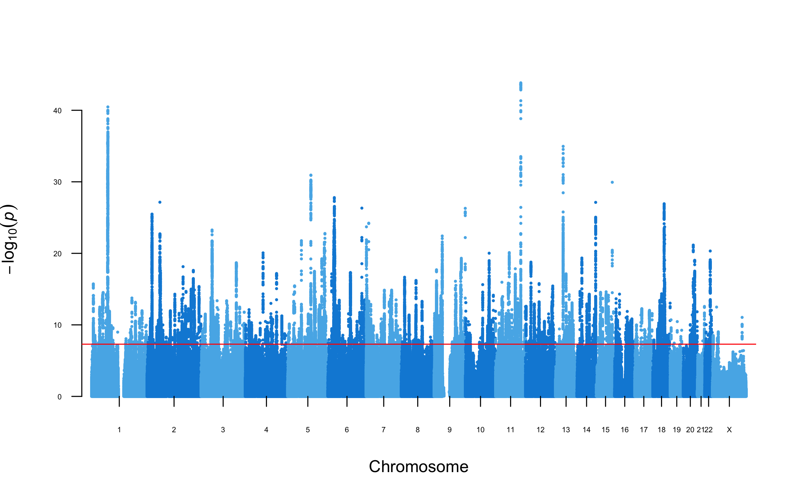

# PGC MDD3 Meta-analysis

[](https://dx.doi.org/10.5281/zenodo.11935052)

The next major meta-analysis ("MDD3") by the Major Depressive Disorder Working Group of the Psychiatric Genomics Consortium. See table of included [cohorts](https://github.com/psychiatric-genomics-consortium/mdd-wave3-meta/blob/main/docs/tables/cohorts/full_div_v3.49.46.01.txt).

**Current version**: v3.49.46.01 [DIV] 



## Embargo date

These data are private to MDD Working Group. All results found here cannot be shared, discussed, or presented in any way without explicit permission from the Working Group chairs. 

## Project overview

Meta-analysis of cohorts for genome-wide association studies of Major Depressive Disorder.

Analysis conducted on [LISA](https://geneticcluster.org).

## Getting started

- [Project updates](docs/updates.md)
- [Contributing](docs/contrib.md)
- [Analysis plan](docs/plan.md)

### Step 1

Clone the repository

```
git clone git@github.com:psychiatric-genomics-consortium/mdd-wave3-meta.git
cd mdd-meta
```
You will need to ensure you have generated and added SSH keys between your machine (OS/Windows/Linux) and your github account. This [video](https://www.youtube.com/watch?v=H5qNpRGB7Qw) gives instructions for how to do this. 

### Step 2

Install [Anaconda](https://conda.io/en/latest/miniconda.html).

**Linux:**
```
wget https://repo.anaconda.com/miniconda/Miniconda3-latest-Linux-x86_64.sh
sh Miniconda3-latest-Linux-x86_64.sh
```

**MacOS:**
```
bin/bash -c "$(curl -fsSL https://raw.githubusercontent.com/Homebrew/install/master/install.sh)"
brew install anaconda
```

Install Python 3.8, Snakemake 5.32, and the basic project dependencies

```
conda activate base
conda install python=3.8
conda install -c conda-forge mamba
mamba install -c bioconda -c conda-forge snakemake-minimal==5.32.2
mamba install dropbox
mamba install pandas
```

### Step 3

Configure the analysis workflow. Make a copy of the configuration file

```
cp config.yaml-template config.yaml
```

Then edit and fill in `config.yaml` with the required parameters for the analysis to be conducted.

### Step 4

Run the meta analysis for the required population. If you are only doing downstream analysis on meta-analysed sumstats, go to *Step 5*.

A meta-analysis can be run for each ancestries group. For example, the European ancestries meta analysis can be run with:

```
snakemake -j1 --use-conda postimp_eur
```

See more about [adding additional cohorts to the meta-analysis](docs/meta.md). The meta analysis workflow is stored in [`rules/meta.smk`](rules/meta.smk).

### Step 5

Prepare for running downstream analysis.

#### For PGC analysts

Fetch the most recent version of the meta-analysis. An authentication token is required in the `config.yaml` file under the `remote : dropbox :` entry. For the full meta-analysis sumstats:

```
snakemake -j1 downstream_full
```

will download a daner sumstats file called `results/distribution/daner_pgc_mdd_full_eur_hg19_v3.NN.MM.OO.rp.gz"`

For sumstats excluding a given `COHORT`:

```
snakemake -j1 downstream_noCOHORT
```

#### For external analysts

Download the required summary statistics "MDD3 202X excluding 23andMe (European Ancestries)" from the [PGC website](https://www.med.unc.edu/pgc/download-results/mdd/). Move the file into the location

```
results/distribution/daner_pgc_mdd_no23andMe_eur_hg19_v3.TBD.TBD.gz
```

Depending on the version of conda you have installed on your machine, you may need to use a package called 'pulp'. This can be installed using pip

```
pip install pulp
```

### Run downstream analysis

Check the [`rules`](rules/) directory for the analyses to be run. See more on [how to contribute](docs/contrib.md).

## Built With

- [RICOPILI](https://sites.google.com/a/broadinstitute.org/ricopili)
- [Snakemake](https://snakemake.readthedocs.io)
- [GWAS-VCF](https://github.com/MRCIEU/gwas-vcf-specification)

## Lead Analysts

* **Mark James Adams** - *analyst* - [Edinburgh](https://www.ed.ac.uk)
* **Swapnil Awasthi** - *analyst* - [Broad](https://www.broadinstitute.org/)
* **Fabian Strait** - *analyst* - [CIMH](https://www.zi-mannheim.de/)
* **Xiangrui Meng** - *analyst* [UCL](http://www.ucl.ac.uk)
* **David Howard** - *analyst* - [KCL](https://www.kcl.ac.uk/)
* **Jonathan Coleman** - *analyst* – [KCL](https://www.kcl.ac.uk/)
* **Oliver Pain** - *analyst* - [KCL](https://www.kcl.ac.uk/)
* **Xueyi Shen** - *analyst* - [Edinburgh](https://www.ed.ac.uk)
* **Shuyang Yao** - *analyst* – [Karolinska](https://ki.se)
* **V Kartik Chundru** - *analyst* [Wellcome Sanger](https://www.sanger.ac.uk)
* **Karmel Choi** - *analyst* – [Harvard/MGH](https://www.hsph.harvard.edu)
* **Karoline Kuchenbaecker** - *analytical group lead* - [UCL](http://www.ucl.ac.uk/)
* **Naomi Wray** - *analytical group director* - [Queensland](https://cnsgenomics.com/)
* **Stephan Ripke** - *analytical group director* - [Broad](https://www.broadinstitute.org/)
* **Cathryn Lewis** - *workgroup chair* - [KCL](https://www.kcl.ac.uk/)
* **Andrew McIntosh** - *workgroup chair* - [Edinburgh](https://www.ed.ac.uk) 

## License

This project is licensed under the MIT License - see the [LICENSE.md](LICENSE) file for details

## Acknowledgments

The PGC has received funding from the US National Institute of Mental Health (5 U01MH109528-04). Statistical analyses were carried out on the Genetic Cluster Computer (http://www.geneticcluster.org) hosted by SURFsara and financially supported by the Netherlands Scientific Organization (NWO 480-05-003) along with a supplement from the Dutch Brain Foundation and the VU University Amsterdam.
