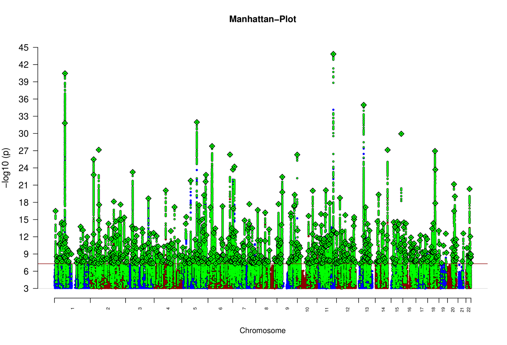

# PGC MDD3 Meta-analysis

Working toward the next meta-analysis ("MDD3") by the Major Depressive Disorder Working Group of the Psychiatric Genomics Consortium.



## Embargo date

These data are private to MDD Working Group. All results found here cannot be shared, discussed, or presented in any way without explicit permission from the Working Group chairs. 

## Project overview

Meta-analysis of cohorts from the [MDD2](https://doi.org/10.1038/s41588-018-0090-3) and [follow-up and replication](https://doi.org/10.1038/s41593-018-0326-7) genome-wide association studies of Major Depressive Disorder:

- PGC clinical cohorts ("MDD29"), [deCODE](http://www.decode.com), [Generation Scotland](https://www.ed.ac.uk/generation-scotland/), [GERA](https://www.ncbi.nlm.nih.gov/projects/gap/cgi-bin/study.cgi?study_id=phs000674.v1.p1), [iPsych](https://ipsych.dk), [UK Biobank](https://www.ukbiobank.ac.uk)

and the following new cohorts:

- [ALSPAC](http://www.bristol.ac.uk/alspac/), [FinnGen](https://www.finngen.fi/en), [23andMe](https://www.23andme.com/) (v7.2), [Airwave](https://police-health.org.uk)

…plus more as they are incorporated into the analysis.

Analysis conducted on [LISA](https://geneticcluster.org).

## Getting started

- [Project updates](docs/updates.md)
- [Contributing](docs/contrib.md)
- [Analysis plan](docs/plan.md)

### Step 1

Clone the repository

```
git clone git@github.com:psychiatric-genomics-consortium/mdd-meta.git
cd mdd-meta
```

### Step 2

Install [Anaconda](https://conda.io/en/latest/miniconda.html).

**Linux:**
```
wget https://repo.anaconda.com/miniconda/Miniconda3-latest-Linux-x86_64.sh
sh Miniconda3-latest-Linux-x86_64.sh
```

**MacOS:**
```
bin/bash -c "$(curl -fsSL https://raw.githubusercontent.com/Homebrew/install/master/install.sh)"
brew install anaconda
```

Install Snakemake and its dependencies

```
conda activate base
conda install -c conda-forge mamba
mamba install -c bioconda -c conda-forge snakemake-minimal
mamba install dropbox
```

### Step 3

Configure the analysis workflow. Make a copy of the configuration file

```
cp config.yaml-template config.yaml
```

Then edit and fill in `config.yaml` with the required parameters for the analysis to be conducted.

### Step 4

Run the meta analysis for the required population. If you are only doing downstream analysis on meta-analysed sumstats, go to *Step 5*.

A meta-analysis can be run for each ancestries group. For example, the European ancestries meta analysis can be run with:

```
snakemake -j1 --use-conda postimp_eur
```

See more about [adding additional cohorts to the meta-analysis](docs/meta.md). The meta analysis workflow is stored in [`rules/meta.smk`](rules/meta.smk).

### Step 5

Prepare for running downstream analysis.

#### For PGC analysts

Fetch the most recent version of the meta-analysis. An authentication token is required in the `config.yaml` file under the `remote : dropbox :` entry. For the full meta-analysis sumstats:

```
snakemake -j1 downstream_full
```

For sumstats excluding a given `COHORT`:

```
snakemake -j1 downstream_noCOHORT
```

#### For external analysts

Download the required summary statistics "MDD3 202X excluding 23andMe (European Ancestries)" from the [PGC website](https://www.med.unc.edu/pgc/download-results/mdd/). Move the file into the location

```
results/distribution/daner_pgc_mdd_no23andMe_eur_hg19_v3.TBD.TBD.gz
```

### Run downstream analysis

Check the [`rules`](rules/) directory for the analyses to be run. See more on [how to contribute](docs/contrib.md).

## Built With

- [RICOPILI](https://sites.google.com/a/broadinstitute.org/ricopili)
- [Snakemake](https://snakemake.readthedocs.io)
- [GWAS-VCF](https://github.com/MRCIEU/gwas-vcf-specification)

## Analysts

* **Mark James Adams** - *analyst* - [Edinburgh](https://www.ed.ac.uk)
* **Swapnil Awasthi** - *analyst* - [Broad](https://www.broadinstitute.org/)
* **Fabian Strait** - *analyst* - [CIMH](https://www.zi-mannheim.de/)
* **Olga Giannakopoulou** - *analyst* [UCL](http://www.bristol.ac.uk/alspac/)
* **David Howard** - *analyst* - [KCL](https://www.kcl.ac.uk/)
* **Oliver Pain** - *analyst* - [KCL](https://www.kcl.ac.uk/)
* **Xueyi Shen** - *analyst* - [Edinburgh](https://www.ed.ac.uk)
* **Alex Kwong** - *analyst* - [Edinburgh](https://www.ed.ac.uk)
* **Karoline Kuchenbaecker** - *analytical group lead* - [UCL](http://www.bristol.ac.uk/alspac/)
* **Naomi Wray** - *analytical group director* - [Queensland](https://cnsgenomics.com/)
* **Stephan Ripke** - *analytical group director* - [Broad](https://www.broadinstitute.org/)
* **Cathryn Lewis** - *workgroup chair* - [KCL](https://www.kcl.ac.uk/)
* **Andrew McIntosh** - *workgroup chair* - [Edinburgh](https://www.ed.ac.uk)

## License

This project is licensed under the MIT License - see the [LICENSE.md](LICENSE) file for details

## Acknowledgments


