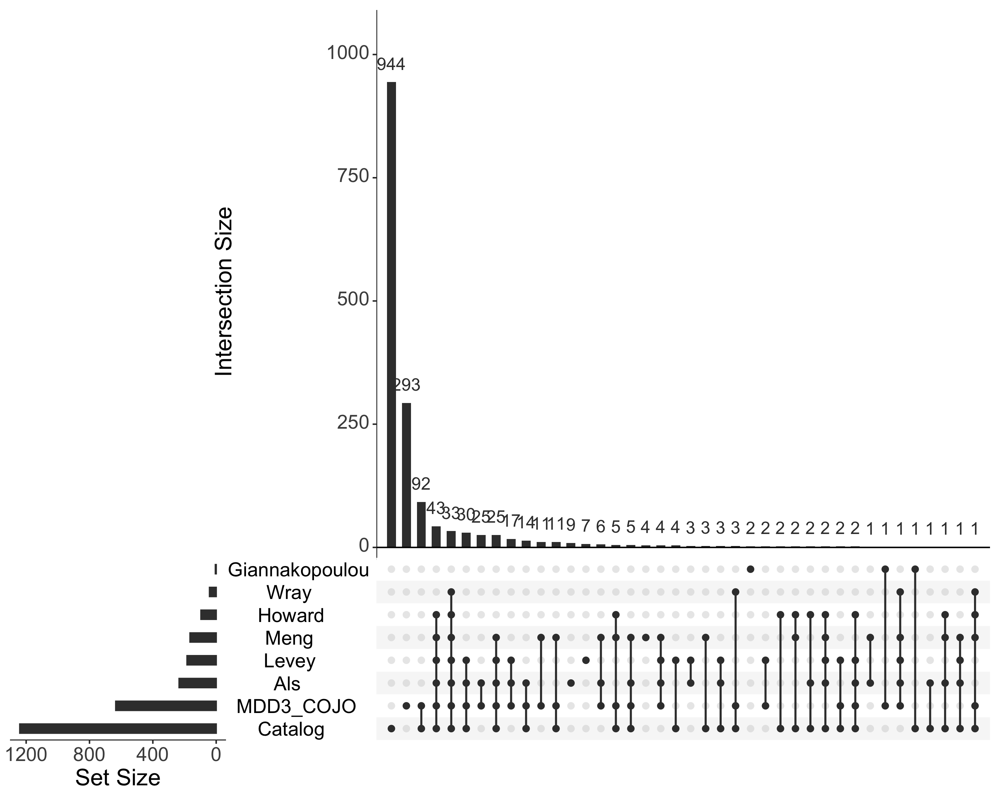
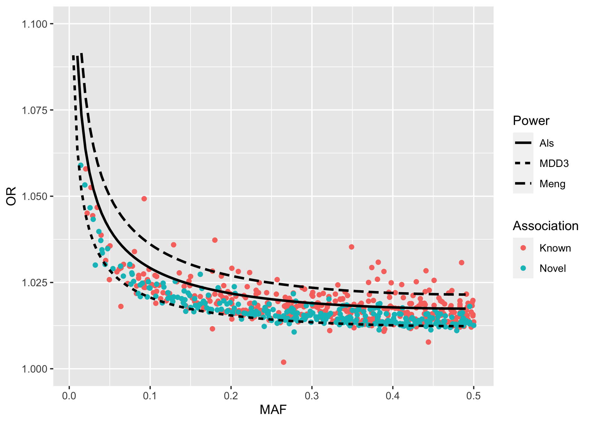

Conditional and Joint Analysis
================

``` r
library(rtracklayer)
library(readxl)
library(readr)
library(dplyr)
library(stringr)
library(tidyr)
library(UpSetR)
library(genpwr)
library(ggplot2)
library(ggman)
```

# Methods

We ran a [conditional and joint
analysis](https://www.nature.com/articles/ng.2213) using
[GCTA](https://cnsgenomics.com/software/gcta/#COJO) to refine the list
of independent loci.

-   Final meta-analysed SNPs from the Ricopili pipeline were used.
-   Ricopili was used for initial clumping with index SNPs identified
    with *p*\< 10^{-4} and *r*<sup>2</sup>\< 0.1 within 3000kb windows.
    The extended MHC region was clumped as a single region.
-   Sumstats were filtered for MAF \>= 0.01, INFO \> 0.6, and Neff \>=
    80% of max.
-   Regions with a genome-wide significant SNP (p \< 5-e8) were
    identified from the clumped results. Regions within 50kb of each
    other were merged.
-   SNPs from these regions were extracted and filtered to unrelated of
    self- and genotype-identified European ancestry participants from UK
    Biobank.
-   A conditional analysis was performed on each region using the
    filtered sumstats superimposed on the UK Biobank LD structure.
-   Singleton regions (with only one genome-wide significant variant)
    were removed.

## Previous sumstats

Variants from [Wray et al
2018](https://www.nature.com/articles/s41588-018-0090-3/tables/2),
[Howard et al
2019](https://www.nature.com/articles/s41593-018-%200326-7) (remove
first and last rows with table captions), and [Levey et al
2021](https://doi.org/10.1038/s41593-021-00860-2), [Giannakopoulou et al
2021](https://jamanetwork.com/journals/jamapsychiatry/article-abstract/2784695),
and the [GWAS catalog for unipolar
depression](https://www.ebi.ac.uk/gwas/efotraits/EFO_0003761). Parse out
regions from Wray and Howard and load queried regions for other results

``` r
tags <- read_table(snakemake@input$tags)
```

    ## 
    ## ── Column specification ──────────────────────────────────────────────────────────────────
    ## cols(
    ##   SNP = col_character(),
    ##   CHR = col_double(),
    ##   BP = col_double(),
    ##   NTAG = col_double(),
    ##   LEFT = col_double(),
    ##   RIGHT = col_double(),
    ##   KBSPAN = col_double(),
    ##   TAGS = col_character()
    ## )

``` r
wray <- read_tsv(snakemake@input$wray) %>%
    separate(`Region (Mb)`, into=c('range.left.Mb', 'range.right.Mb'), sep='–', convert=TRUE) %>%
    mutate(range.left=range.left.Mb*1e6, range.right=range.right.Mb*1e6)
```

    ## Rows: 44 Columns: 11

    ## ── Column specification ──────────────────────────────────────────────────────────────────
    ## Delimiter: "\t"
    ## chr (6): Region (Mb), SNP, P, A1/A2, Prev., Gene context
    ## dbl (4): Chr., OR (A1), s.e. (log(OR)), Freq.
    ## 
    ## ℹ Use `spec()` to retrieve the full column specification for this data.
    ## ℹ Specify the column types or set `show_col_types = FALSE` to quiet this message.

``` r
howard <- read_excel(snakemake@input$howard, skip=2, n_max=102) %>%
    separate(`Region (bp) of clumped variants (P < 10-4) in linkage disequilibrium (r2 > 0.1) with lead variant`, into=c('range.left', 'range.right'), sep='-', convert=TRUE)
```

    ## New names:
    ## * `Odds Ratio` -> `Odds Ratio...8`
    ## * `Lower 95% Confidence Interval` -> `Lower 95% Confidence Interval...9`
    ## * `Upper 95% Confidence Interval` -> `Upper 95% Confidence Interval...10`
    ## * `Log(Odds Ratio)` -> `Log(Odds Ratio)...11`
    ## * `Standard error of the Log(Odds Ratio)` -> `Standard error of the Log(Odds Ratio)...12`
    ## * ...

``` r
levey <- read_tsv(snakemake@input$levey, col_types=cols(CHR.BP=col_character())) %>%
left_join(select(tags, SNP, LEFT, RIGHT), by=c('rsid'='SNP')) %>%
mutate(LEFT=if_else(is.na(LEFT), true=BP, false=LEFT),
       RIGHT=if_else(is.na(RIGHT), true=BP, false=RIGHT))

giannakopoulou <- read_tsv(snakemake@input$giannakopoulou, col_types=cols('CHR:POS'=col_character())) %>%
separate(`CHR:POS`, into=c('CHR', 'POS'), convert=TRUE) %>%
left_join(select(tags, SNP, LEFT, RIGHT), by='SNP') %>%
mutate(LEFT=if_else(is.na(LEFT), true=as.numeric(POS), false=LEFT),
       RIGHT=if_else(is.na(RIGHT), true=as.numeric(POS), false=RIGHT))

gwas_catalog <- read_tsv(snakemake@input$catalog) %>%
filter(!is.na(CHR_ID)) %>%
mutate(CHR=if_else(CHR_ID == 'X', true=23, false=as.numeric(CHR_ID)),
       POS=as.numeric(CHR_POS),
       SNP=paste0('rs', SNP_ID_CURRENT)) %>%
filter(!is.na(POS)) %>%
left_join(select(tags, SNP, LEFT, RIGHT), by='SNP') %>%
mutate(LEFT=if_else(is.na(LEFT), true=POS, false=LEFT),
       RIGHT=if_else(is.na(RIGHT), true=POS, false=RIGHT))
```

    ## Rows: 2391 Columns: 38
    ## ── Column specification ──────────────────────────────────────────────────────────────────
    ## Delimiter: "\t"
    ## chr  (28): FIRST AUTHOR, JOURNAL, LINK, STUDY, DISEASE/TRAIT, INITIAL SAMPLE...
    ## dbl   (8): PUBMEDID, UPSTREAM_GENE_DISTANCE, DOWNSTREAM_GENE_DISTANCE, MERGE...
    ## date  (2): DATE ADDED TO CATALOG, DATE
    ## 
    ## ℹ Use `spec()` to retrieve the full column specification for this data.
    ## ℹ Specify the column types or set `show_col_types = FALSE` to quiet this message.

    ## Warning in replace_with(out, !condition, false, fmt_args(~false), glue("length
    ## of {fmt_args(~condition)}")): NAs introduced by coercion

    ## Warning in mask$eval_all_mutate(quo): NAs introduced by coercion

# Results

## COJO SNP and region counts

List of clumped and COJO SNPs and regions

-   Sumstats:
    results/cojo/daner_pgc_mdd_full_eur_hg19_v3.49.24.11.qc.gz  
-   Clump file:
    results/distribution/daner_pgc_mdd_full_eur_hg19_v3.49.24.11.gz.p4.clump.areator.sorted.1mhc  
-   COJO regions: 577  
-   Clumped SNPs: 817  
-   COJO Selected SNPs: 617  
-   Singleton regions: 65  
-   COJO+Clump SNPs: 617  
-   COJO Final SNPs: 552  
-   COJO Final SNPs p \<= 5e-8, pJ \<= 5e-8: 543  
-   COJO Final SNPs p \> 5e-8, pJ \<= 5e-8: 9

Load list of COJO SNPs

``` r
cojo <- read_tsv(snakemake@input$cojo)
```

    ## Rows: 556 Columns: 28
    ## ── Column specification ──────────────────────────────────────────────────────────────────
    ## Delimiter: "\t"
    ## chr  (4): SNP, A1, A2, Direction
    ## dbl (24): region, snp_idx, CHR, BP, FRQ_A_525197, FRQ_U_3362335, INFO, OR, S...
    ## 
    ## ℹ Use `spec()` to retrieve the full column specification for this data.
    ## ℹ Specify the column types or set `show_col_types = FALSE` to quiet this message.

## Clumped results

Clumped results from Ricopili

``` r
rp <- read_table(snakemake@input$rp_clump) %>% filter(P <= 5e-8)
```

    ## 
    ## ── Column specification ──────────────────────────────────────────────────────────────────
    ## cols(
    ##   .default = col_double(),
    ##   SNP = col_character(),
    ##   A1A2 = col_character(),
    ##   `(Nca,Nco,Neff)Dir` = col_character(),
    ##   `LD-friends(0.1).p0.001` = col_character(),
    ##   `LD-friends(0.6).p0.001` = col_character(),
    ##   gwas_catalog_span.6 = col_character(),
    ##   `genes.6.50kb(dist2index)` = col_character(),
    ##   N.genes.6.50kb = col_character()
    ## )
    ## ℹ Use `spec()` for the full column specifications.

## Genomic ranges

Construct genomic range objects so that SNPs and regions can be
intersected and compared.

``` r
cojo_gr <- with(cojo, GRanges(seqnames=CHR, ranges=IRanges(start=range.left, end=range.right), SNP=SNP))
rp_gr <- with(rp, GRanges(seqnames=CHR, ranges=IRanges(start=range.left, end=range.right), SNP=SNP))

wray_gr <- with(wray, GRanges(seqnames=Chr., ranges=IRanges(start=range.left, end=range.right, SNP=SNP)))
howard_gr <- with(howard, GRanges(seqnames=Chromosome, ranges=IRanges(start=range.left, end=range.right, SNP=`Marker Name`)))
levey_gr <- with(levey, GRanges(seqnames=CHR, ranges=IRanges(start=LEFT, end=RIGHT)))
giannakopoulou_gr <- with(giannakopoulou, GRanges(seqnames=CHR, ranges=IRanges(start=LEFT, end=RIGHT)))
gwas_catalog_gr <- with(gwas_catalog, GRanges(seqnames=CHR, ranges=IRanges(start=LEFT, end=RIGHT)))
```

## GWAS catalog

Tally entries in the GWAS catalog for each region

``` r
parse_catalog_entry <- function(catalog_entry) {
    # extract LD and RSID from first element
    ld_snp_match <- str_match(catalog_entry[1], "\\((.+)\\)(rs[[:digit:]]+)")
    ld <- as.numeric(ld_snp_match[,2])
    snp <- ld_snp_match[,3]
    # parse rest of elements into phenotype(PubMed ID)(P-value)
    phenotype_matches <- str_match(catalog_entry[-1], "(.+)\\(([[:digit:]]+)\\)\\((.+)\\)")
    phenotypes <- phenotype_matches[,2]
    pubmeds <- as.numeric(phenotype_matches[,3])
    p_values <- as.numeric(phenotype_matches[,4])
    
    return(data.frame(ld, catalogSNP=snp, phenotype=phenotypes, pubmed_id=pubmeds, P=p_values))
}


rp_gwas_catalog_entries <-
plyr::ddply(filter(rp, gwas_catalog_span.6 != '-'), ~SNP, function(rp_entry) {
    # get GWAS catalog cell
    gwas_catalog <- rp_entry$gwas_catalog_span.6
    # split out into catalog entries (separated by /, removing first empty element)
    catalog_entries <- str_split(gwas_catalog, "/")[[1]]
    catalog_entries_complete <- catalog_entries[which(catalog_entries != "")]
    # split SNP entries by ";"
    catalog_entries_list <- str_split(catalog_entries_complete, ";")
    # parse each entry
    catalog_entries_df <- plyr::ldply(catalog_entries_list, parse_catalog_entry)
    return(catalog_entries_df)
}) %>% as_tibble()
```

# Parse gene list

``` r
rp_genes_dist <- 
plyr::ddply(filter(rp, `genes.6.50kb(dist2index)` != '-'), ~SNP, function(rp_entry) {
    genes_dist <- rp_entry$`genes.6.50kb(dist2index)`
    genes_dist_list <- str_split(genes_dist, ',')[[1]]
    genes_dist_match <- str_match(genes_dist_list, "(.+)\\((.+)\\)")
    return(data.frame(gene=genes_dist_match[,2], dist2index=as.numeric(genes_dist_match[,3])))
}) %>% as_tibble()
```

## Comparison to previous findings

Find overlaps between clumped, COJO, and previous results. Append and
then reduce all regions

``` r
all_gr <- reduce(c(cojo_gr, rp_gr, wray_gr, howard_gr, levey_gr, giannakopoulou_gr, gwas_catalog_gr))
```

Find overlaps and make lists for an upset plot. Take the index from the
combined set as the element, then find which of them are found within
each of the sets of SNPs. The upset plot function handles finding each
combination of intersections.

``` r
hits_upset <- list(MDD3_COJO=unique(findOverlaps(all_gr, cojo_gr)@from),
                   MDD3_Clump=unique(findOverlaps(all_gr, rp_gr)@from),
                   Wray=unique(findOverlaps(all_gr, wray_gr)@from),
                   Howard=unique(findOverlaps(all_gr, howard_gr)@from),
                   Levey=unique(findOverlaps(all_gr, levey_gr)@from),
                   Giannakopoulou=unique(findOverlaps(all_gr, giannakopoulou_gr)@from),
                   Catalog=unique(findOverlaps(all_gr, gwas_catalog_gr)@from))
                   
upset(fromList(hits_upset), nsets=7, order.by='freq', text.scale=2)
```

<!-- -->

Find which COJO regions overlap with Howard

``` r
cojo_howard_overlaps <- findOverlaps(cojo_gr, howard_gr)
cojo_howard_overlaps
```

    ## Hits object with 116 hits and 0 metadata columns:
    ##         queryHits subjectHits
    ##         <integer>   <integer>
    ##     [1]         1           1
    ##     [2]         5           2
    ##     [3]         6           3
    ##     [4]         8           4
    ##     [5]         9           4
    ##     ...       ...         ...
    ##   [112]       521          97
    ##   [113]       525          98
    ##   [114]       532         100
    ##   [115]       534         101
    ##   [116]       548         102
    ##   -------
    ##   queryLength: 556 / subjectLength: 102

Count number of regions in Howard that overlap:

``` r
howard %>% slice(unique(cojo_howard_overlaps@to)) %>% count()
```

    ## # A tibble: 1 × 1
    ##       n
    ##   <int>
    ## 1    89

Find which COJO regions overlap with Levey

``` r
cojo_levey_overlaps <- findOverlaps(cojo_gr, levey_gr)
cojo_levey_overlaps
```

    ## Hits object with 262 hits and 0 metadata columns:
    ##         queryHits subjectHits
    ##         <integer>   <integer>
    ##     [1]         1         110
    ##     [2]         5           2
    ##     [3]         6          65
    ##     [4]         8          77
    ##     [5]         8          26
    ##     ...       ...         ...
    ##   [258]       537         154
    ##   [259]       538         154
    ##   [260]       544         120
    ##   [261]       548         153
    ##   [262]       549         211
    ##   -------
    ##   queryLength: 556 / subjectLength: 223

Count number of regions in Levey that overlap:

``` r
levey %>% slice(unique(cojo_levey_overlaps@to)) %>% count()
```

    ## # A tibble: 1 × 1
    ##       n
    ##   <int>
    ## 1   193

``` r
cojo_known_overlaps <- findOverlaps(cojo_gr, reduce(c(wray_gr, howard_gr, levey_gr, giannakopoulou_gr, gwas_catalog_gr)))

cojo_known <- cojo %>% slice(unique(cojo_known_overlaps@from))

catalog_known <- rp_gwas_catalog_entries %>% filter(SNP %in% cojo_known$SNP) %>% count(phenotype) %>% arrange(desc(n))
catalog_known
```

    ## # A tibble: 199 × 2
    ##    phenotype                   n
    ##    <chr>                   <int>
    ##  1 Serum_metabolit...        186
    ##  2 Schizophrenia              64
    ##  3 Intelligence_(MTAG)        61
    ##  4 Waist_circumfer...         44
    ##  5 Neuroticism                32
    ##  6 Autism_spectrum...         30
    ##  7 Trans_fatty_acid_levels    29
    ##  8 Depression_(broad)         28
    ##  9 Glycerophosphol...         27
    ## 10 Depressive_symp...         24
    ## # … with 189 more rows

Newly discovered regions

``` r
cojo_new <- cojo %>% slice(unique(-cojo_known_overlaps@from)) %>% arrange(P)
cojo_new %>%
select(region, snp_idx, CHR, SNP, BP, P, pJ) %>%
group_by(region)
```

    ## # A tibble: 252 × 7
    ## # Groups:   region [248]
    ##    region snp_idx   CHR SNP                BP        P       pJ
    ##     <dbl>   <dbl> <dbl> <chr>           <dbl>    <dbl>    <dbl>
    ##  1    174       1     5 rs1993739   153215007 5.71e-20 5.72e-20
    ##  2    362       1    12 rs2363585    60791165 1.69e-16 1.69e-16
    ##  3    310       1    10 rs12778915   77617557 2.35e-16 2.35e-16
    ##  4    237       1     7 rs12666306  115082406 1.38e-15 1.39e-15
    ##  5    395       1    14 rs17100626   33772933 2.05e-15 2.06e-15
    ##  6    318       1    10 rs3808964   125426627 7.13e-15 7.14e-15
    ##  7    101       1     3 rs116310555  71814431 4.24e-14 4.24e-14
    ##  8    392       1    13 rs9524024    94022948 8.23e-14 8.24e-14
    ##  9    136       1     4 rs13134858  115522306 9.96e-14 9.97e-14
    ## 10    355       1    12 rs7973992    39168233 1.20e-13 1.21e-13
    ## # … with 242 more rows

``` r
rp_gwas_catalog_entries %>% filter(SNP %in% cojo_new$SNP) %>% count(phenotype) %>% arrange(desc(n)) %>% filter(!phenotype %in% catalog_known$phenotype)
```

    ## # A tibble: 28 × 2
    ##    phenotype                   n
    ##    <chr>                   <int>
    ##  1 Monocyte_count              3
    ##  2 Pulse_pressure              3
    ##  3 Blood_osmolalit...          2
    ##  4 Blood_pressure              2
    ##  5 Mean_corpuscular_volume     2
    ##  6 Aspirin_hydroly...          1
    ##  7 Bladder_cancer              1
    ##  8 Butyrylcholines...          1
    ##  9 Cardiovascular_...          1
    ## 10 Chin_dimples                1
    ## # … with 18 more rows

``` r
rp_genes_dist %>% filter(SNP %in% cojo_new$SNP) %>% group_by(SNP) %>% filter(dist2index == min(dist2index)) %>% ungroup() %>% select(gene) %>% distinct()
```

    ## # A tibble: 253 × 1
    ##    gene     
    ##    <chr>    
    ##  1 NTRK3    
    ##  2 GTF2IRD1 
    ##  3 NXPH1    
    ##  4 MAGI2    
    ##  5 ETV6     
    ##  6 AQP12A   
    ##  7 SHTN1    
    ##  8 VAX1     
    ##  9 MIR3663HG
    ## 10 MIR3663  
    ## # … with 243 more rows

Calculate power for previous versus current GWAS

``` r
# use sum of effective sample sizes and case rate of 50% rather than sum of cases and controls
wray_power <- genpwr.calc(calc='es', model='logistic', ge.interaction=NULL, N=405961, Case.Rate=0.5, k=NULL, MAF=seq(0.005, 0.49, by=0.005), Power=0.8, Alpha=5e-8, True.Model='Additive', Test.Model='Additive')

levey_power <- genpwr.calc(calc='es', model='logistic', ge.interaction=NULL, N=938012, Case.Rate=0.5, k=NULL, MAF=seq(0.005, 0.49, by=0.005), Power=0.8, Alpha=5e-8, True.Model='Additive', Test.Model='Additive')

mdd2022_power <- genpwr.calc(calc='es', model='logistic', ge.interaction=NULL, N=2*776935, Case.Rate=0.5, k=NULL, MAF=seq(0.005, 0.49, by=0.005), Power=0.8, Alpha=5e-8, True.Model='Additive', Test.Model='Additive')
```

``` r
frq_u_col <- str_subset(names(cojo), 'FRQ_U')

cojo_known_novel <- bind_rows(
mutate(cojo_known, Association='Known'),
mutate(cojo_new, Association='Novel')) %>%
mutate(BETA=log(OR)) %>%
select(SNP, Association, OR, BETA, FRQ=starts_with('FRQ_U')) %>%
mutate(MAF=if_else(FRQ <= 0.5, true=FRQ, false=1-FRQ))

power_known_novel <- bind_rows(
transmute(levey_power, Power='Levey', MAF, OR=`OR_at_Alpha_5e-08`),
transmute(mdd2022_power, Power='MDD3', MAF, OR=`OR_at_Alpha_5e-08`)
)

ggplot(cojo_known_novel, aes(x=MAF, y=exp(abs(BETA)))) + 
geom_point(aes(color=Association)) +
geom_line(mapping=aes(y=OR, linetype=Power), data=power_known_novel, size=1) +
scale_y_continuous('OR', limits=c(1, 1.1))
```

    ## Warning: Removed 2 row(s) containing missing values (geom_path).

<!-- -->
