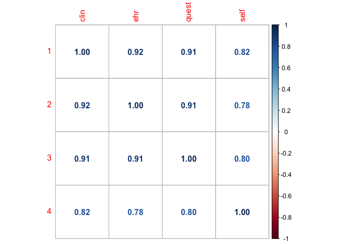

Structure Meta-Analysis with GenomicSEM
================

Summary statistics were grouped based on phenotype, then meta-analysed:

-   `Clin`: Clinical assessment
-   `EHR`: Electronic health records
-   `Quest`: Questionnaire
-   `SelfRep`: Single-item self report

The LDSC covariance structure of the four MDD phenotype was calcuted
using [GenomicSEM](https://github.com/GenomicSEM/GenomicSEM).

``` r
library(GenomicSEM)
library(readr)
library(corrplot)
library(dplyr)
```

Read in the covariance structure and the LDSC

``` r
mdd_covstruct <- dget(snakemake@input$covstruct)
```

LDSC statistics

``` r
ldsc_table <- read_tsv(snakemake@input$ldsc_table)
```

    ## 
    ## ── Column specification ──────────────────────────────────────────────────────────────────────────────────────────────────
    ## cols(
    ##   pheno = col_character(),
    ##   ancestries = col_character(),
    ##   N_cases = col_double(),
    ##   N_controls = col_double(),
    ##   sample_prev = col_double(),
    ##   pop_prev = col_double(),
    ##   LambdaGC = col_double(),
    ##   MeanChiSq = col_double(),
    ##   LambdaGCldsc = col_double(),
    ##   ldsc_intercept = col_double(),
    ##   h2_obs = col_double(),
    ##   h2_se_obs = col_double(),
    ##   h2_liab = col_double(),
    ##   h2_se_liab = col_double()
    ## )

``` r
knitr::kable(ldsc_table)
```

| pheno   | ancestries | N_cases | N_controls | sample_prev | pop_prev | LambdaGC | MeanChiSq | LambdaGCldsc | ldsc_intercept | h2_obs | h2_se_obs | h2_liab | h2_se_liab |
|:--------|:-----------|--------:|-----------:|------------:|---------:|---------:|----------:|-------------:|---------------:|-------:|----------:|--------:|-----------:|
| Clin    | eur        |   21654 |      44593 |     0.32690 |     0.15 |    1.097 |    1.1087 |       1.1112 |         1.0227 | 0.0625 |    0.0085 |  0.0850 |     0.0115 |
| EHR     | eur        |  311491 |     877110 |     0.26210 |     0.15 |    1.516 |    1.7737 |       1.5956 |         1.0306 | 0.0317 |    0.0011 |  0.0491 |     0.0017 |
| Quest   | eur        |   70887 |     339597 |     0.17270 |     0.15 |    1.230 |    1.3224 |       1.2730 |         1.0161 | 0.0383 |    0.0020 |  0.0803 |     0.0041 |
| SelfRep | eur        |  114992 |    1789651 |     0.06037 |     0.15 |    1.645 |    1.9634 |       1.7100 |         1.0040 | 0.0245 |    0.0009 |  0.1291 |     0.0050 |

Genetic correlations

``` r
corrplot(cov2cor(mdd_covstruct$S), method='number')
```

<!-- -->

## Common factor model

``` r
common.model <- "A =~ NA*Clin + EHR + Quest + SelfRep
A ~~ 1*A"

common.fit <- usermodel(covstruc=mdd_covstruct, estimation='DWLS', model=common.model)
```

    ## [1] "Running primary model"
    ## [1] "Calculating CFI"
    ## [1] "Calculating Standardized Results"
    ## [1] "Calculating SRMR"
    ## elapsed 
    ##   0.562

``` r
knitr::kable(common.fit$modelfit)
```

|     |    chisq |  df |   p_chisq |      AIC | CFI |      SRMR |
|:----|---------:|----:|----------:|---------:|----:|----------:|
| df  | 1.776247 |   2 | 0.4114271 | 17.77625 |   1 | 0.0141556 |

``` r
common.fit.results <- common.fit$results %>%
    mutate(Unstand_SE=as.numeric(Unstand_SE),
           STD_Genotype_SE=as.numeric(STD_Genotype_SE),
           p_value=if_else(p_value == '< 5e-300', true=0, false=as.numeric(p_value)))
```

    ## Warning in replace_with(out, !condition, false, fmt_args(~false), glue("length
    ## of {fmt_args(~condition)}")): NAs introduced by coercion

``` r
knitr::kable(common.fit.results, digits=4)
```

|     | lhs     | op   | rhs     | Unstand_Est | Unstand_SE | STD_Genotype | STD_Genotype_SE | STD_All | p_value |
|:----|:--------|:-----|:--------|------------:|-----------:|-------------:|----------------:|--------:|--------:|
| 1   | A       | =\~  | Clin    |      0.2906 |     0.0113 |       0.9968 |          0.0388 |  0.9968 |  0.0000 |
| 2   | A       | =\~  | EHR     |      0.2040 |     0.0045 |       0.9210 |          0.0203 |  0.9210 |  0.0000 |
| 3   | A       | =\~  | Quest   |      0.2674 |     0.0081 |       0.9441 |          0.0285 |  0.9441 |  0.0000 |
| 4   | A       | =\~  | SelfRep |      0.3076 |     0.0101 |       0.8561 |          0.0280 |  0.8561 |  0.0000 |
| 6   | Clin    | \~\~ | Clin    |      0.0005 |     0.0100 |       0.0063 |          0.1172 |  0.0063 |  0.9570 |
| 7   | EHR     | \~\~ | EHR     |      0.0074 |     0.0016 |       0.1517 |          0.0323 |  0.1517 |  0.0000 |
| 8   | Quest   | \~\~ | Quest   |      0.0087 |     0.0045 |       0.1087 |          0.0558 |  0.1087 |  0.0513 |
| 9   | SelfRep | \~\~ | SelfRep |      0.0345 |     0.0055 |       0.2670 |          0.0427 |  0.2670 |  0.0000 |
| 5   | A       | \~\~ | A       |      1.0000 |         NA |       1.0000 |              NA |  1.0000 |      NA |

## GWAS-by-subtraction

Fit a [GWAS-by-subtraction](https://rpubs.com/MichelNivard/565885) to
decompose variance into that of minimally-phenotyped depression shared
with maximal phenotypes versus specific to maximal phenotypes.

``` r
md.model <- "MIN =~ NA*SelfRep + Clin + EHR + Quest
MAX =~ NA*Clin + EHR + Quest

MIN ~~ 1*MIN
MAX ~~ 1*MAX
MIN ~~ 0*MAX

SelfRep ~~ 0*Clin + 0*EHR + 0*Quest
SelfRep ~~ 0*SelfRep"
```

``` r
md.fit <- usermodel(covstruc=mdd_covstruct, estimation='DWLS', model=md.model)
```

    ## [1] "Running primary model"
    ## [1] "Calculating CFI"
    ## [1] "Calculating Standardized Results"
    ## [1] "Calculating SRMR"
    ## elapsed 
    ##   0.325 
    ## [1] "Model fit statistics are all printed as NA as you have specified a fully saturated model (i.e., df = 0)"

``` r
md.fit.results <- md.fit$results %>%
mutate(Unstand_SE=as.numeric(Unstand_SE),
       STD_Genotype_SE=as.numeric(STD_Genotype_SE),
       p_value=if_else(p_value == '< 5e-300', true=0, false=as.numeric(p_value)))
```

    ## Warning in replace_with(out, !condition, false, fmt_args(~false), glue("length
    ## of {fmt_args(~condition)}")): NAs introduced by coercion

``` r
knitr::kable(md.fit.results, digits=4)
```

|     | lhs     | op   | rhs     | Unstand_Est | Unstand_SE | STD_Genotype | STD_Genotype_SE | STD_All | p_value |
|:----|:--------|:-----|:--------|------------:|-----------:|-------------:|----------------:|--------:|--------:|
| 10  | MIN     | =\~  | SelfRep |      0.3593 |     0.0069 |       1.0000 |          0.0193 |  1.0000 |  0.0000 |
| 7   | MIN     | =\~  | Clin    |      0.2503 |     0.0130 |       0.8585 |          0.0447 |  0.8585 |  0.0000 |
| 8   | MIN     | =\~  | EHR     |      0.1727 |     0.0052 |       0.7796 |          0.0233 |  0.7796 |  0.0000 |
| 9   | MIN     | =\~  | Quest   |      0.2322 |     0.0079 |       0.8195 |          0.0279 |  0.8195 |  0.0000 |
| 3   | MAX     | =\~  | Clin    |      0.1408 |     0.0297 |       0.4831 |          0.1018 |  0.4831 |  0.0000 |
| 4   | MAX     | =\~  | EHR     |      0.1240 |     0.0190 |       0.5598 |          0.0859 |  0.5598 |  0.0000 |
| 5   | MAX     | =\~  | Quest   |      0.1182 |     0.0222 |       0.4171 |          0.0784 |  0.4171 |  0.0000 |
| 1   | Clin    | \~\~ | Clin    |      0.0025 |     0.0106 |       0.0295 |          0.1243 |  0.0295 |  0.8123 |
| 2   | EHR     | \~\~ | EHR     |      0.0039 |     0.0040 |       0.0789 |          0.0812 |  0.0789 |  0.3314 |
| 13  | Quest   | \~\~ | Quest   |      0.0124 |     0.0049 |       0.1544 |          0.0611 |  0.1544 |  0.0115 |
| 12  | MIN     | \~\~ | MIN     |      1.0000 |         NA |       1.0000 |              NA |  1.0000 |      NA |
| 6   | MAX     | \~\~ | MAX     |      1.0000 |         NA |       1.0000 |              NA |  1.0000 |      NA |
| 11  | MIN     | \~\~ | MAX     |      0.0000 |         NA |       0.0000 |              NA |  0.0000 |      NA |
| 14  | SelfRep | \~\~ | Clin    |      0.0000 |         NA |       0.0000 |              NA |  0.0000 |      NA |
| 15  | SelfRep | \~\~ | EHR     |      0.0000 |         NA |       0.0000 |              NA |  0.0000 |      NA |
| 16  | SelfRep | \~\~ | Quest   |      0.0000 |         NA |       0.0000 |              NA |  0.0000 |      NA |
| 17  | SelfRep | \~\~ | SelfRep |      0.0000 |         NA |       0.0000 |              NA |  0.0000 |      NA |
