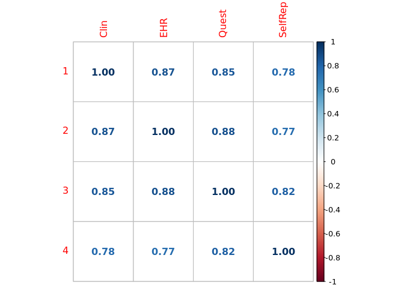

Structure Meta-Analysis with GenomicSEM
================

Summary statistics were grouped based on phenotype, then meta-analysed:

-   `clin`: Clinical assessment
-   `ehr`: Electronic health records
-   `quest`: Questionnaire
-   `self`: Single-item self report

The LDSC covariance structure of the four MDD phenotype was calcuted
using [GenomicSEM](https://github.com/GenomicSEM/GenomicSEM).

``` r
library(GenomicSEM)
```

``` r
library(readr)
library(corrplot)
```

    ## corrplot 0.90 loaded

Read in the covariance structure and the LDSC

``` r
mdd_covstruct <- dget(snakemake@input$covstruct)
```

LDSC statistics

``` r
ldsc_table <- read_tsv(snakemake@input$ldsc_table)
```

    ## 
    ## ── Column specification ────────────────────────────────────────────────────────────
    ## cols(
    ##   pheno = col_character(),
    ##   ancestries = col_character(),
    ##   N_cases = col_double(),
    ##   N_controls = col_double(),
    ##   sample_prev = col_double(),
    ##   pop_prev = col_double(),
    ##   LambdaGC = col_double(),
    ##   MeanChiSq = col_double(),
    ##   LambdaGCldsc = col_double(),
    ##   ldsc_intercept = col_double(),
    ##   h2_obs = col_double(),
    ##   h2_se_obs = col_double(),
    ##   h2_liab = col_double(),
    ##   h2_se_liab = col_double()
    ## )

``` r
knitr::kable(ldsc_table)
```

| pheno | ancestries | N_cases | N_controls | sample_prev | pop_prev | LambdaGC | MeanChiSq | LambdaGCldsc | ldsc_intercept | h2_obs | h2_se_obs | h2_liab | h2_se_liab |
|:------|:-----------|--------:|-----------:|------------:|---------:|---------:|----------:|-------------:|---------------:|-------:|----------:|--------:|-----------:|
| clin  | eur        |   30722 |      59954 |     0.33880 |     0.15 |    1.124 |    1.1484 |       1.1490 |         1.0214 | 0.0680 |    0.0071 |  0.0908 |     0.0095 |
| ehr   | eur        |  310522 |     876421 |     0.26160 |     0.15 |    1.444 |    1.7548 |       1.5807 |         1.0279 | 0.0313 |    0.0011 |  0.0485 |     0.0018 |
| quest | eur        |   55519 |     346777 |     0.13800 |     0.15 |    1.194 |    1.2725 |       1.2266 |         1.0156 | 0.0328 |    0.0018 |  0.0824 |     0.0045 |
| self  | eur        |  114992 |    1789651 |     0.06037 |     0.15 |    1.453 |    1.9058 |       1.6485 |         0.9803 | 0.0240 |    0.0009 |  0.1265 |     0.0049 |

Genetic correlations

``` r
corrplot(cov2cor(mdd_covstruct$S), method='number')
```

<!-- -->

Common factor model

``` r
common.model <- "A =~ NA*clin + ehr + quest + self
A ~~ 1*A"

common.fit <- usermodel(covstruc=mdd_covstruct, estimation='DWLS', model=common.model)
```

    ## [1] "Running primary model"
    ## [1] "Calculating CFI"
    ## [1] "Calculating Standardized Results"
    ## [1] "Calculating SRMR"
    ## elapsed 
    ##   0.632

``` r
knitr::kable(common.fit$modelfit)
```

|     |    chisq |  df |   p_chisq |      AIC | CFI |      SRMR |
|:----|---------:|----:|----------:|---------:|----:|----------:|
| df  | 0.612646 |   2 | 0.7361488 | 16.61265 |   1 | 0.0075507 |

``` r
common.fit$results$Unstand_SE <- as.numeric(common.fit$results$Unstand_SE)
common.fit$results$STD_Genotype_SE <- as.numeric(common.fit$results$STD_Genotype_SE)

knitr::kable(common.fit$results, digits=4)
```

|     | lhs   | op   | rhs   | Unstand_Est | Unstand_SE | STD_Genotype | STD_Genotype_SE | STD_All | p_value               |
|:----|:------|:-----|:------|------------:|-----------:|-------------:|----------------:|--------:|:----------------------|
| 1   | A     | =\~  | clin  |      0.2930 |     0.0121 |       0.9724 |          0.0403 |  0.9724 | 1.1522361334359e-128  |
| 2   | A     | =\~  | ehr   |      0.2074 |     0.0044 |       0.9417 |          0.0200 |  0.9417 | \< 5e-300             |
| 3   | A     | =\~  | quest |      0.2758 |     0.0082 |       0.9609 |          0.0285 |  0.9609 | 6.72730650027693e-250 |
| 4   | A     | =\~  | self  |      0.2945 |     0.0087 |       0.8282 |          0.0245 |  0.8282 | 2.43326841868962e-251 |
| 6   | clin  | \~\~ | clin  |      0.0049 |     0.0078 |       0.0544 |          0.0854 |  0.0544 | 0.524558310719012     |
| 7   | ehr   | \~\~ | ehr   |      0.0055 |     0.0015 |       0.1132 |          0.0318 |  0.1132 | 0.000367093534982363  |
| 8   | quest | \~\~ | quest |      0.0063 |     0.0043 |       0.0767 |          0.0520 |  0.0767 | 0.139995966627356     |
| 9   | self  | \~\~ | self  |      0.0397 |     0.0037 |       0.3140 |          0.0293 |  0.3140 | 1.00009912017466e-26  |
| 5   | A     | \~\~ | A     |      1.0000 |         NA |       1.0000 |              NA |  1.0000 | NA                    |
