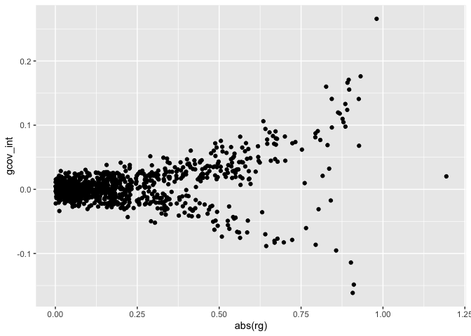

LD Score Genetic Correlations
================

``` r
library(readr)
library(dplyr)
```

    ## 
    ## Attaching package: 'dplyr'

    ## The following objects are masked from 'package:stats':
    ## 
    ##     filter, lag

    ## The following objects are masked from 'package:base':
    ## 
    ##     intersect, setdiff, setequal, union

``` r
library(stringr)
library(ggplot2)
```

Read in LDSC rg tables

``` r
ldsc_rg_info <- read_tsv(snakemake@input$full)
```

    ## 
    ## ── Column specification ──────────────────────────────────────────────────────────────────────
    ## cols(
    ##   .default = col_double(),
    ##   p1 = col_character(),
    ##   p2 = col_character(),
    ##   id = col_character(),
    ##   trait = col_character(),
    ##   group_name = col_character(),
    ##   unit = col_character(),
    ##   sex = col_character(),
    ##   ontology = col_character(),
    ##   consortium = col_character(),
    ##   build = col_character(),
    ##   author = col_character(),
    ##   subcategory = col_character(),
    ##   note = col_character(),
    ##   population = col_character(),
    ##   category = col_character()
    ## )
    ## ℹ Use `spec()` for the full column specifications.

``` r
ldsc_noukbb_rg_info <- read_tsv(snakemake@input$noukbb)
```

    ## 
    ## ── Column specification ──────────────────────────────────────────────────────────────────────
    ## cols(
    ##   .default = col_double(),
    ##   p1 = col_character(),
    ##   p2 = col_character(),
    ##   id = col_character(),
    ##   trait = col_character(),
    ##   group_name = col_character(),
    ##   unit = col_character(),
    ##   sex = col_character(),
    ##   ontology = col_character(),
    ##   consortium = col_character(),
    ##   build = col_character(),
    ##   author = col_character(),
    ##   subcategory = col_character(),
    ##   note = col_character(),
    ##   population = col_character(),
    ##   category = col_character()
    ## )
    ## ℹ Use `spec()` for the full column specifications.

``` r
ldsc_rg_mr_candidates <- read_tsv(snakemake@input$mr)
```

    ## 
    ## ── Column specification ──────────────────────────────────────────────────────────────────────
    ## cols(
    ##   id = col_character(),
    ##   trait = col_character(),
    ##   rg = col_double(),
    ##   p = col_double(),
    ##   qvalue = col_double(),
    ##   gcov_int = col_double(),
    ##   subcategory = col_character()
    ## )

Plot size of genetic correlation versus covariance intercept

``` r
ggplot(ldsc_rg_info, aes(x=abs(rg), y=gcov_int)) +
geom_point()
```

<!-- -->

Compare genetic covariance for `full` versus `noUKBB` sumstats

``` r
ldsc_full_vs_noukbb_gcov <-
inner_join(
ldsc_rg_info %>% transmute(id, trait, gcov_int.full=gcov_int),
ldsc_noukbb_rg_info %>% transmute(id, trait, gcov_int.noUKBB=gcov_int),
by=c('id', 'trait')
) %>%
mutate(ukb=str_detect(id, 'ukb'))

ggplot(ldsc_full_vs_noukbb_gcov, aes(x=gcov_int.full, y=gcov_int.noUKBB, colour=ukb)) +
geom_point() + 
facet_grid(~ukb) +
coord_equal()
```

<!-- -->

``` r
ldsc_full_noukbb_gcov <-
bind_rows(
ldsc_rg_info %>% transmute(id, trait, gcov_int, cohorts='full'),
ldsc_noukbb_rg_info %>% transmute(id, trait, gcov_int=gcov_int, cohorts='noUKBB')
) %>%
mutate(ukb=if_else(str_detect(id, 'ukb'), 'sumstats from UKBB', 'other sumstats'))

ggplot(ldsc_full_noukbb_gcov, aes(x=gcov_int, fill=cohorts)) +
geom_density() +
facet_grid(cohorts~ukb)
```

<!-- -->

``` r
ldsc_full_noukbb_gcov %>%
group_by(cohorts, ukb) %>%
summarize(max_gov=max(abs(gcov_int)))
```

    ## `summarise()` has grouped output by 'cohorts'. You can override using the `.groups` argument.

    ## # A tibble: 4 x 3
    ## # Groups:   cohorts [2]
    ##   cohorts ukb                max_gov
    ##   <chr>   <chr>                <dbl>
    ## 1 full    other sumstats      0.276 
    ## 2 full    sumstats from UKBB  0.132 
    ## 3 noUKBB  other sumstats      0.267 
    ## 4 noUKBB  sumstats from UKBB  0.0259

FDR corrected associations, removing phenotypes from UKB and with large
genetic covariance intercepts

``` r
ldsc_rg_mr_candidates %>%
group_by(subcategory) %>%
filter(rg==max(rg)) %>%
filter(p==min(p)) %>%
select(-id)
```

    ## # A tibble: 17 x 6
    ## # Groups:   subcategory [17]
    ##    trait                          rg        p   qvalue gcov_int subcategory     
    ##    <chr>                       <dbl>    <dbl>    <dbl>    <dbl> <chr>           
    ##  1 Trauma exposure in major…  0.400  2.02e-25 1.57e-24  -0.0048 <NA>            
    ##  2 schizophrenia              0.378  3.59e-99 1.40e-97   0.0222 Psychiatric / n…
    ##  3 Cigarettes smoked per day  0.304  9.49e-29 8.25e-28   0.0209 Behavioural     
    ##  4 Waist-to-hip ratio         0.167  6.46e- 9 1.14e- 8  -0.0023 Anthropometric  
    ##  5 Years of schooling        -0.161  2.07e-15 8.09e-15  -0.0234 Education       
    ##  6 triglycerides              0.143  2.08e-18 1.01e-17   0.0156 Lipid           
    ##  7 Age at menarche           -0.128  8.86e-14 2.66e-13  -0.0003 Reproductive ag…
    ##  8 C-Reactive protein level   0.108  6.04e- 6 7.59e- 6   0.0047 Immune system   
    ##  9 ER+ Breast cancer (GWAS)   0.100  2.83e- 5 3.31e- 5  -0.0098 Cancer          
    ## 10 Crohn's disease            0.0972 5.67e- 5 6.30e- 5  -0.0004 Autoimmune / in…
    ## 11 Urinary sodium-potassium…  0.0817 3   e- 4 2.79e- 4  -0.0115 Biomarker       
    ## 12 Type 2 diabetes            0.0815 1.5 e- 3 1.19e- 3   0.0188 Diabetes        
    ## 13 Chronotype                -0.0633 7.7 e- 3 4.98e- 3  -0.005  Sleeping        
    ## 14 Haemoglobin concentration  0.0586 8.84e- 2 4.66e- 2  -0.0076 Haemotological  
    ## 15 Fasting glucose            0.0549 5.89e- 2 3.23e- 2  -0.0042 Glycemic        
    ## 16 Femoral neck bone minera… -0.0493 7.97e- 2 4.25e- 2   0.0002 Bone            
    ## 17 diastolic blood pressure   0.0376 4.2 e- 3 2.93e- 3  -0.0181 Blood pressure
