PGC MDD3 sumstats QC checks for meta-analysis
================

-   [Sample sizes](#sample-sizes)
-   [Reference panel alignment](#reference-panel-alignment)
-   [Genetic correlation with clinical
    cohorts](#genetic-correlation-with-clinical-cohorts)
-   [Genetic correlation with previous meta
    analysis](#genetic-correlation-with-previous-meta-analysis)
-   [Genetic covariance intercepts](#genetic-covariance-intercepts)
    -   [Clustering](#clustering)
    -   [Genetic correlations](#genetic-correlations)

``` r
library(dplyr)
```

    ## 
    ## Attaching package: 'dplyr'

    ## The following objects are masked from 'package:stats':
    ## 
    ##     filter, lag

    ## The following objects are masked from 'package:base':
    ## 
    ##     intersect, setdiff, setequal, union

``` r
library(readr)
library(tidyr)
library(stringr)
library(ggplot2)
library(fdrtool)
library(corrplot)
```

    ## corrplot 0.90 loaded

# Sample sizes

``` r
meta_qc_align <- read_tsv(snakemake@input$meta_qc_align)
```

    ## 
    ## ── Column specification ────────────────────────────────────────────────────────────────
    ## cols(
    ##   .default = col_double(),
    ##   cohort = col_character(),
    ##   ancestries = col_character(),
    ##   release = col_character()
    ## )
    ## ℹ Use `spec()` for the full column specifications.

``` r
cohorts_mdd <- read_tsv(snakemake@input$cohorts_mdd)
```

    ## Warning: Missing column names filled in: 'X7' [7]

    ## 
    ## ── Column specification ────────────────────────────────────────────────────────────────
    ## cols(
    ##   Dataset = col_character(),
    ##   N_cases = col_double(),
    ##   N_controls = col_double(),
    ##   `LAMBDA-GC` = col_double(),
    ##   `N-SNPs` = col_double(),
    ##   N_eff_half = col_double(),
    ##   X7 = col_logical()
    ## )

``` r
cohorts_samples <- cohorts_mdd %>%
filter(Dataset != 'SUM') %>%
mutate(cohort=str_match(Dataset, "mdd_(.+)_eur")[,2])

meta_samples <- 
meta_qc_align %>%
filter(!cohort %in% c('MDD29', 'PGC')) %>%
bind_rows(cohorts_samples) %>%
group_by(cohort) %>%
summarize(Cases=sum(N_cases), Controls=sum(N_controls)) %>%
pivot_longer(Cases:Controls, names_to="MDD", values_to="N") %>%
arrange(desc(N))

cohort_order <-
meta_samples %>%
filter(MDD == 'Cases') %>%
arrange(desc(N)) %>%
pull(cohort)

ggplot(meta_samples, aes(x=0, y=0, color=MDD, size=N)) +
geom_point() +
facet_wrap(~factor(cohort, levels=cohort_order)) +
scale_size_area(max_size=33) +
theme_minimal() +
theme(axis.line=element_blank(),
  axis.text.x=element_blank(),
  axis.text.y=element_blank(),
  axis.ticks=element_blank(),
  axis.title.x=element_blank(),
  axis.title.y=element_blank())
```

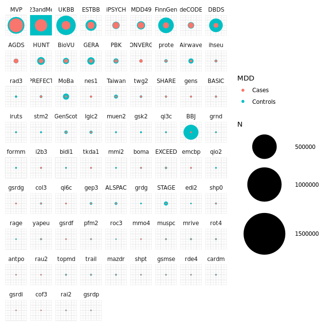<!-- -->

# Reference panel alignment

Marker names were aligned to the meta-analysis reference panel and
effect sizes were checked. SNPs with MAF \< 0.001 in the imputation
reference panel and INFO \< 0.1 in the cohort were removed.

``` r
meta_qc_align %>% print(n=Inf)
```

    ## # A tibble: 30 × 20
    ##    cohort  ancestries release             N_cases N_controls    snps snps_merged
    ##    <chr>   <chr>      <chr>                 <dbl>      <dbl>   <dbl>       <dbl>
    ##  1 23andMe eas        v7_2                   2727      90220  5.67e6     4596072
    ##  2 Taiwan  eas        20200327               1348       8392  4.15e6     4153855
    ##  3 23andMe eur        v7_2_202012          112892    1773938  7.50e6     6042865
    ##  4 AGDS    eur        202012                12123      12684  7.62e6     7582482
    ##  5 Airwave eur        0820                   2100      15713  7.49e6     7472104
    ##  6 ALSPAC  eur        27022020                472       3475  9.09e6     7670548
    ##  7 BASIC   eur        202011                 1003       1854  7.77e6     7729355
    ##  8 BioVU   eur        NoCov_SAIGE_051821     7757      24723  6.26e6     6259739
    ##  9 DBDS    eur        FINAL202103           13347     145996  7.59e6     6712418
    ## 10 deCODE  eur        DEPALL_FINAL_WHEAD    20000      28000  8.84e6     7565967
    ## 11 ESTBB   eur        EstBB                 35473      91301  2.69e7    14632453
    ## 12 EXCEED  eur        202010                  580       2071  8.08e6     8044829
    ## 13 FinnGen eur        R5_18032020           23424     192220  1.64e7    12556084
    ## 14 GenScot eur        1215a                   997       6358  7.71e6     7689638
    ## 15 GERA    eur        0915a_mds5             7162      38307  1.09e7     9018343
    ## 16 HUNT    eur        gp_hospital_metaca…   11658      42535  8.69e6     7800700
    ## 17 iPSYCH  eur        2012_HRC              19156      22708  8.81e6     8772167
    ## 18 iPSYCH  eur        2015i_HRC             10002      15434  8.85e6     8812581
    ## 19 lgic2   eur        202011                  906       4717  7.76e6     7721426
    ## 20 MDD49   eur        29w2_20w3_1504        28147      48033  7.71e6     7677489
    ## 21 MoBa    eur        harvest12               603      10213  6.50e6     6500874
    ## 22 MoBa    eur        harvest24               367       6122  6.50e6     6500863
    ## 23 MoBa    eur        rotterdam1              553       8860  6.50e6     6500879
    ## 24 MVP     eur        4_0ICDdep_202106     151974     226640  6.08e6     5270898
    ## 25 PBK     eur        2020                   5607      16080  7.35e6     7324393
    ## 26 PREFECT eur        run1                   1796       3290  8.96e6     8917662
    ## 27 SHARE   eur        godartsshare_842021    1063       1921  1.36e7    12502949
    ## 28 STAGE   eur        MDDdx_saige             421       9134  7.43e6     7397331
    ## 29 tkda1   eur        run1                    672        846  8.86e6     8815537
    ## 30 UKBB    eur        MD_glm_202012         41500     319630  9.10e6     7512039
    ## # … with 13 more variables: snps_unambiguous_flips <dbl>, snps_matching <dbl>,
    ## #   snps_turned <dbl>, snps_unresolved <dbl>, snps_aligned <dbl>,
    ## #   median_fst <dbl>, max_fst <dbl>, var_fst <dbl>, snps_kept <dbl>,
    ## #   median_or <dbl>, max_OR <dbl>, median_SE <dbl>, max_SE <dbl>

Median odds-ratios with standard error

``` r
ggplot(meta_qc_align %>%
       unite('cohort',
              cohort, ancestries, release, 
              sep="."),
        aes(x=reorder(cohort, (4*N_cases*N_controls)/(N_cases + N_controls)),
            y=median_or,
            ymax=exp(log(median_or)+median_SE),
            ymin=exp(log(median_or)-median_SE))) +
geom_linerange() +
geom_point() +
coord_flip(ylim=c(0.8, 1.25))
```

<!-- -->

Mean standard error versus effective sample size:

``` r
ggplot(meta_qc_align %>%
       unite('cohort',
              cohort, ancestries, release, 
              sep=".") %>%
       mutate(Neff=(4*N_cases*N_controls)/(N_cases + N_controls)),
        aes(x=Neff, y=median_SE, label=cohort)) +
geom_text(size=2) +
scale_x_log10(breaks=c(1, 100, 1000, 5000, 10000, 50000, 100000, 500000))
```

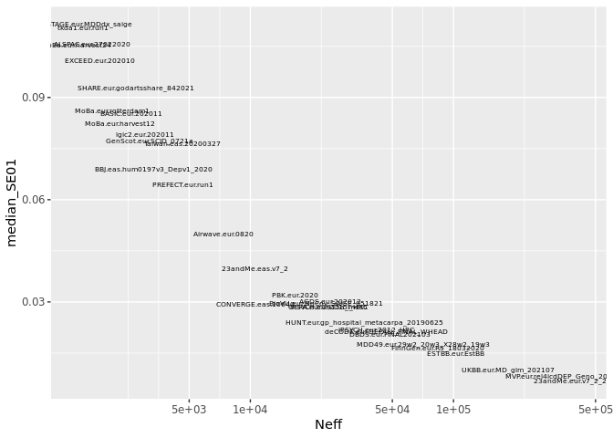<!-- -->

# Genetic correlation with clinical cohorts

LDSC genetic correlations were calculated with the PGC `MDD29` clinical
cohorts

``` r
meta_qc_ldsc <-
read_table2(snakemake@input$meta_qc_ldsc) %>%
mutate(se.mdd2=as.numeric(str_remove_all(se.mdd2, "[\\(\\)]")),
       se.mdd29=as.numeric(str_remove_all(se.mdd29, "[\\(\\)]")),
       gencov_se.mdd2=as.numeric(str_remove_all(gencov_se.mdd2, "[\\(\\)]")),
       gencov_se.mdd29=as.numeric(str_remove_all(gencov_se.mdd29, "[\\(\\)]"))
    )
```

    ## 
    ## ── Column specification ────────────────────────────────────────────────────────────────
    ## cols(
    ##   cohort = col_character(),
    ##   release = col_character(),
    ##   h2_obs = col_double(),
    ##   h2_obs_se = col_double(),
    ##   rg.mdd2 = col_double(),
    ##   se.mdd2 = col_double(),
    ##   gencov.mdd2 = col_double(),
    ##   gencov_se.mdd2 = col_double(),
    ##   z1z2.mdd2 = col_double(),
    ##   rg.mdd29 = col_double(),
    ##   se.mdd29 = col_double(),
    ##   gencov.mdd29 = col_double(),
    ##   gencov_se.mdd29 = col_double(),
    ##   z1z2.mdd29 = col_double()
    ## )

    ## Warning: 3 parsing failures.
    ## row col   expected    actual                           file
    ##   4  -- 14 columns 7 columns 'docs/tables/meta_qc_ldsc.txt'
    ##   5  -- 14 columns 7 columns 'docs/tables/meta_qc_ldsc.txt'
    ##  20  -- 14 columns 7 columns 'docs/tables/meta_qc_ldsc.txt'

``` r
ggplot(meta_qc_ldsc, aes(x=reorder(paste(cohort, release), rg.mdd29), y=rg.mdd29, ymin=rg.mdd29-se.mdd29, ymax=rg.mdd29+se.mdd29)) +
geom_linerange() +
geom_point() +
coord_flip(ylim=c(0, 1.25))
```

    ## Warning: Removed 8 rows containing missing values (geom_segment).

    ## Warning: Removed 8 rows containing missing values (geom_point).

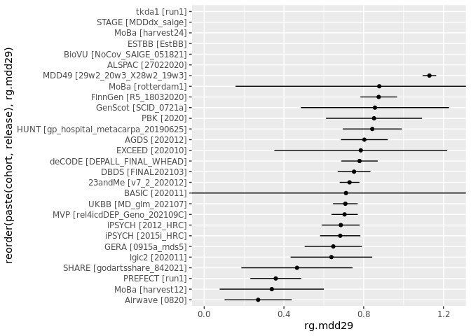<!-- -->

Genetic covariance:

``` r
ggplot(meta_qc_ldsc, aes(x=reorder(paste(cohort, release), gencov.mdd29), y=gencov.mdd29, ymin=gencov.mdd29-gencov_se.mdd29, ymax=gencov.mdd29+gencov_se.mdd29)) +
geom_linerange() +
geom_point() +
coord_flip()
```

    ## Warning: Removed 3 rows containing missing values (geom_segment).

    ## Warning: Removed 3 rows containing missing values (geom_point).

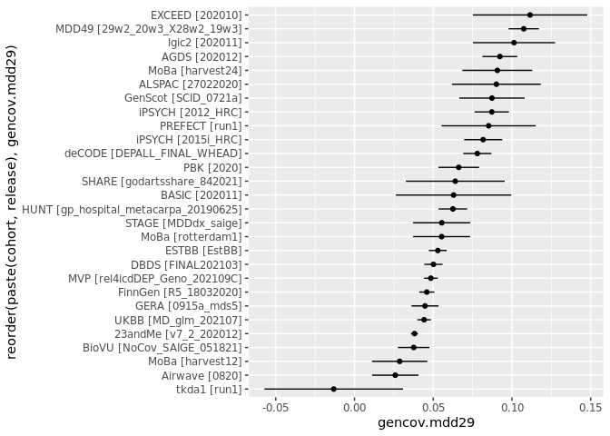<!-- -->

# Genetic correlation with previous meta analysis

``` r
ggplot(meta_qc_ldsc, aes(x=reorder(paste(cohort, release), rg.mdd2), y=rg.mdd2, ymin=rg.mdd2-se.mdd2, ymax=rg.mdd2+se.mdd2)) +
geom_linerange() +
geom_point() +
coord_flip(ylim=c(0, 1.25))
```

    ## Warning: Removed 4 rows containing missing values (geom_segment).

    ## Warning: Removed 4 rows containing missing values (geom_point).

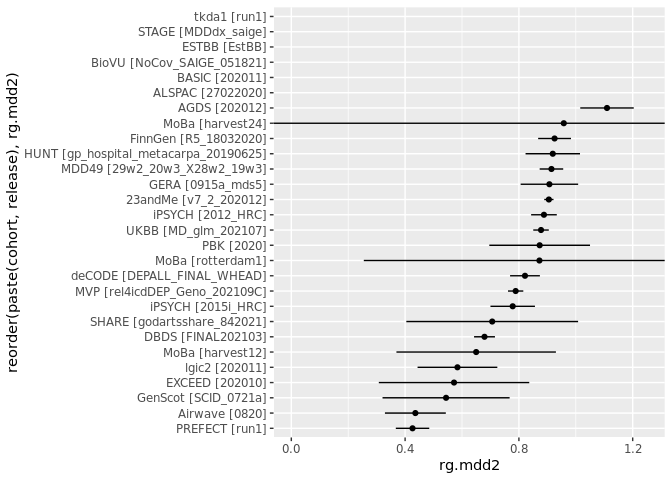<!-- -->

Genetic covariance:

``` r
ggplot(meta_qc_ldsc, aes(x=reorder(paste(cohort, release), gencov.mdd2), y=gencov.mdd2, ymin=gencov.mdd2-gencov_se.mdd2, ymax=gencov.mdd2+gencov_se.mdd2)) +
geom_linerange() +
geom_point() +
coord_flip()
```

    ## Warning: Removed 3 rows containing missing values (geom_segment).

<!-- -->

# Genetic covariance intercepts

Pairwise LDSC genetic covariance intercepts between all cohorts

``` r
meta_qc_ldsc_pairs <- read_tsv(snakemake@input$meta_qc_ldsc_pairs)
```

    ## 
    ## ── Column specification ────────────────────────────────────────────────────────────────
    ## cols(
    ##   cohort1 = col_character(),
    ##   subcohort1 = col_character(),
    ##   cohort2 = col_character(),
    ##   subcohort2 = col_character(),
    ##   ancestry1 = col_character(),
    ##   ancestry2 = col_character(),
    ##   rg = col_double(),
    ##   se = col_double(),
    ##   z = col_double(),
    ##   p = col_double(),
    ##   h2_obs = col_double(),
    ##   h2_obs_se = col_double(),
    ##   h2_int = col_double(),
    ##   h2_int_se = col_double(),
    ##   gcov_int = col_double(),
    ##   gcov_int_se = col_double()
    ## )

``` r
# calculate total sample sizes
meta_qc_samplesize <- meta_qc_align %>%
transmute(cohort, ancestries, release, N=N_cases+N_controls)

# sumstats appearing in MDD3 (exclude other
# sumstats like Wray 2018 that have had their 
# sumstats munged for other reasons)
meta_qc_ldsc_pairs_mdd3 <- meta_qc_ldsc_pairs  %>%
filter(!cohort1 %in% c('MDD29', 'PGC') & !cohort2 %in% c('MDD29', 'PGC')) %>%
left_join(meta_qc_samplesize %>% rename(cohortN1=N), by=c('cohort1'='cohort', 'subcohort1'='release', 'ancestry1'='ancestries')) %>%
left_join(meta_qc_samplesize %>% rename(cohortN2=N), by=c('cohort2'='cohort', 'subcohort2'='release', 'ancestry2'='ancestries'))
```

Histogram of intercepts

``` r
ggplot(meta_qc_ldsc_pairs_mdd3, aes(x=gcov_int)) +
geom_histogram()
```

    ## `stat_bin()` using `bins = 30`. Pick better value with `binwidth`.

    ## Warning: Removed 46 rows containing non-finite values (stat_bin).

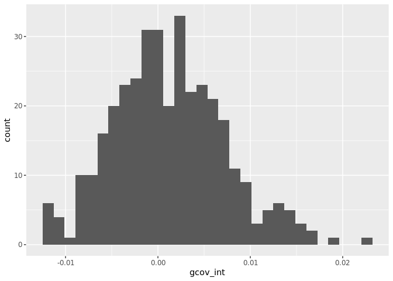<!-- -->

Pairwise intercepts

Show the largest and smallest intercepts. Exclude Wray2018 sumstats that
are also in the mix. Calculate distance from 0 in standard deviation
units to get an idea of the magnitude of departure from expectation
relative to the other intercepts.

``` r
meta_qc_ldsc_pairs_mdd3 %>%
select(cohort1, subcohort1, cohort2, subcohort2, gcov_int) %>%
mutate(SDs=abs(gcov_int)/sd(gcov_int, na.rm=T)) %>%
arrange(desc(gcov_int))
```

    ## # A tibble: 378 × 6
    ##    cohort1 subcohort1                     cohort2 subcohort2      gcov_int   SDs
    ##    <chr>   <chr>                          <chr>   <chr>              <dbl> <dbl>
    ##  1 23andMe v7_2_202012                    iPSYCH  2012_HRC          0.0219  3.45
    ##  2 MoBa    harvest12                      MoBa    rotterdam1        0.0213  3.36
    ##  3 MDD49   29w2_20w3_1504                 tkda1   run1              0.0212  3.34
    ##  4 HUNT    gp_hospital_metacarpa_20190625 MoBa    harvest12         0.0203  3.20
    ##  5 HUNT    gp_hospital_metacarpa_20190625 iPSYCH  2015i_HRC         0.0165  2.60
    ##  6 HUNT    gp_hospital_metacarpa_20190625 MVP     4_0ICDdep_2021…   0.0165  2.60
    ##  7 MVP     4_0ICDdep_202106               PBK     2020              0.015   2.36
    ##  8 AGDS    202012                         iPSYCH  2012_HRC          0.0147  2.32
    ##  9 HUNT    gp_hospital_metacarpa_20190625 iPSYCH  2012_HRC          0.0146  2.30
    ## 10 MDD49   29w2_20w3_1504                 PREFECT run1              0.0144  2.27
    ## # … with 368 more rows

``` r
meta_qc_ldsc_pairs_mdd3 %>%
select(cohort1, subcohort1, cohort2, subcohort2, gcov_int) %>%
mutate(SDs=abs(gcov_int)/sd(gcov_int, na.rm=T)) %>%
arrange(gcov_int)
```

    ## # A tibble: 378 × 6
    ##    cohort1 subcohort1          cohort2 subcohort2          gcov_int   SDs
    ##    <chr>   <chr>               <chr>   <chr>                  <dbl> <dbl>
    ##  1 GERA    0915a_mds5          MoBa    harvest12            -0.0172  2.71
    ##  2 MVP     4_0ICDdep_202106    lgic2   202011               -0.0127  2.00
    ##  3 23andMe v7_2_202012         BASIC   202011               -0.0123  1.94
    ##  4 23andMe v7_2_202012         Airwave 0820                 -0.012   1.89
    ##  5 SHARE   godartsshare_842021 iPSYCH  2012_HRC             -0.0116  1.83
    ##  6 EXCEED  202010              MoBa    harvest12            -0.0109  1.72
    ##  7 GERA    0915a_mds5          iPSYCH  2012_HRC             -0.0109  1.72
    ##  8 MoBa    harvest12           SHARE   godartsshare_842021  -0.0106  1.67
    ##  9 23andMe v7_2_202012         ALSPAC  27022020             -0.0103  1.62
    ## 10 EXCEED  202010              GenScot 1215a                -0.0103  1.62
    ## # … with 368 more rows

Estimate amount of sample overlap as
$N_S = g\_{\\mathrm{cov}\_\\mathrm{int}}\\sqrt{N_1N_2} / r\_\\mathrm{P}$,
where *r*<sub>P</sub> is the phenotypic correlation between the two MDD
phenotype (assume *r*<sub>P</sub> = 1)

``` r
rP <- 1
meta_qc_ldsc_pairs_mdd3_ns <-
meta_qc_ldsc_pairs_mdd3 %>%
mutate(Ns_factor=sqrt(cohortN1*cohortN2)/rP) %>%
mutate(Ns=gcov_int*Ns_factor,
       Ns_l95=(gcov_int+qnorm(0.025)*gcov_int_se)*Ns_factor,
       Ns_u95=(gcov_int+qnorm(0.975)*gcov_int_se)*Ns_factor,
       chisq=gcov_int^2/gcov_int_se^2) %>%
filter(!is.na(chisq)) %>%
mutate(qval=fdrtool(pchisq(chisq, df=1, lower.tail=F), statistic='pvalue', plot=FALSE)$qval) %>%
select(cohort1, subcohort1, cohort2, subcohort2, cohortN1, cohortN2, chisq, qval, Ns, Ns_l95, Ns_u95) %>%
mutate(Ns_pct=100*Ns/(cohortN1+cohortN2))
```

    ## Step 1... determine cutoff point
    ## Step 2... estimate parameters of null distribution and eta0
    ## Step 3... compute p-values and estimate empirical PDF/CDF
    ## Step 4... compute q-values and local fdr

Sort (largest-to-smallest) by sample overlap

``` r
meta_qc_ldsc_pairs_mdd3_ns %>%
arrange(desc(Ns)) %>%
select(-chisq, -qval, -Ns_pct)
```

    ## # A tibble: 332 × 9
    ##    cohort1 subcohort1  cohort2 subcohort2 cohortN1 cohortN2    Ns  Ns_l95 Ns_u95
    ##    <chr>   <chr>       <chr>   <chr>         <dbl>    <dbl> <dbl>   <dbl>  <dbl>
    ##  1 23andMe v7_2_202012 iPSYCH  2012_HRC    1886830    41864 6155.  1.03e3 11278.
    ##  2 23andMe v7_2_202012 ESTBB   EstBB       1886830   126774 5429. -1.95e3 12810.
    ##  3 23andMe v7_2_202012 MVP     4_0ICDdep…  1886830   378614 4818. -1.27e4 22377.
    ##  4 23andMe v7_2_202012 UKBB    MD_glm_20…  1886830   361130 4788. -7.99e3 17569.
    ##  5 MVP     4_0ICDdep_… UKBB    MD_glm_20…   378614   361130 3106. -2.84e3  9049.
    ##  6 23andMe v7_2_202012 BioVU   NoCov_SAI…  1886830    32480 2624. -8.69e2  6118.
    ##  7 23andMe v7_2_202012 GERA    0915a_mds5  1886830    45469 2519. -1.90e3  6939.
    ##  8 FinnGen R5_18032020 MVP     4_0ICDdep…   215644   378614 2400. -1.86e3  6656.
    ##  9 HUNT    gp_hospita… MVP     4_0ICDdep…    54193   378614 2363.  3.70e2  4357.
    ## 10 MDD49   29w2_20w3_… UKBB    MD_glm_20…    76180   361130 2189.  4.38e1  4335.
    ## # … with 322 more rows

Sort (largest-to-smallest) by percentage of overlap to combined sample
size

``` r
meta_qc_ldsc_pairs_mdd3_ns %>%
arrange(desc(Ns_pct)) %>%
select(-cohortN1, -cohortN2, -chisq, -qval)
```

    ## # A tibble: 332 × 8
    ##    cohort1 subcohort1            cohort2 subcohort2      Ns Ns_l95 Ns_u95 Ns_pct
    ##    <chr>   <chr>                 <chr>   <chr>        <dbl>  <dbl>  <dbl>  <dbl>
    ##  1 MoBa    harvest12             MoBa    rotterdam1   215.  102.     328.  1.06 
    ##  2 HUNT    gp_hospital_metacarp… iPSYCH  2015i_HRC    613.  220.    1006.  0.769
    ##  3 HUNT    gp_hospital_metacarp… MoBa    harvest12    491.  183.     800.  0.756
    ##  4 HUNT    gp_hospital_metacarp… iPSYCH  2012_HRC     695.   88.6   1302.  0.724
    ##  5 AGDS    202012                iPSYCH  2012_HRC     474.   50.5    897.  0.711
    ##  6 STAGE   MDDdx_saige           lgic2   202011        92.4  16.2    168.  0.608
    ##  7 PREFECT run1                  STAGE   MDDdx_saige   88.5   9.29   168.  0.605
    ##  8 iPSYCH  2012_HRC              iPSYCH  2015i_HRC    401.    4.84   798.  0.596
    ##  9 GenScot 1215a                 PBK     2020         172.   52.9    291.  0.591
    ## 10 GERA    0915a_mds5            MDD49   29w2_20w3_1… 712.   43.1   1381.  0.585
    ## # … with 322 more rows

Sort by *χ*<sup>2</sup> (Wald) test statistics

``` r
meta_qc_ldsc_pairs_mdd3_ns %>%
arrange(desc(chisq)) %>%
select(-cohortN1, -cohortN2)
```

    ## # A tibble: 332 × 10
    ##    cohort1 subcohort1      cohort2 subcohort2  chisq   qval     Ns Ns_l95 Ns_u95
    ##    <chr>   <chr>           <chr>   <chr>       <dbl>  <dbl>  <dbl>  <dbl>  <dbl>
    ##  1 MoBa    harvest12       MoBa    rotterdam1  14.0  0.0380  215.   102.    328.
    ##  2 MDD49   29w2_20w3_1504  tkda1   run1        13.4  0.0380  228.   106.    350.
    ##  3 HUNT    gp_hospital_me… MoBa    harvest12    9.75 0.149   491.   183.    800.
    ##  4 HUNT    gp_hospital_me… iPSYCH  2015i_HRC    9.34 0.166   613.   220.   1006.
    ##  5 GERA    0915a_mds5      UKBB    MD_glm_202…  8.07 0.225  1820.   564.   3075.
    ##  6 GenScot 1215a           PBK     2020         8.03 0.227   172.    52.9   291.
    ##  7 GERA    0915a_mds5      MoBa    harvest12    7.45 0.267  -381.  -655.   -108.
    ##  8 STAGE   MDDdx_saige     lgic2   202011       5.65 0.414    92.4   16.2   168.
    ##  9 23andMe v7_2_202012     iPSYCH  2012_HRC     5.55 0.422  6155.  1032.  11278.
    ## 10 HUNT    gp_hospital_me… MVP     4_0ICDdep_…  5.40 0.433  2363.   370.   4357.
    ## # … with 322 more rows, and 1 more variable: Ns_pct <dbl>

Test for heterogeniety in covariance intercepts. Calculate *w*, the
inverse variance of each *g*<sub>covint</sub> standard error, then
calculate a weighted sum $\\hat{g\_\\mathrm{covint}}$

``` r
meta_qc_ldsc_pairs_mdd3 %>%
filter(!is.na(gcov_int)) %>%
mutate(w=1/gcov_int_se^2) %>%
mutate(gcov_int_hat=sum(w*gcov_int)/sum(w)) %>%
summarise(Q=sum(w*(gcov_int-gcov_int_hat)^2), k=n()) %>%
mutate(I2=(Q-(k-1))/Q)
```

    ## # A tibble: 1 × 3
    ##       Q     k    I2
    ##   <dbl> <int> <dbl>
    ## 1  382.   332 0.135

There is thus some heterogeneity in genetic covariance intercepts. We
also want to look at heterogeniety per-cohort. The LDSC intercepts were
calculated for each unique pair of cohorts. Expand this table to have
every ordering of each pair

``` r
# get unique cohort names from name and ancestry columns
meta_qc_ldsc_pairs_mdd3_named <-
meta_qc_ldsc_pairs_mdd3 %>%
mutate(cohort1=paste(cohort1, subcohort1, ancestry1, sep='.'),
       cohort2=paste(cohort2, subcohort2, ancestry2, sep='.')) %>%
mutate(pair_name=paste(cohort1, cohort2, sep=','))

# get all unique cohort names
cohorts <- unique(c(meta_qc_ldsc_pairs_mdd3_named$cohort1,
                    meta_qc_ldsc_pairs_mdd3_named$cohort2))

# ordered pairs of cohort we have data listings for
cohorts_pair_names <- unique(meta_qc_ldsc_pairs_mdd3_named$pair_name)

# create list of all pairs of cohorts
meta_qc_ldsc_pairs_mdd3_all <-
tibble(cohort1=cohorts, cohort2=cohorts) %>%
complete(cohort1, cohort2) %>%
filter(cohort1 != cohort2) %>%
mutate(pair_name12=paste(cohort1, cohort2, sep=','),
       pair_name21=paste(cohort2, cohort1, sep=',')) %>%
mutate(pair_name=case_when(pair_name12 %in% cohorts_pair_names ~ pair_name12,
                           pair_name21 %in% cohorts_pair_names ~ pair_name21,
                           TRUE ~ NA_character_)) %>%
select(cohort1, cohort2, pair_name) %>%
left_join(meta_qc_ldsc_pairs_mdd3_named %>% select(pair_name, gcov_int, gcov_int_se), by='pair_name')
```

Calculate *Q* and *I*<sup>2</sup> for each cohort

``` r
meta_qc_ldsc_pairs_mdd3_all_het <-
meta_qc_ldsc_pairs_mdd3_all %>%
group_by(cohort1) %>%
filter(!is.na(gcov_int)) %>%
mutate(w=1/gcov_int_se^2) %>%
mutate(gcov_int_hat=sum(w*gcov_int)/sum(w)) %>%
summarise(Q=sum(w*(gcov_int-gcov_int_hat)^2), k=n()) %>%
mutate(I2=(Q-(k-1))/Q) %>%
arrange(desc(I2))
meta_qc_ldsc_pairs_mdd3_all_het %>%
as.data.frame()
```

    ##                                    cohort1         Q  k          I2
    ## 1                       MoBa.harvest12.eur 46.621464 24  0.50666500
    ## 2                      GERA.0915a_mds5.eur 41.783675 24  0.44954579
    ## 3                           tkda1.run1.eur 25.330702 16  0.40783323
    ## 4                      MoBa.rotterdam1.eur 36.794358 25  0.34772608
    ## 5                      iPSYCH.2012_HRC.eur 38.242776 26  0.34628177
    ## 6                         PREFECT.run1.eur 32.263839 24  0.28712761
    ## 7                 MDD49.29w2_20w3_1504.eur 33.404877 25  0.28154204
    ## 8                         BASIC.202011.eur 17.585639 14  0.26076046
    ## 9                    STAGE.MDDdx_saige.eur 32.618193 27  0.20289881
    ## 10 HUNT.gp_hospital_metacarpa_20190625.eur 28.646211 25  0.16219288
    ## 11                            PBK.2020.eur 26.601346 24  0.13538210
    ## 12                       GenScot.1215a.eur 26.688603 25  0.10073973
    ## 13                 23andMe.v7_2_202012.eur 28.190332 27  0.07769798
    ## 14                     ALSPAC.27022020.eur 22.647995 22  0.07276559
    ## 15                        lgic2.202011.eur 25.527596 25  0.05984098
    ## 16                    iPSYCH.2015i_HRC.eur 24.505461 25  0.02062648
    ## 17            BioVU.NoCov_SAIGE_051821.eur 22.030323 24 -0.04401557
    ## 18                         AGDS.202012.eur 22.449600 25 -0.06906135
    ## 19                  UKBB.MD_glm_202012.eur 21.349864 25 -0.12412893
    ## 20                MVP.4_0ICDdep_202106.eur 22.981473 27 -0.13134612
    ## 21           SHARE.godartsshare_842021.eur 18.668701 23 -0.17844299
    ## 22                       EXCEED.202010.eur 20.083898 25 -0.19498714
    ## 23                    DBDS.FINAL202103.eur 19.645652 26 -0.27254618
    ## 24           deCODE.DEPALL_FINAL_WHEAD.eur 17.930019 25 -0.33853733
    ## 25                         ESTBB.EstBB.eur 17.420034 25 -0.37772407
    ## 26                 FinnGen.R5_18032020.eur 16.864479 25 -0.42310951
    ## 27                        Airwave.0820.eur 16.216991 26 -0.54159299
    ## 28                      MoBa.harvest24.eur  4.183043 10 -1.15154368

``` r
# find range to fit all gcov_int values
gcov_int_min <- min(with(meta_qc_ldsc_pairs_mdd3, gcov_int-gcov_int_se), na.rm=TRUE)
gcov_int_max <- max(with(meta_qc_ldsc_pairs_mdd3, gcov_int+gcov_int_se), na.rm=TRUE)

ggplot(meta_qc_ldsc_pairs_mdd3_all %>% filter(cohort1 %in% meta_qc_ldsc_pairs_mdd3_all_het$cohort1[1:4]),
       aes(x=cohort2, y=gcov_int, ymin=gcov_int-gcov_int_se, ymax=gcov_int+gcov_int_se)) +
geom_point() +
geom_linerange() +
facet_grid(cols=vars(cohort1)) +
coord_flip(ylim=c(gcov_int_min-0.01, gcov_int_max+0.01))
```

    ## Warning: Removed 19 rows containing missing values (geom_point).

    ## Warning: Removed 3 rows containing missing values (geom_segment).

    ## Warning: Removed 3 rows containing missing values (geom_segment).

    ## Warning: Removed 2 rows containing missing values (geom_segment).

    ## Warning: Removed 11 rows containing missing values (geom_segment).

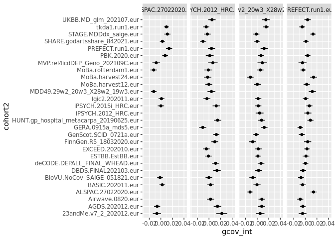<!-- -->

``` r
ggplot(meta_qc_ldsc_pairs_mdd3_all %>% filter(cohort1 %in% meta_qc_ldsc_pairs_mdd3_all_het$cohort1[5:8]),
   aes(x=cohort2, y=gcov_int, ymin=gcov_int-gcov_int_se, ymax=gcov_int+gcov_int_se)) +
geom_point() +
geom_linerange() +
facet_grid(cols=vars(cohort1)) +
coord_flip(ylim=c(gcov_int_min-0.01, gcov_int_max+0.01))
```

    ## Warning: Removed 19 rows containing missing values (geom_point).

    ## Warning: Removed 13 rows containing missing values (geom_segment).

    ## Warning: Removed 1 rows containing missing values (geom_segment).

    ## Warning: Removed 2 rows containing missing values (geom_segment).

    ## Warning: Removed 3 rows containing missing values (geom_segment).

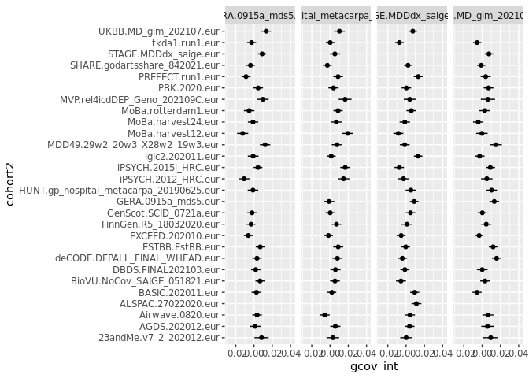<!-- -->

## Clustering

Cluster based on similarity in genetic covariance intercepts.

``` r
# get a list of all cohort/subcohort names

subcohorts <- 
bind_rows(
select(meta_qc_ldsc_pairs_mdd3, cohort=cohort1, subcohort=subcohort1),
select(meta_qc_ldsc_pairs_mdd3, cohort=cohort2, subcohort=subcohort2)
) %>%
distinct()
```

Make a matrix:

``` r
cohort_names <- 
subcohorts %>%
transmute(cohort=paste(cohort, subcohort, sep='.')) %>%
pull(cohort)

gcov_int_mat <- diag(length(cohort_names))
dimnames(gcov_int_mat) <- list(cohort_names, cohort_names)

for(i in seq.int(nrow(meta_qc_ldsc_pairs_mdd3))) {
    cohort1 <- meta_qc_ldsc_pairs_mdd3$cohort1[i]
    cohort2 <- meta_qc_ldsc_pairs_mdd3$cohort2[i]
    subcohort1 <- meta_qc_ldsc_pairs_mdd3$subcohort1[i]
    subcohort2 <- meta_qc_ldsc_pairs_mdd3$subcohort2[i]
    cohort_name1 <- paste(cohort1, subcohort1, sep='.')
    cohort_name2 <- paste(cohort2, subcohort2, sep='.')

    # if gcov_int is NA, substitute 0 (average)

    gcov_int <- coalesce(meta_qc_ldsc_pairs_mdd3$gcov_int[i], 0)

    gcov_int_mat[cohort_name1,cohort_name2] <- gcov_int 
    gcov_int_mat[cohort_name2,cohort_name1] <- gcov_int
}
```

Convert intercepts into a dissimilarity matrix. For intercepts, `1 ==`
same, `0 ==` average, `<0 ==` different. For dissimilarity, `0 ==` same
and larger values `==` more dissimilar.

``` r
plot(hclust(as.dist(1-gcov_int_mat)))
```

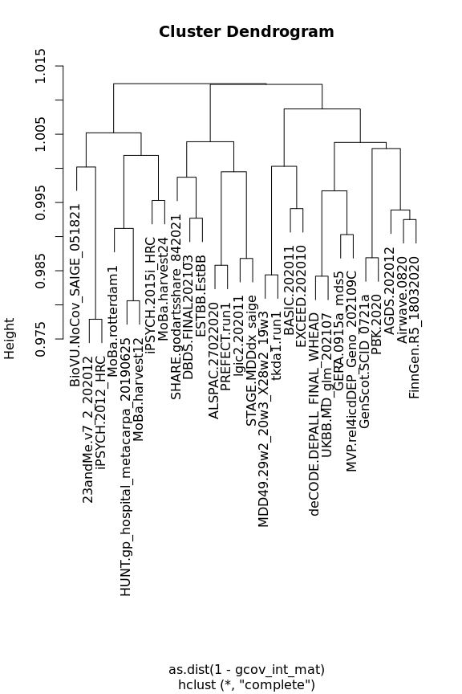<!-- -->

``` r
corrplot(gcov_int_mat, is.corr=FALSE, diag=FALSE)
```

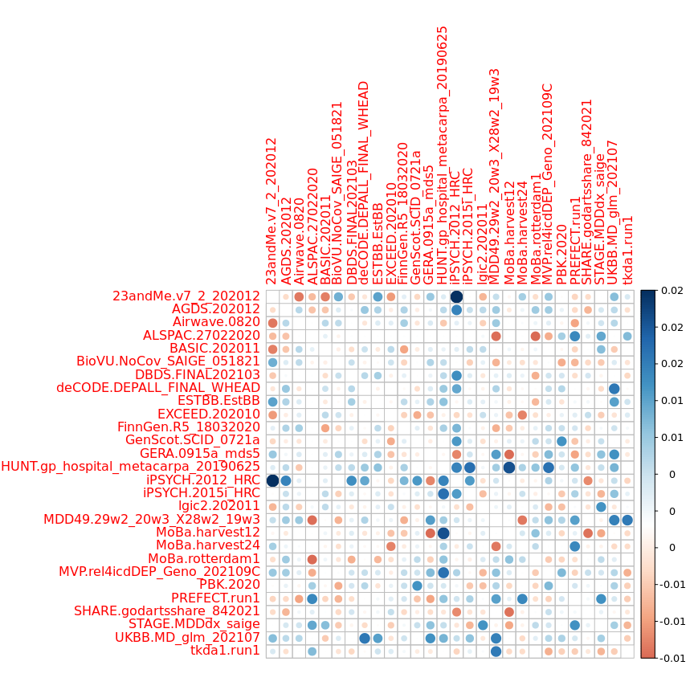<!-- -->

## Genetic correlations

``` r
rg_mat <- diag(length(cohort_names))
dimnames(rg_mat) <- list(cohort_names, cohort_names)
rg_se_mat <- diag(x=0, nrow=length(cohort_names), ncol=length(cohort_names))
dimnames(rg_se_mat) <- list(cohort_names, cohort_names)

for(i in seq.int(nrow(meta_qc_ldsc_pairs_mdd3))) {
    cohort1 <- meta_qc_ldsc_pairs_mdd3$cohort1[i]
    cohort2 <- meta_qc_ldsc_pairs_mdd3$cohort2[i]
    subcohort1 <- meta_qc_ldsc_pairs_mdd3$subcohort1[i]
    subcohort2 <- meta_qc_ldsc_pairs_mdd3$subcohort2[i]
    cohort_name1 <- paste(cohort1, subcohort1, sep='.')
    cohort_name2 <- paste(cohort2, subcohort2, sep='.')

    # if rg is NA, substitute 0 (average)

    rg <- meta_qc_ldsc_pairs_mdd3$rg[i]
    rg_se <- meta_qc_ldsc_pairs_mdd3$se[i]

    rg_mat[cohort_name1,cohort_name2] <- rg 
    rg_mat[cohort_name2,cohort_name1] <- rg
    rg_se_mat[cohort_name1,cohort_name2] <- rg_se
    rg_se_mat[cohort_name2,cohort_name1] <- rg_se
}
```

``` r
rg_mat_1 <- rg_mat
rg_mat_1[which(rg_mat_1 > 1)] <- 1
rg_mat_1[which(rg_mat_1 < -1)] <- -1

rg_lowCI <- rg_mat + qnorm(0.025)*rg_se_mat
rg_uppCI <- rg_mat + qnorm(0.975)*rg_se_mat

rg_lowCI_1 <- rg_lowCI
rg_lowCI_1[which(rg_lowCI_1 > 1)] <- 1
rg_lowCI_1[which(rg_lowCI_1 < -1)] <- -1

rg_uppCI_1 <- rg_uppCI
rg_uppCI_1[which(rg_uppCI_1 > 1)] <- 1
rg_uppCI_1[which(rg_uppCI_1 < -1)] <- -1


has_rg_idx <- rowSums(!is.na(rg_mat_1)) > 1

corrplot.mixed(rg_mat_1[has_rg_idx,has_rg_idx],
               lowCI=rg_lowCI_1[has_rg_idx,has_rg_idx],
               uppCI=rg_uppCI_1[has_rg_idx,has_rg_idx],
               na.label='.', tl.pos='lt', diag='u', plotCI='rect', number.cex=0.75)
```

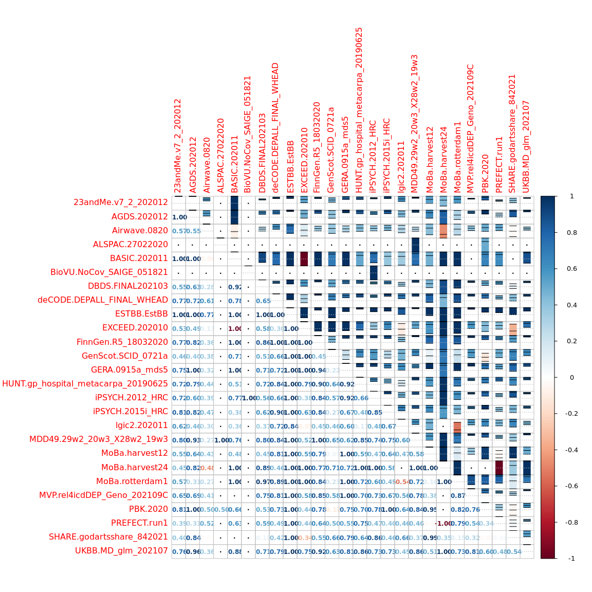<!-- -->
