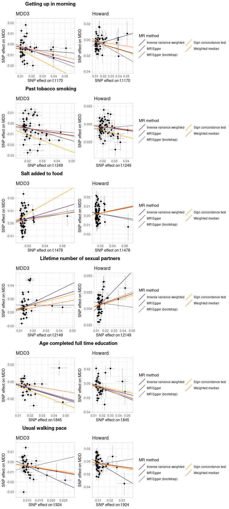
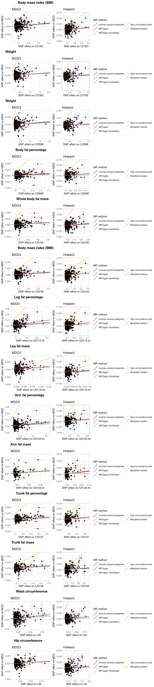

MR phewas: scatter plots
================
X Shen
06 January, 2022

## ————————————————————————

## UKB MR PheWAS

-----

### QC: MDD to other traits

Results

-----

#### Brain and cognition

#### Environment

#### Self-reported and assessed physical condition

## ————————————————————————

### QC: Other traits to MDD

-----

#### Environment

#### Self-reported and assessed physical condition

