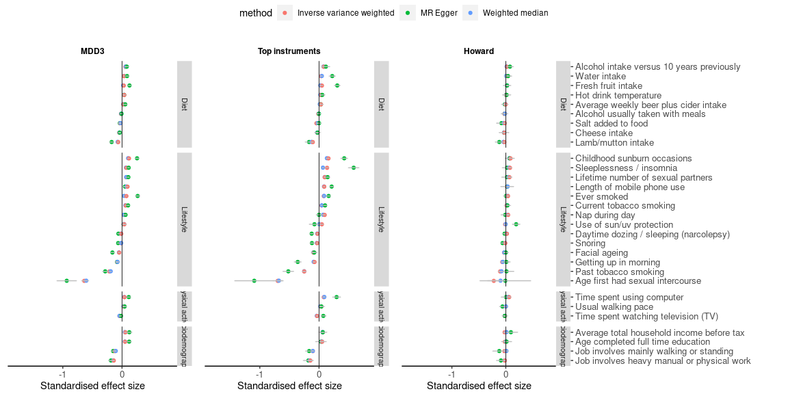
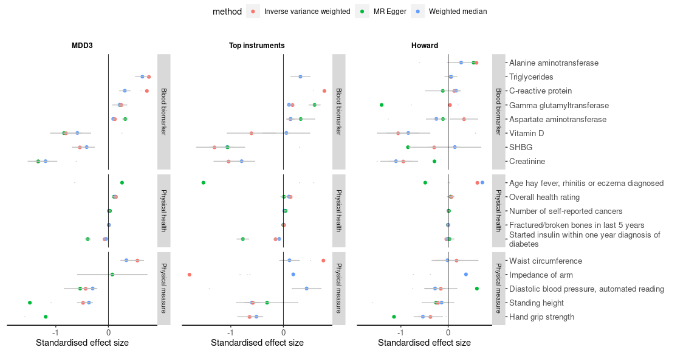
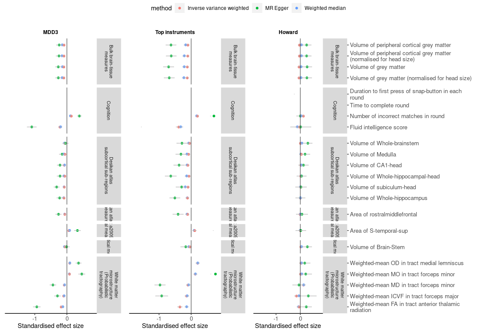
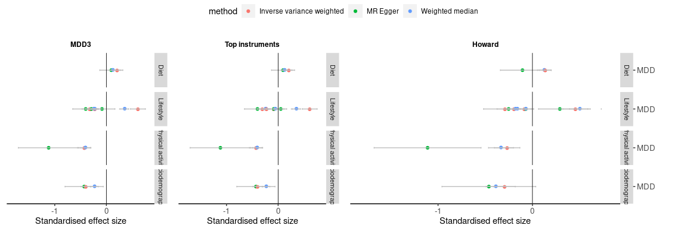
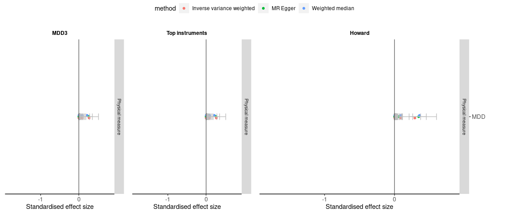

MR phewas: scatter plots
================
X Shen
13 January, 2022

## ————————————————————————

## UKB MR PheWAS

-----

### MDD as exposure

##### Environment

    ## Scale for 'y' is already present. Adding another scale for 'y', which will
    ## replace the existing scale.
    ## Scale for 'y' is already present. Adding another scale for 'y', which will
    ## replace the existing scale.
    ## Scale for 'y' is already present. Adding another scale for 'y', which will
    ## replace the existing scale.

<!-- -->

##### Physical health

    ## Scale for 'y' is already present. Adding another scale for 'y', which will
    ## replace the existing scale.
    ## Scale for 'y' is already present. Adding another scale for 'y', which will
    ## replace the existing scale.
    ## Scale for 'y' is already present. Adding another scale for 'y', which will
    ## replace the existing scale.

<!-- -->

##### Brain MRI

    ## Scale for 'y' is already present. Adding another scale for 'y', which will
    ## replace the existing scale.
    ## Scale for 'y' is already present. Adding another scale for 'y', which will
    ## replace the existing scale.
    ## Scale for 'y' is already present. Adding another scale for 'y', which will
    ## replace the existing scale.

<!-- -->

### MDD as outcome

##### Environment

    ## Scale for 'y' is already present. Adding another scale for 'y', which will
    ## replace the existing scale.
    ## Scale for 'y' is already present. Adding another scale for 'y', which will
    ## replace the existing scale.
    ## Scale for 'y' is already present. Adding another scale for 'y', which will
    ## replace the existing scale.

<!-- -->

##### Physical health

    ## Scale for 'y' is already present. Adding another scale for 'y', which will
    ## replace the existing scale.
    ## Scale for 'y' is already present. Adding another scale for 'y', which will
    ## replace the existing scale.
    ## Scale for 'y' is already present. Adding another scale for 'y', which will
    ## replace the existing scale.

<!-- -->
