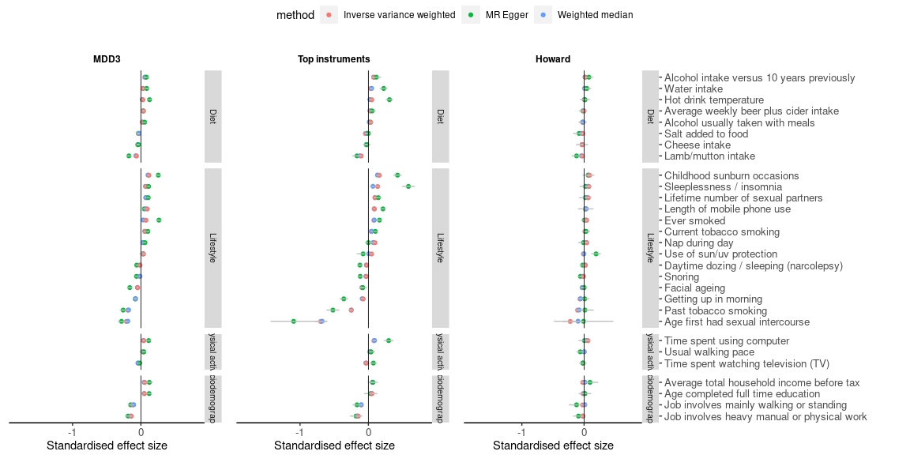
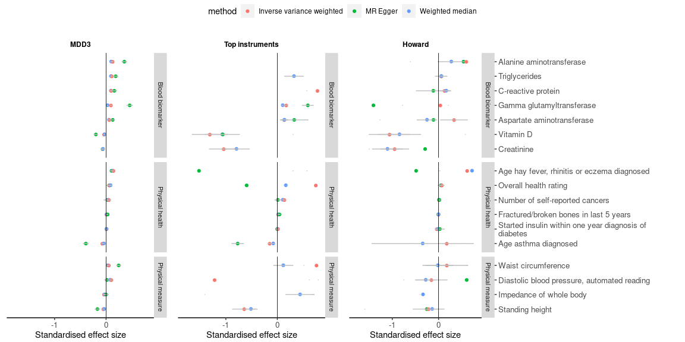
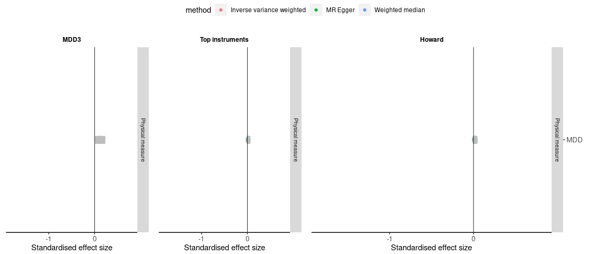

MR phewas: scatter plots
================
X Shen
06 January, 2022

## ————————————————————————

## UKB MR PheWAS

-----

### MDD as exposure

##### Environment

<!-- -->

##### Physical health

<!-- -->

##### Brain MRI

<!-- -->

### MDD as outcome

##### Environment

<!-- -->

##### Physical health

<!-- -->
