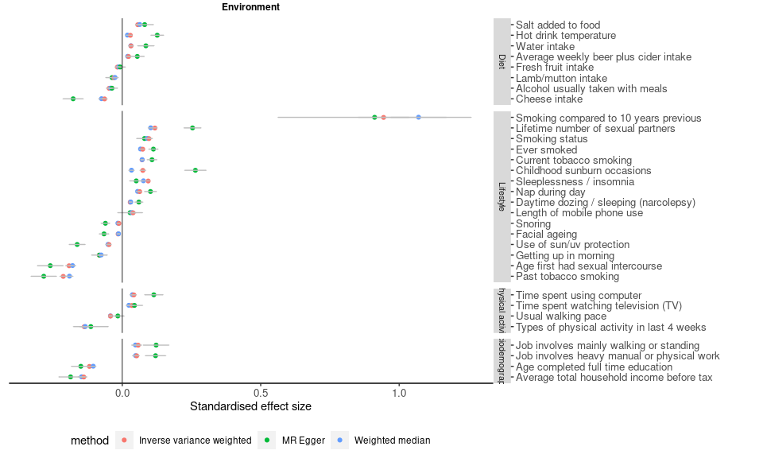
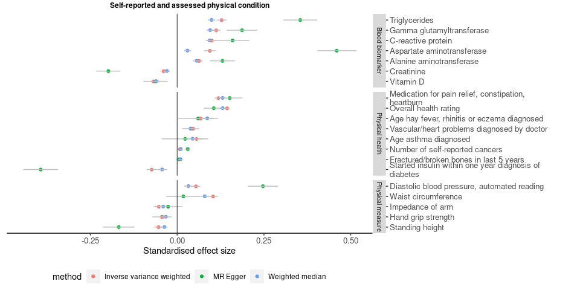
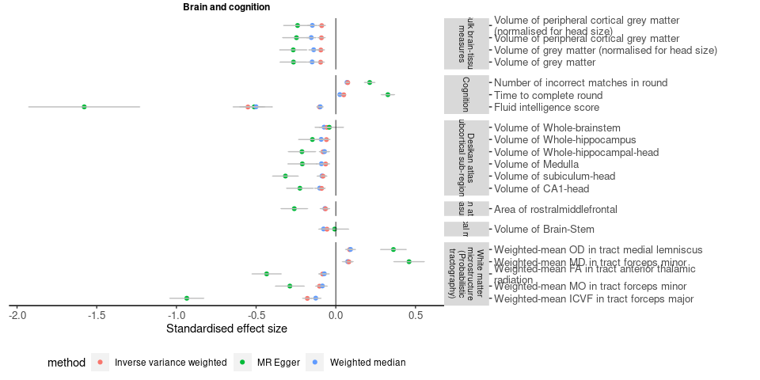
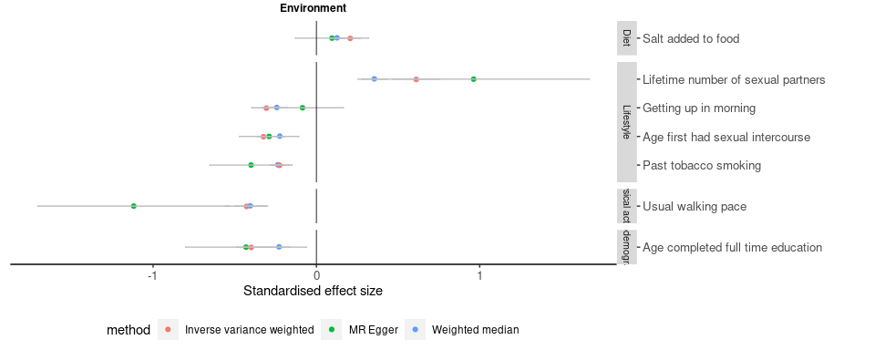
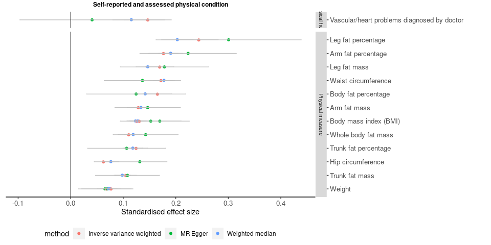
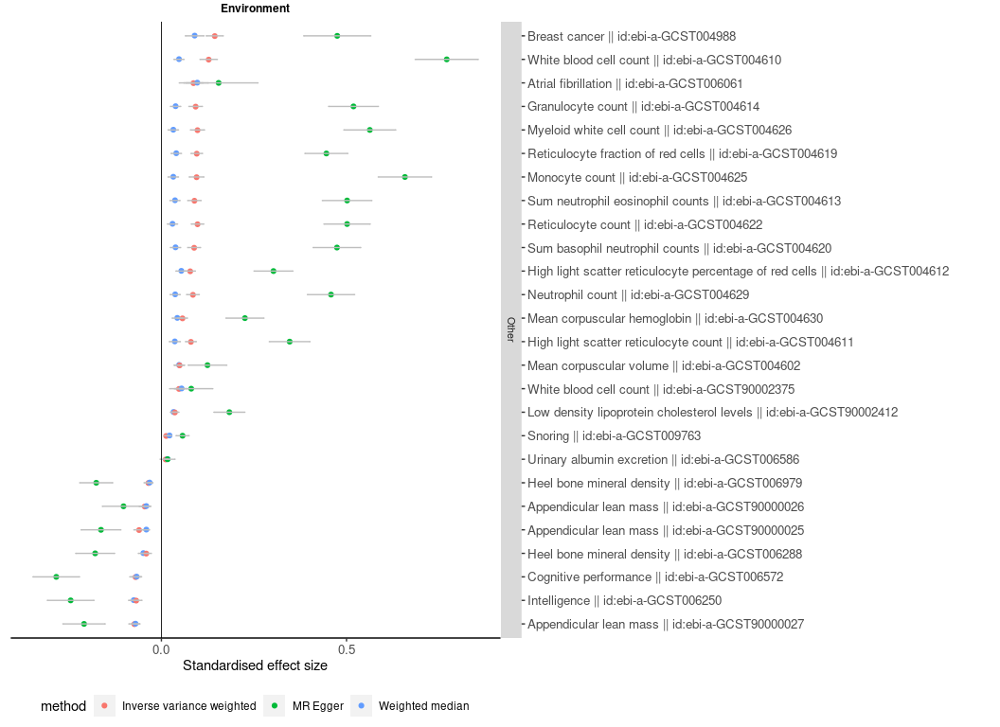
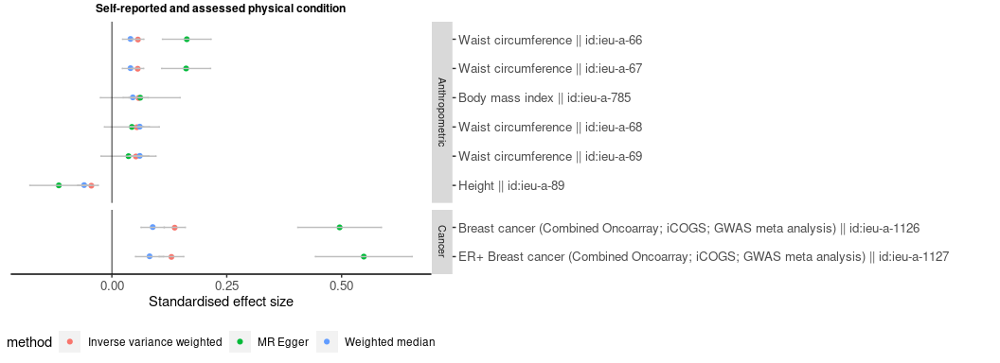
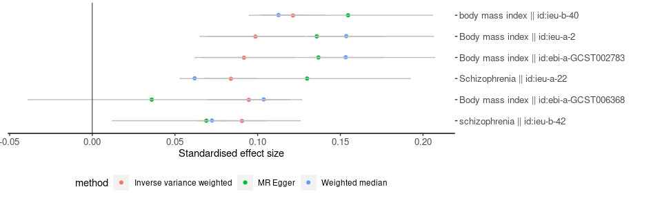

MR phewas result
================
X Shen
04 April, 2022

## ————————————————————————

## UKB MR PheWAS

### Methods

MDD GWAS:

  - noUKBB GWAS was used for MR to keep consistent with the PRS PheWAS
    analysis.

  - OR was log-transformed.

Phenotypes were selected if it satisfies all conditions below:

  - Associated with the PRS that is the most predictive of MDD CIDI

  - Not a direct measure of any mental health condition

  - With \>10 independent genetic instruments

GWAS sumstats were obtained from:

  - [The Neale lab UKB GWAS sumstas
    round 2](https://docs.google.com/spreadsheets/d/1kvPoupSzsSFBNSztMzl04xMoSC3Kcx3CrjVf4yBmESU/edit#gid=227859291)

  - [BIG40 GWAS sumstats for
    IDPs](https://open.win.ox.ac.uk/ukbiobank/big40/BIG40-IDPs_v4/IDPs.html)

  - Local GWAS using
    [regenie](https://rgcgithub.github.io/regenie/recommendations/) on
    all European participants in UKB (see details here)

  - Note: phenotypes that have two separate measures for left/right side
    of body/brain were combined in the PRS PheWAS. For consistency, GWAS
    sumstats for these traits were meta-analysed using
    [mtag](https://github.com/JonJala/mtag/wiki/Tutorial-1:-The-Basics)
    (with the –h2\_equal and –perfect\_gencov
    [flags](https://github.com/JonJala/mtag/wiki/Tutorial-2:-Special-Options)).

Details about MR analysis:

  - R package ([TwoSampleMR
    v0.5.6](https://mrcieu.github.io/TwoSampleMR/articles/index.html),
    under R v3.6.1)

  - MR methods: IVW, weighted median, MR Egger

The flow chart below shows the steps of obtaining GWAS
sumstats:

The flow chart below shows the steps of extracting instruments from GWAS
sumstats:

-----

### Results

Valid causal effects are displayed if **ALL** of the following four
criteria are met:

  - IVW: pFDR \<0.05

  - Weighted median: pFDR \< 0.05

  - MR Egger: pFDR \< 0.05 **OR** pFDR for Egger intercept \> 0.05

  - Effect sizes for all three methods in the same direction

-----

#### MDD as exposure

##### Environment

<!-- -->

##### Physical health

<!-- -->

##### Brain MRI

<!-- -->

-----

#### MDD as outcome

##### Environment

<!-- -->

##### Physical health

<!-- -->

## ————————————————————————

## MR-base PheWAS

### Methods

MDD GWAS:

  - noUKBB GWAS was used for MR to keep consistent with the UKB MR and
    PRS PheWAS analyses.

  - OR was log-transformed.

Phenotypes were selected if it satisfies all conditions below (list
available
[here](https://github.com/psychiatric-genomics-consortium/mdd-meta/blob/gsem/docs/tables/ldsc_open_mr_candidates.txt)):

  - Available in the [Open GWAS Database](https://gwas.mrcieu.ac.uk/).

  - Show significant genetic correlation with MDD

  - Low absolute gcov\_int (range from -0.024 to 0.024)

GWAS sumstats:

Extracted directly in TwoSampleMR using their unique ieu IDs. Code
available
[here](https://mrcieu.github.io/TwoSampleMR/articles/perform_mr.html#multivariable-mr-1).

Details about MR analysis:

  - R package ([TwoSampleMR
    v0.5.6](https://mrcieu.github.io/TwoSampleMR/articles/index.html),
    under R v3.6.1)

  - MR methods: IVW, weighted median, MR Egger

-----

### Results

Valid causal effects are displayed if **ALL** of the following four
criteria are met:

  - IVW: pFDR \<0.05

  - Weighted median: pFDR \< 0.05

  - MR Egger: pFDR \< 0.05 **OR** pFDR for Egger intercept \> 0.05

  - Effect sizes for all three methods in the same direction

-----

#### MDD as exposure

##### Environment and others

<!-- -->

##### Physical health

<!-- -->

-----

#### MDD as outcome

<!-- -->
