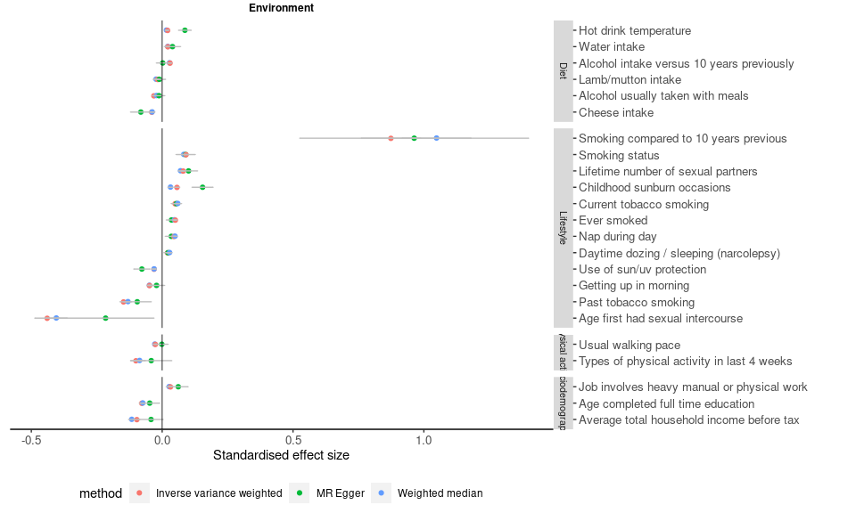

MR phewas result
================
X Shen
14 September, 2021

-----

## UKB MR PheWAS

### Methods

MDD GWAS:

  - noUKBB GWAS was used for MR to keep consistent with the PRS PheWAS
    analysis.

  - OR was log-transformed.

Phenotypes were selected if it satisfies all conditions below:

  - Associated with the PRS that is the most predictive of MDD CIDI

  - With \>10 independent genetic instruments

GWAS sumstats were obtained from:

  - [The Neale lab UKB GWAS sumstas
    round 2](https://docs.google.com/spreadsheets/d/1kvPoupSzsSFBNSztMzl04xMoSC3Kcx3CrjVf4yBmESU/edit#gid=227859291)

  - [BIG40 GWAS sumstats for
    IDPs](https://open.win.ox.ac.uk/ukbiobank/big40/BIG40-IDPs_v4/IDPs.html)

  - Local GWAS using
    [regenie](https://rgcgithub.github.io/regenie/recommendations/) on
    all European participants in UKB (see details here)

  - Note: phenotypes that have two separate measures for left/right side
    of body/brain were combined in the PRS PheWAS. For consistency, GWAS
    sumstats for these traits were meta-analysed using
    [mtag](https://github.com/JonJala/mtag/wiki/Tutorial-1:-The-Basics)
    (with the –h2\_equal and –perfect\_gencov
    [flags](https://github.com/JonJala/mtag/wiki/Tutorial-2:-Special-Options)).

Details about MR analysis:

  - R package ([TwoSampleMR
    v0.5.6](https://mrcieu.github.io/TwoSampleMR/articles/index.html),
    under R v3.6.1)

  - MR methods: IVW, weighted median, MR Egger

The flow chart below shows the steps of obtaining GWAS
sumstats:

)

The flow chart below shows the steps of extracting instruments from GWAS
sumstats:


/newline

### Results

    ## Parsed with column specification:
    ## cols(
    ##   .default = col_character(),
    ##   nsnp = col_double(),
    ##   b = col_double(),
    ##   se = col_double(),
    ##   pval = col_double(),
    ##   egger_intercept = col_double(),
    ##   egger_se = col_double(),
    ##   egger_pval = col_double(),
    ##   Q = col_double(),
    ##   Q_df = col_double(),
    ##   Q_pval = col_double()
    ## )

    ## See spec(...) for full column specifications.

Valid causal effects are displayed if **ALL** of the following four
criteria are met:

  - IVW: pFDR \<0.05

  - Weighted median: pFDR \< 0.05

  - MR Egger: pFDR \< 0.05 **OR** pFDR for Egger intercept \> 0.05

  - Effect sizes for all three methods in the same direction

<!-- end list -->

``` r
find_sig <- function(x.res,x.pheno,target.column){
  x.res = x.res %>% 
    filter(get(target.column)==x.pheno)
  sig.output = ifelse(x.res$p.fdr[x.res$method=='Inverse variance weighted']<0.05,1,0)+
    ifelse(x.res$egger_p.fdr[x.res$method=='MR Egger']>0.05,1,
           ifelse(x.res$p.fdr[x.res$method=='MR Egger']<0.05,1,0))+
    ifelse(x.res$p.fdr[x.res$method=='Weighted median']<0.05,1,0)+
    ifelse(abs(sum(sign(x.res$b)))==3,1,0)
  output = sig.output==4
  output = data.frame(pheno=unique(x.res[,target.column]),sig.output,is.valid=output)
  return(output)
}
```

#### MDD as exposure

``` r
mr.ukb.mdd_to_pheno = mr.ukb %>% filter(exposure=='MDD') %>% 
  group_by(method) %>% 
  mutate(p.fdr = p.adjust(pval,method='fdr'),
         Q_p.fdr = p.adjust(Q_pval,method='fdr'),
         egger_p.fdr = p.adjust(egger_pval,method='fdr'))
ls.sig.mdd_to_pheno = mr.ukb.mdd_to_pheno$outcome %>% unique %>% as.list %>% 
  pblapply(.,find_sig,x.res=mr.ukb.mdd_to_pheno,target.column='outcome') %>% 
  bind_rows %>% 
  filter(is.valid==T)
  
mr.sig.ukb.mdd_to_pheno = mr.ukb.mdd_to_pheno %>% 
  .[.$outcome %in% ls.sig.mdd_to_pheno$outcome,] %>% 
  as.data.frame %>% 
  select(-id.exposure,-id.outcome) 

# mr.sig.ukb.mdd_to_pheno %>%
#   kbl() %>%
#   kable_material(c("striped", "hover"))

dat.fig = mr.sig.ukb.mdd_to_pheno %>% 
  mutate(Field=label_outcome) 

dat.fig$category = dat.fig$category %>% as.list %>% 
  lapply(.,strwrap,width=25) %>% 
  lapply(.,paste0,collapse='\n') %>% 
  unlist
dat.fig$Field = dat.fig$Field %>% as.list %>% 
  lapply(.,strwrap,width=50) %>% 
  lapply(.,paste0,collapse='\n') %>% 
  unlist

figs=mr.sig.ukb.mdd_to_pheno$lv1 %>% unique %>% 
  as.list %>% 
  lapply(., beta_fig,tmp.dat.fig=dat.fig)
```

##### Environment

<!-- -->

##### Physical health

<!-- -->

##### Brain MRI

<!-- -->

#### MDD as outcome:

``` r
mr.ukb.pheno_to_mdd = mr.ukb %>% filter(outcome=='MDD',nsnp>=30) %>% 
  group_by(method) %>% 
  mutate(p.fdr = p.adjust(pval,method='fdr'),
         Q_p.fdr = p.adjust(Q_pval,method='fdr'),
         egger_p.fdr = p.adjust(egger_pval,method='fdr'))

ls.sig.pheno_to_mdd = mr.ukb.pheno_to_mdd$exposure %>% unique %>% as.list %>% 
  pblapply(.,find_sig,x.res=mr.ukb.pheno_to_mdd,target.column='exposure') %>% 
  bind_rows %>% 
  filter(is.valid==T)

mr.sig.ukb.pheno_to_mdd = mr.ukb.pheno_to_mdd %>% 
  .[.$exposure %in% ls.sig.pheno_to_mdd$exposure,] %>% 
  as.data.frame %>% 
  select(-id.exposure,-id.outcome) 

ls.sig.pheno_to_mdd %>%
  kbl() %>%
  kable_material(c("striped", "hover"))
```

<table class=" lightable-material lightable-striped lightable-hover" style='font-family: "Source Sans Pro", helvetica, sans-serif; margin-left: auto; margin-right: auto;'>

<thead>

<tr>

<th style="text-align:left;">

exposure

</th>

<th style="text-align:right;">

sig.output

</th>

<th style="text-align:left;">

is.valid

</th>

</tr>

</thead>

<tbody>

<tr>

<td style="text-align:left;">

f.1478

</td>

<td style="text-align:right;">

4

</td>

<td style="text-align:left;">

TRUE

</td>

</tr>

<tr>

<td style="text-align:left;">

f.20160

</td>

<td style="text-align:right;">

4

</td>

<td style="text-align:left;">

TRUE

</td>

</tr>

<tr>

<td style="text-align:left;">

f.21001

</td>

<td style="text-align:right;">

4

</td>

<td style="text-align:left;">

TRUE

</td>

</tr>

<tr>

<td style="text-align:left;">

f.21002

</td>

<td style="text-align:right;">

4

</td>

<td style="text-align:left;">

TRUE

</td>

</tr>

<tr>

<td style="text-align:left;">

f.2139

</td>

<td style="text-align:right;">

4

</td>

<td style="text-align:left;">

TRUE

</td>

</tr>

<tr>

<td style="text-align:left;">

f.2149

</td>

<td style="text-align:right;">

4

</td>

<td style="text-align:left;">

TRUE

</td>

</tr>

<tr>

<td style="text-align:left;">

f.23098

</td>

<td style="text-align:right;">

4

</td>

<td style="text-align:left;">

TRUE

</td>

</tr>

<tr>

<td style="text-align:left;">

f.23100

</td>

<td style="text-align:right;">

4

</td>

<td style="text-align:left;">

TRUE

</td>

</tr>

<tr>

<td style="text-align:left;">

f.23104

</td>

<td style="text-align:right;">

4

</td>

<td style="text-align:left;">

TRUE

</td>

</tr>

<tr>

<td style="text-align:left;">

f.23115.lnr

</td>

<td style="text-align:right;">

4

</td>

<td style="text-align:left;">

TRUE

</td>

</tr>

<tr>

<td style="text-align:left;">

f.23116.lnr

</td>

<td style="text-align:right;">

4

</td>

<td style="text-align:left;">

TRUE

</td>

</tr>

<tr>

<td style="text-align:left;">

f.23123.lnr

</td>

<td style="text-align:right;">

4

</td>

<td style="text-align:left;">

TRUE

</td>

</tr>

<tr>

<td style="text-align:left;">

f.23124.lnr

</td>

<td style="text-align:right;">

4

</td>

<td style="text-align:left;">

TRUE

</td>

</tr>

<tr>

<td style="text-align:left;">

f.23127

</td>

<td style="text-align:right;">

4

</td>

<td style="text-align:left;">

TRUE

</td>

</tr>

<tr>

<td style="text-align:left;">

f.23128

</td>

<td style="text-align:right;">

4

</td>

<td style="text-align:left;">

TRUE

</td>

</tr>

<tr>

<td style="text-align:left;">

f.30650

</td>

<td style="text-align:right;">

4

</td>

<td style="text-align:left;">

TRUE

</td>

</tr>

<tr>

<td style="text-align:left;">

f.48

</td>

<td style="text-align:right;">

4

</td>

<td style="text-align:left;">

TRUE

</td>

</tr>

<tr>

<td style="text-align:left;">

f.49

</td>

<td style="text-align:right;">

4

</td>

<td style="text-align:left;">

TRUE

</td>

</tr>

<tr>

<td style="text-align:left;">

f.6150

</td>

<td style="text-align:right;">

4

</td>

<td style="text-align:left;">

TRUE

</td>

</tr>

<tr>

<td style="text-align:left;">

f.845

</td>

<td style="text-align:right;">

4

</td>

<td style="text-align:left;">

TRUE

</td>

</tr>

</tbody>

</table>

-----

## MR-base PheWAS

### Methods

MDD GWAS:

  - noUKBB GWAS was used for MR to keep consistent with the UKB MR and
    PRS PheWAS analyses.

  - OR was log-transformed.

Phenotypes were selected if it satisfies all conditions below (list
available
[here](https://github.com/psychiatric-genomics-consortium/mdd-meta/blob/gsem/docs/tables/ldsc_open_mr_candidates.txt)):

  - Available in the [Open GWAS Database](https://gwas.mrcieu.ac.uk/).

  - Show significant genetic correlation with MDD

  - Low absolute gcov\_int (range from -0.024 to 0.024)

GWAS sumstats:

Extracted directly in TwoSampleMR using their unique ieu IDs. Code
available
[here](https://mrcieu.github.io/TwoSampleMR/articles/perform_mr.html#multivariable-mr-1).

Details about MR analysis:

  - R package ([TwoSampleMR
    v0.5.6](https://mrcieu.github.io/TwoSampleMR/articles/index.html),
    under R v3.6.1)

  - MR methods: IVW, weighted median, MR Egger

### Results

    ## Parsed with column specification:
    ## cols(
    ##   .default = col_double(),
    ##   id.exposure = col_character(),
    ##   id.outcome = col_character(),
    ##   outcome = col_character(),
    ##   exposure = col_character(),
    ##   method = col_character(),
    ##   trait = col_character(),
    ##   subcategory = col_character()
    ## )

    ## See spec(...) for full column specifications.

Valid causal effects are displayed if **ALL** of the following four
criteria are met:

  - IVW: pFDR \<0.05

  - Weighted median: pFDR \< 0.05

  - MR Egger: pFDR \< 0.05 **OR** pFDR for Egger intercept \> 0.05

  - Effect sizes for all three methods in the same direction

#### MDD as exposure:

``` r
mr.mr_base.mdd_to_pheno = mr.mr_base %>% filter(exposure=='MDD') %>% 
  group_by(method) %>% 
  mutate(p.fdr = p.adjust(pval,method='fdr'),
         Q_p.fdr = p.adjust(Q_pval,method='fdr'),
         egger_p.fdr = p.adjust(egger_pval,method='fdr'))
ls.sig.mdd_to_pheno = mr.mr_base.mdd_to_pheno$outcome %>% 
  unique %>% as.list %>% 
  pblapply(.,find_sig,x.res=mr.mr_base.mdd_to_pheno,
           target.column='outcome') %>% 
  bind_rows %>% 
  filter(is.valid==T)
  
mr.sig.mr_base.mdd_to_pheno = mr.mr_base.mdd_to_pheno %>% 
  .[.$outcome %in% ls.sig.mdd_to_pheno$outcome,] %>% 
  as.data.frame %>% 
  select(-id.exposure,-id.outcome) 

mr.sig.mr_base.mdd_to_pheno %>%
  kbl() %>%
  kable_material(c("striped", "hover"))
```

<table class=" lightable-material lightable-striped lightable-hover" style='font-family: "Source Sans Pro", helvetica, sans-serif; margin-left: auto; margin-right: auto;'>

<thead>

<tr>

<th style="text-align:left;">

outcome

</th>

<th style="text-align:left;">

exposure

</th>

<th style="text-align:left;">

method

</th>

<th style="text-align:right;">

nsnp

</th>

<th style="text-align:right;">

b

</th>

<th style="text-align:right;">

se

</th>

<th style="text-align:right;">

pval

</th>

<th style="text-align:right;">

egger\_intercept

</th>

<th style="text-align:right;">

egger\_se

</th>

<th style="text-align:right;">

egger\_pval

</th>

<th style="text-align:right;">

Q

</th>

<th style="text-align:right;">

Q\_df

</th>

<th style="text-align:right;">

Q\_pval

</th>

<th style="text-align:left;">

trait

</th>

<th style="text-align:right;">

rg

</th>

<th style="text-align:right;">

rg\_p

</th>

<th style="text-align:right;">

rg\_qval

</th>

<th style="text-align:right;">

gcov\_int

</th>

<th style="text-align:left;">

subcategory

</th>

<th style="text-align:right;">

p.fdr

</th>

<th style="text-align:right;">

Q\_p.fdr

</th>

<th style="text-align:right;">

egger\_p.fdr

</th>

</tr>

</thead>

<tbody>

<tr>

<td style="text-align:left;">

Mean corpuscular volume || id:ebi-a-GCST004602

</td>

<td style="text-align:left;">

MDD

</td>

<td style="text-align:left;">

Inverse variance weighted

</td>

<td style="text-align:right;">

517

</td>

<td style="text-align:right;">

0.0491776

</td>

<td style="text-align:right;">

0.0134760

</td>

<td style="text-align:right;">

0.0002630

</td>

<td style="text-align:right;">

\-0.0016394

</td>

<td style="text-align:right;">

0.0010924

</td>

<td style="text-align:right;">

0.1340403

</td>

<td style="text-align:right;">

1295.1747

</td>

<td style="text-align:right;">

516

</td>

<td style="text-align:right;">

0.0000000

</td>

<td style="text-align:left;">

Mean corpuscular volume

</td>

<td style="text-align:right;">

0.0335

</td>

<td style="text-align:right;">

1.71e-02

</td>

<td style="text-align:right;">

0.0105114

</td>

<td style="text-align:right;">

0.0009

</td>

<td style="text-align:left;">

NA

</td>

<td style="text-align:right;">

0.0004219

</td>

<td style="text-align:right;">

0.0000000

</td>

<td style="text-align:right;">

0.2401556

</td>

</tr>

<tr>

<td style="text-align:left;">

Mean corpuscular volume || id:ebi-a-GCST004602

</td>

<td style="text-align:left;">

MDD

</td>

<td style="text-align:left;">

MR Egger

</td>

<td style="text-align:right;">

517

</td>

<td style="text-align:right;">

0.1244283

</td>

<td style="text-align:right;">

0.0519180

</td>

<td style="text-align:right;">

0.0169022

</td>

<td style="text-align:right;">

\-0.0016394

</td>

<td style="text-align:right;">

0.0010924

</td>

<td style="text-align:right;">

0.1340403

</td>

<td style="text-align:right;">

1295.1747

</td>

<td style="text-align:right;">

516

</td>

<td style="text-align:right;">

0.0000000

</td>

<td style="text-align:left;">

Mean corpuscular volume

</td>

<td style="text-align:right;">

0.0335

</td>

<td style="text-align:right;">

1.71e-02

</td>

<td style="text-align:right;">

0.0105114

</td>

<td style="text-align:right;">

0.0009

</td>

<td style="text-align:left;">

NA

</td>

<td style="text-align:right;">

0.0386592

</td>

<td style="text-align:right;">

0.0000000

</td>

<td style="text-align:right;">

0.2401556

</td>

</tr>

<tr>

<td style="text-align:left;">

Mean corpuscular volume || id:ebi-a-GCST004602

</td>

<td style="text-align:left;">

MDD

</td>

<td style="text-align:left;">

Weighted median

</td>

<td style="text-align:right;">

517

</td>

<td style="text-align:right;">

0.0478375

</td>

<td style="text-align:right;">

0.0134051

</td>

<td style="text-align:right;">

0.0003589

</td>

<td style="text-align:right;">

\-0.0016394

</td>

<td style="text-align:right;">

0.0010924

</td>

<td style="text-align:right;">

0.1340403

</td>

<td style="text-align:right;">

1295.1747

</td>

<td style="text-align:right;">

516

</td>

<td style="text-align:right;">

0.0000000

</td>

<td style="text-align:left;">

Mean corpuscular volume

</td>

<td style="text-align:right;">

0.0335

</td>

<td style="text-align:right;">

1.71e-02

</td>

<td style="text-align:right;">

0.0105114

</td>

<td style="text-align:right;">

0.0009

</td>

<td style="text-align:left;">

NA

</td>

<td style="text-align:right;">

0.0009186

</td>

<td style="text-align:right;">

0.0000000

</td>

<td style="text-align:right;">

0.2401556

</td>

</tr>

<tr>

<td style="text-align:left;">

White blood cell count || id:ebi-a-GCST004610

</td>

<td style="text-align:left;">

MDD

</td>

<td style="text-align:left;">

Inverse variance weighted

</td>

<td style="text-align:right;">

517

</td>

<td style="text-align:right;">

0.1276854

</td>

<td style="text-align:right;">

0.0232973

</td>

<td style="text-align:right;">

0.0000000

</td>

<td style="text-align:right;">

\-0.0140090

</td>

<td style="text-align:right;">

0.0017900

</td>

<td style="text-align:right;">

0.0000000

</td>

<td style="text-align:right;">

3751.3973

</td>

<td style="text-align:right;">

516

</td>

<td style="text-align:right;">

0.0000000

</td>

<td style="text-align:left;">

White blood cell count

</td>

<td style="text-align:right;">

0.0440

</td>

<td style="text-align:right;">

4.40e-03

</td>

<td style="text-align:right;">

0.0030467

</td>

<td style="text-align:right;">

\-0.0037

</td>

<td style="text-align:left;">

NA

</td>

<td style="text-align:right;">

0.0000002

</td>

<td style="text-align:right;">

0.0000000

</td>

<td style="text-align:right;">

0.0000000

</td>

</tr>

<tr>

<td style="text-align:left;">

White blood cell count || id:ebi-a-GCST004610

</td>

<td style="text-align:left;">

MDD

</td>

<td style="text-align:left;">

MR Egger

</td>

<td style="text-align:right;">

517

</td>

<td style="text-align:right;">

0.7707901

</td>

<td style="text-align:right;">

0.0850783

</td>

<td style="text-align:right;">

0.0000000

</td>

<td style="text-align:right;">

\-0.0140090

</td>

<td style="text-align:right;">

0.0017900

</td>

<td style="text-align:right;">

0.0000000

</td>

<td style="text-align:right;">

3751.3973

</td>

<td style="text-align:right;">

516

</td>

<td style="text-align:right;">

0.0000000

</td>

<td style="text-align:left;">

White blood cell count

</td>

<td style="text-align:right;">

0.0440

</td>

<td style="text-align:right;">

4.40e-03

</td>

<td style="text-align:right;">

0.0030467

</td>

<td style="text-align:right;">

\-0.0037

</td>

<td style="text-align:left;">

NA

</td>

<td style="text-align:right;">

0.0000000

</td>

<td style="text-align:right;">

0.0000000

</td>

<td style="text-align:right;">

0.0000000

</td>

</tr>

<tr>

<td style="text-align:left;">

White blood cell count || id:ebi-a-GCST004610

</td>

<td style="text-align:left;">

MDD

</td>

<td style="text-align:left;">

Weighted median

</td>

<td style="text-align:right;">

517

</td>

<td style="text-align:right;">

0.0475603

</td>

<td style="text-align:right;">

0.0135664

</td>

<td style="text-align:right;">

0.0004554

</td>

<td style="text-align:right;">

\-0.0140090

</td>

<td style="text-align:right;">

0.0017900

</td>

<td style="text-align:right;">

0.0000000

</td>

<td style="text-align:right;">

3751.3973

</td>

<td style="text-align:right;">

516

</td>

<td style="text-align:right;">

0.0000000

</td>

<td style="text-align:left;">

White blood cell count

</td>

<td style="text-align:right;">

0.0440

</td>

<td style="text-align:right;">

4.40e-03

</td>

<td style="text-align:right;">

0.0030467

</td>

<td style="text-align:right;">

\-0.0037

</td>

<td style="text-align:left;">

NA

</td>

<td style="text-align:right;">

0.0011125

</td>

<td style="text-align:right;">

0.0000000

</td>

<td style="text-align:right;">

0.0000000

</td>

</tr>

<tr>

<td style="text-align:left;">

High light scatter reticulocyte count || id:ebi-a-GCST004611

</td>

<td style="text-align:left;">

MDD

</td>

<td style="text-align:left;">

Inverse variance weighted

</td>

<td style="text-align:right;">

517

</td>

<td style="text-align:right;">

0.0796888

</td>

<td style="text-align:right;">

0.0145205

</td>

<td style="text-align:right;">

0.0000000

</td>

<td style="text-align:right;">

\-0.0058110

</td>

<td style="text-align:right;">

0.0011520

</td>

<td style="text-align:right;">

0.0000006

</td>

<td style="text-align:right;">

1456.6998

</td>

<td style="text-align:right;">

516

</td>

<td style="text-align:right;">

0.0000000

</td>

<td style="text-align:left;">

High light scatter reticulocyte count

</td>

<td style="text-align:right;">

0.0407

</td>

<td style="text-align:right;">

7.90e-03

</td>

<td style="text-align:right;">

0.0050915

</td>

<td style="text-align:right;">

0.0035

</td>

<td style="text-align:left;">

NA

</td>

<td style="text-align:right;">

0.0000002

</td>

<td style="text-align:right;">

0.0000000

</td>

<td style="text-align:right;">

0.0000059

</td>

</tr>

<tr>

<td style="text-align:left;">

High light scatter reticulocyte count || id:ebi-a-GCST004611

</td>

<td style="text-align:left;">

MDD

</td>

<td style="text-align:left;">

MR Egger

</td>

<td style="text-align:right;">

517

</td>

<td style="text-align:right;">

0.3464481

</td>

<td style="text-align:right;">

0.0547546

</td>

<td style="text-align:right;">

0.0000000

</td>

<td style="text-align:right;">

\-0.0058110

</td>

<td style="text-align:right;">

0.0011520

</td>

<td style="text-align:right;">

0.0000006

</td>

<td style="text-align:right;">

1456.6998

</td>

<td style="text-align:right;">

516

</td>

<td style="text-align:right;">

0.0000000

</td>

<td style="text-align:left;">

High light scatter reticulocyte count

</td>

<td style="text-align:right;">

0.0407

</td>

<td style="text-align:right;">

7.90e-03

</td>

<td style="text-align:right;">

0.0050915

</td>

<td style="text-align:right;">

0.0035

</td>

<td style="text-align:left;">

NA

</td>

<td style="text-align:right;">

0.0000000

</td>

<td style="text-align:right;">

0.0000000

</td>

<td style="text-align:right;">

0.0000059

</td>

</tr>

<tr>

<td style="text-align:left;">

High light scatter reticulocyte count || id:ebi-a-GCST004611

</td>

<td style="text-align:left;">

MDD

</td>

<td style="text-align:left;">

Weighted median

</td>

<td style="text-align:right;">

517

</td>

<td style="text-align:right;">

0.0361862

</td>

<td style="text-align:right;">

0.0148670

</td>

<td style="text-align:right;">

0.0149330

</td>

<td style="text-align:right;">

\-0.0058110

</td>

<td style="text-align:right;">

0.0011520

</td>

<td style="text-align:right;">

0.0000006

</td>

<td style="text-align:right;">

1456.6998

</td>

<td style="text-align:right;">

516

</td>

<td style="text-align:right;">

0.0000000

</td>

<td style="text-align:left;">

High light scatter reticulocyte count

</td>

<td style="text-align:right;">

0.0407

</td>

<td style="text-align:right;">

7.90e-03

</td>

<td style="text-align:right;">

0.0050915

</td>

<td style="text-align:right;">

0.0035

</td>

<td style="text-align:left;">

NA

</td>

<td style="text-align:right;">

0.0227702

</td>

<td style="text-align:right;">

0.0000000

</td>

<td style="text-align:right;">

0.0000059

</td>

</tr>

<tr>

<td style="text-align:left;">

High light scatter reticulocyte percentage of red cells ||
id:ebi-a-GCST004612

</td>

<td style="text-align:left;">

MDD

</td>

<td style="text-align:left;">

Inverse variance weighted

</td>

<td style="text-align:right;">

517

</td>

<td style="text-align:right;">

0.0778150

</td>

<td style="text-align:right;">

0.0137891

</td>

<td style="text-align:right;">

0.0000000

</td>

<td style="text-align:right;">

\-0.0048991

</td>

<td style="text-align:right;">

0.0010997

</td>

<td style="text-align:right;">

0.0000103

</td>

<td style="text-align:right;">

1313.7141

</td>

<td style="text-align:right;">

516

</td>

<td style="text-align:right;">

0.0000000

</td>

<td style="text-align:left;">

High light scatter reticulocyte percentage of red cells

</td>

<td style="text-align:right;">

0.0489

</td>

<td style="text-align:right;">

1.20e-03

</td>

<td style="text-align:right;">

0.0009748

</td>

<td style="text-align:right;">

0.0038

</td>

<td style="text-align:left;">

NA

</td>

<td style="text-align:right;">

0.0000001

</td>

<td style="text-align:right;">

0.0000000

</td>

<td style="text-align:right;">

0.0000583

</td>

</tr>

<tr>

<td style="text-align:left;">

High light scatter reticulocyte percentage of red cells ||
id:ebi-a-GCST004612

</td>

<td style="text-align:left;">

MDD

</td>

<td style="text-align:left;">

MR Egger

</td>

<td style="text-align:right;">

517

</td>

<td style="text-align:right;">

0.3027109

</td>

<td style="text-align:right;">

0.0522681

</td>

<td style="text-align:right;">

0.0000000

</td>

<td style="text-align:right;">

\-0.0048991

</td>

<td style="text-align:right;">

0.0010997

</td>

<td style="text-align:right;">

0.0000103

</td>

<td style="text-align:right;">

1313.7141

</td>

<td style="text-align:right;">

516

</td>

<td style="text-align:right;">

0.0000000

</td>

<td style="text-align:left;">

High light scatter reticulocyte percentage of red cells

</td>

<td style="text-align:right;">

0.0489

</td>

<td style="text-align:right;">

1.20e-03

</td>

<td style="text-align:right;">

0.0009748

</td>

<td style="text-align:right;">

0.0038

</td>

<td style="text-align:left;">

NA

</td>

<td style="text-align:right;">

0.0000001

</td>

<td style="text-align:right;">

0.0000000

</td>

<td style="text-align:right;">

0.0000583

</td>

</tr>

<tr>

<td style="text-align:left;">

High light scatter reticulocyte percentage of red cells ||
id:ebi-a-GCST004612

</td>

<td style="text-align:left;">

MDD

</td>

<td style="text-align:left;">

Weighted median

</td>

<td style="text-align:right;">

517

</td>

<td style="text-align:right;">

0.0538067

</td>

<td style="text-align:right;">

0.0144298

</td>

<td style="text-align:right;">

0.0001923

</td>

<td style="text-align:right;">

\-0.0048991

</td>

<td style="text-align:right;">

0.0010997

</td>

<td style="text-align:right;">

0.0000103

</td>

<td style="text-align:right;">

1313.7141

</td>

<td style="text-align:right;">

516

</td>

<td style="text-align:right;">

0.0000000

</td>

<td style="text-align:left;">

High light scatter reticulocyte percentage of red cells

</td>

<td style="text-align:right;">

0.0489

</td>

<td style="text-align:right;">

1.20e-03

</td>

<td style="text-align:right;">

0.0009748

</td>

<td style="text-align:right;">

0.0038

</td>

<td style="text-align:left;">

NA

</td>

<td style="text-align:right;">

0.0005302

</td>

<td style="text-align:right;">

0.0000000

</td>

<td style="text-align:right;">

0.0000583

</td>

</tr>

<tr>

<td style="text-align:left;">

Sum neutrophil eosinophil counts || id:ebi-a-GCST004613

</td>

<td style="text-align:left;">

MDD

</td>

<td style="text-align:left;">

Inverse variance weighted

</td>

<td style="text-align:right;">

517

</td>

<td style="text-align:right;">

0.0892134

</td>

<td style="text-align:right;">

0.0179295

</td>

<td style="text-align:right;">

0.0000006

</td>

<td style="text-align:right;">

\-0.0089835

</td>

<td style="text-align:right;">

0.0014024

</td>

<td style="text-align:right;">

0.0000000

</td>

<td style="text-align:right;">

2221.7049

</td>

<td style="text-align:right;">

516

</td>

<td style="text-align:right;">

0.0000000

</td>

<td style="text-align:left;">

Sum neutrophil eosinophil counts

</td>

<td style="text-align:right;">

0.0462

</td>

<td style="text-align:right;">

3.40e-03

</td>

<td style="text-align:right;">

0.0024437

</td>

<td style="text-align:right;">

\-0.0045

</td>

<td style="text-align:left;">

NA

</td>

<td style="text-align:right;">

0.0000017

</td>

<td style="text-align:right;">

0.0000000

</td>

<td style="text-align:right;">

0.0000000

</td>

</tr>

<tr>

<td style="text-align:left;">

Sum neutrophil eosinophil counts || id:ebi-a-GCST004613

</td>

<td style="text-align:left;">

MDD

</td>

<td style="text-align:left;">

MR Egger

</td>

<td style="text-align:right;">

517

</td>

<td style="text-align:right;">

0.5016099

</td>

<td style="text-align:right;">

0.0666556

</td>

<td style="text-align:right;">

0.0000000

</td>

<td style="text-align:right;">

\-0.0089835

</td>

<td style="text-align:right;">

0.0014024

</td>

<td style="text-align:right;">

0.0000000

</td>

<td style="text-align:right;">

2221.7049

</td>

<td style="text-align:right;">

516

</td>

<td style="text-align:right;">

0.0000000

</td>

<td style="text-align:left;">

Sum neutrophil eosinophil counts

</td>

<td style="text-align:right;">

0.0462

</td>

<td style="text-align:right;">

3.40e-03

</td>

<td style="text-align:right;">

0.0024437

</td>

<td style="text-align:right;">

\-0.0045

</td>

<td style="text-align:left;">

NA

</td>

<td style="text-align:right;">

0.0000000

</td>

<td style="text-align:right;">

0.0000000

</td>

<td style="text-align:right;">

0.0000000

</td>

</tr>

<tr>

<td style="text-align:left;">

Sum neutrophil eosinophil counts || id:ebi-a-GCST004613

</td>

<td style="text-align:left;">

MDD

</td>

<td style="text-align:left;">

Weighted median

</td>

<td style="text-align:right;">

517

</td>

<td style="text-align:right;">

0.0367445

</td>

<td style="text-align:right;">

0.0135323

</td>

<td style="text-align:right;">

0.0066213

</td>

<td style="text-align:right;">

\-0.0089835

</td>

<td style="text-align:right;">

0.0014024

</td>

<td style="text-align:right;">

0.0000000

</td>

<td style="text-align:right;">

2221.7049

</td>

<td style="text-align:right;">

516

</td>

<td style="text-align:right;">

0.0000000

</td>

<td style="text-align:left;">

Sum neutrophil eosinophil counts

</td>

<td style="text-align:right;">

0.0462

</td>

<td style="text-align:right;">

3.40e-03

</td>

<td style="text-align:right;">

0.0024437

</td>

<td style="text-align:right;">

\-0.0045

</td>

<td style="text-align:left;">

NA

</td>

<td style="text-align:right;">

0.0116686

</td>

<td style="text-align:right;">

0.0000000

</td>

<td style="text-align:right;">

0.0000000

</td>

</tr>

<tr>

<td style="text-align:left;">

Granulocyte count || id:ebi-a-GCST004614

</td>

<td style="text-align:left;">

MDD

</td>

<td style="text-align:left;">

Inverse variance weighted

</td>

<td style="text-align:right;">

517

</td>

<td style="text-align:right;">

0.0924813

</td>

<td style="text-align:right;">

0.0181004

</td>

<td style="text-align:right;">

0.0000003

</td>

<td style="text-align:right;">

\-0.0092886

</td>

<td style="text-align:right;">

0.0014130

</td>

<td style="text-align:right;">

0.0000000

</td>

<td style="text-align:right;">

2256.9702

</td>

<td style="text-align:right;">

516

</td>

<td style="text-align:right;">

0.0000000

</td>

<td style="text-align:left;">

Granulocyte count

</td>

<td style="text-align:right;">

0.0466

</td>

<td style="text-align:right;">

3.20e-03

</td>

<td style="text-align:right;">

0.0023214

</td>

<td style="text-align:right;">

\-0.0043

</td>

<td style="text-align:left;">

NA

</td>

<td style="text-align:right;">

0.0000009

</td>

<td style="text-align:right;">

0.0000000

</td>

<td style="text-align:right;">

0.0000000

</td>

</tr>

<tr>

<td style="text-align:left;">

Granulocyte count || id:ebi-a-GCST004614

</td>

<td style="text-align:left;">

MDD

</td>

<td style="text-align:left;">

MR Egger

</td>

<td style="text-align:right;">

517

</td>

<td style="text-align:right;">

0.5188828

</td>

<td style="text-align:right;">

0.0671576

</td>

<td style="text-align:right;">

0.0000000

</td>

<td style="text-align:right;">

\-0.0092886

</td>

<td style="text-align:right;">

0.0014130

</td>

<td style="text-align:right;">

0.0000000

</td>

<td style="text-align:right;">

2256.9702

</td>

<td style="text-align:right;">

516

</td>

<td style="text-align:right;">

0.0000000

</td>

<td style="text-align:left;">

Granulocyte count

</td>

<td style="text-align:right;">

0.0466

</td>

<td style="text-align:right;">

3.20e-03

</td>

<td style="text-align:right;">

0.0023214

</td>

<td style="text-align:right;">

\-0.0043

</td>

<td style="text-align:left;">

NA

</td>

<td style="text-align:right;">

0.0000000

</td>

<td style="text-align:right;">

0.0000000

</td>

<td style="text-align:right;">

0.0000000

</td>

</tr>

<tr>

<td style="text-align:left;">

Granulocyte count || id:ebi-a-GCST004614

</td>

<td style="text-align:left;">

MDD

</td>

<td style="text-align:left;">

Weighted median

</td>

<td style="text-align:right;">

517

</td>

<td style="text-align:right;">

0.0383525

</td>

<td style="text-align:right;">

0.0138219

</td>

<td style="text-align:right;">

0.0055242

</td>

<td style="text-align:right;">

\-0.0092886

</td>

<td style="text-align:right;">

0.0014130

</td>

<td style="text-align:right;">

0.0000000

</td>

<td style="text-align:right;">

2256.9702

</td>

<td style="text-align:right;">

516

</td>

<td style="text-align:right;">

0.0000000

</td>

<td style="text-align:left;">

Granulocyte count

</td>

<td style="text-align:right;">

0.0466

</td>

<td style="text-align:right;">

3.20e-03

</td>

<td style="text-align:right;">

0.0023214

</td>

<td style="text-align:right;">

\-0.0043

</td>

<td style="text-align:left;">

NA

</td>

<td style="text-align:right;">

0.0100653

</td>

<td style="text-align:right;">

0.0000000

</td>

<td style="text-align:right;">

0.0000000

</td>

</tr>

<tr>

<td style="text-align:left;">

Reticulocyte fraction of red cells || id:ebi-a-GCST004619

</td>

<td style="text-align:left;">

MDD

</td>

<td style="text-align:left;">

Inverse variance weighted

</td>

<td style="text-align:right;">

517

</td>

<td style="text-align:right;">

0.0955049

</td>

<td style="text-align:right;">

0.0155546

</td>

<td style="text-align:right;">

0.0000000

</td>

<td style="text-align:right;">

\-0.0076266

</td>

<td style="text-align:right;">

0.0012187

</td>

<td style="text-align:right;">

0.0000000

</td>

<td style="text-align:right;">

1667.9278

</td>

<td style="text-align:right;">

516

</td>

<td style="text-align:right;">

0.0000000

</td>

<td style="text-align:left;">

Reticulocyte fraction of red cells

</td>

<td style="text-align:right;">

0.0433

</td>

<td style="text-align:right;">

3.00e-03

</td>

<td style="text-align:right;">

0.0021967

</td>

<td style="text-align:right;">

0.0017

</td>

<td style="text-align:left;">

NA

</td>

<td style="text-align:right;">

0.0000000

</td>

<td style="text-align:right;">

0.0000000

</td>

<td style="text-align:right;">

0.0000000

</td>

</tr>

<tr>

<td style="text-align:left;">

Reticulocyte fraction of red cells || id:ebi-a-GCST004619

</td>

<td style="text-align:left;">

MDD

</td>

<td style="text-align:left;">

MR Egger

</td>

<td style="text-align:right;">

517

</td>

<td style="text-align:right;">

0.4456112

</td>

<td style="text-align:right;">

0.0579239

</td>

<td style="text-align:right;">

0.0000000

</td>

<td style="text-align:right;">

\-0.0076266

</td>

<td style="text-align:right;">

0.0012187

</td>

<td style="text-align:right;">

0.0000000

</td>

<td style="text-align:right;">

1667.9278

</td>

<td style="text-align:right;">

516

</td>

<td style="text-align:right;">

0.0000000

</td>

<td style="text-align:left;">

Reticulocyte fraction of red cells

</td>

<td style="text-align:right;">

0.0433

</td>

<td style="text-align:right;">

3.00e-03

</td>

<td style="text-align:right;">

0.0021967

</td>

<td style="text-align:right;">

0.0017

</td>

<td style="text-align:left;">

NA

</td>

<td style="text-align:right;">

0.0000000

</td>

<td style="text-align:right;">

0.0000000

</td>

<td style="text-align:right;">

0.0000000

</td>

</tr>

<tr>

<td style="text-align:left;">

Reticulocyte fraction of red cells || id:ebi-a-GCST004619

</td>

<td style="text-align:left;">

MDD

</td>

<td style="text-align:left;">

Weighted median

</td>

<td style="text-align:right;">

517

</td>

<td style="text-align:right;">

0.0401278

</td>

<td style="text-align:right;">

0.0139266

</td>

<td style="text-align:right;">

0.0039594

</td>

<td style="text-align:right;">

\-0.0076266

</td>

<td style="text-align:right;">

0.0012187

</td>

<td style="text-align:right;">

0.0000000

</td>

<td style="text-align:right;">

1667.9278

</td>

<td style="text-align:right;">

516

</td>

<td style="text-align:right;">

0.0000000

</td>

<td style="text-align:left;">

Reticulocyte fraction of red cells

</td>

<td style="text-align:right;">

0.0433

</td>

<td style="text-align:right;">

3.00e-03

</td>

<td style="text-align:right;">

0.0021967

</td>

<td style="text-align:right;">

0.0017

</td>

<td style="text-align:left;">

NA

</td>

<td style="text-align:right;">

0.0072758

</td>

<td style="text-align:right;">

0.0000000

</td>

<td style="text-align:right;">

0.0000000

</td>

</tr>

<tr>

<td style="text-align:left;">

Sum basophil neutrophil counts || id:ebi-a-GCST004620

</td>

<td style="text-align:left;">

MDD

</td>

<td style="text-align:left;">

Inverse variance weighted

</td>

<td style="text-align:right;">

517

</td>

<td style="text-align:right;">

0.0884359

</td>

<td style="text-align:right;">

0.0172305

</td>

<td style="text-align:right;">

0.0000003

</td>

<td style="text-align:right;">

\-0.0084043

</td>

<td style="text-align:right;">

0.0013505

</td>

<td style="text-align:right;">

0.0000000

</td>

<td style="text-align:right;">

2048.3980

</td>

<td style="text-align:right;">

516

</td>

<td style="text-align:right;">

0.0000000

</td>

<td style="text-align:left;">

Sum basophil neutrophil counts

</td>

<td style="text-align:right;">

0.0514

</td>

<td style="text-align:right;">

1.20e-03

</td>

<td style="text-align:right;">

0.0009748

</td>

<td style="text-align:right;">

\-0.0058

</td>

<td style="text-align:left;">

NA

</td>

<td style="text-align:right;">

0.0000008

</td>

<td style="text-align:right;">

0.0000000

</td>

<td style="text-align:right;">

0.0000000

</td>

</tr>

<tr>

<td style="text-align:left;">

Sum basophil neutrophil counts || id:ebi-a-GCST004620

</td>

<td style="text-align:left;">

MDD

</td>

<td style="text-align:left;">

MR Egger

</td>

<td style="text-align:right;">

517

</td>

<td style="text-align:right;">

0.4742427

</td>

<td style="text-align:right;">

0.0641880

</td>

<td style="text-align:right;">

0.0000000

</td>

<td style="text-align:right;">

\-0.0084043

</td>

<td style="text-align:right;">

0.0013505

</td>

<td style="text-align:right;">

0.0000000

</td>

<td style="text-align:right;">

2048.3980

</td>

<td style="text-align:right;">

516

</td>

<td style="text-align:right;">

0.0000000

</td>

<td style="text-align:left;">

Sum basophil neutrophil counts

</td>

<td style="text-align:right;">

0.0514

</td>

<td style="text-align:right;">

1.20e-03

</td>

<td style="text-align:right;">

0.0009748

</td>

<td style="text-align:right;">

\-0.0058

</td>

<td style="text-align:left;">

NA

</td>

<td style="text-align:right;">

0.0000000

</td>

<td style="text-align:right;">

0.0000000

</td>

<td style="text-align:right;">

0.0000000

</td>

</tr>

<tr>

<td style="text-align:left;">

Sum basophil neutrophil counts || id:ebi-a-GCST004620

</td>

<td style="text-align:left;">

MDD

</td>

<td style="text-align:left;">

Weighted median

</td>

<td style="text-align:right;">

517

</td>

<td style="text-align:right;">

0.0381350

</td>

<td style="text-align:right;">

0.0137875

</td>

<td style="text-align:right;">

0.0056762

</td>

<td style="text-align:right;">

\-0.0084043

</td>

<td style="text-align:right;">

0.0013505

</td>

<td style="text-align:right;">

0.0000000

</td>

<td style="text-align:right;">

2048.3980

</td>

<td style="text-align:right;">

516

</td>

<td style="text-align:right;">

0.0000000

</td>

<td style="text-align:left;">

Sum basophil neutrophil counts

</td>

<td style="text-align:right;">

0.0514

</td>

<td style="text-align:right;">

1.20e-03

</td>

<td style="text-align:right;">

0.0009748

</td>

<td style="text-align:right;">

\-0.0058

</td>

<td style="text-align:left;">

NA

</td>

<td style="text-align:right;">

0.0102553

</td>

<td style="text-align:right;">

0.0000000

</td>

<td style="text-align:right;">

0.0000000

</td>

</tr>

<tr>

<td style="text-align:left;">

Reticulocyte count || id:ebi-a-GCST004622

</td>

<td style="text-align:left;">

MDD

</td>

<td style="text-align:left;">

Inverse variance weighted

</td>

<td style="text-align:right;">

517

</td>

<td style="text-align:right;">

0.0975513

</td>

<td style="text-align:right;">

0.0168352

</td>

<td style="text-align:right;">

0.0000000

</td>

<td style="text-align:right;">

\-0.0088015

</td>

<td style="text-align:right;">

0.0013122

</td>

<td style="text-align:right;">

0.0000000

</td>

<td style="text-align:right;">

1951.6158

</td>

<td style="text-align:right;">

516

</td>

<td style="text-align:right;">

0.0000000

</td>

<td style="text-align:left;">

Reticulocyte count

</td>

<td style="text-align:right;">

0.0323

</td>

<td style="text-align:right;">

2.89e-02

</td>

<td style="text-align:right;">

0.0168929

</td>

<td style="text-align:right;">

0.0007

</td>

<td style="text-align:left;">

NA

</td>

<td style="text-align:right;">

0.0000000

</td>

<td style="text-align:right;">

0.0000000

</td>

<td style="text-align:right;">

0.0000000

</td>

</tr>

<tr>

<td style="text-align:left;">

Reticulocyte count || id:ebi-a-GCST004622

</td>

<td style="text-align:left;">

MDD

</td>

<td style="text-align:left;">

MR Egger

</td>

<td style="text-align:right;">

517

</td>

<td style="text-align:right;">

0.5015918

</td>

<td style="text-align:right;">

0.0623663

</td>

<td style="text-align:right;">

0.0000000

</td>

<td style="text-align:right;">

\-0.0088015

</td>

<td style="text-align:right;">

0.0013122

</td>

<td style="text-align:right;">

0.0000000

</td>

<td style="text-align:right;">

1951.6158

</td>

<td style="text-align:right;">

516

</td>

<td style="text-align:right;">

0.0000000

</td>

<td style="text-align:left;">

Reticulocyte count

</td>

<td style="text-align:right;">

0.0323

</td>

<td style="text-align:right;">

2.89e-02

</td>

<td style="text-align:right;">

0.0168929

</td>

<td style="text-align:right;">

0.0007

</td>

<td style="text-align:left;">

NA

</td>

<td style="text-align:right;">

0.0000000

</td>

<td style="text-align:right;">

0.0000000

</td>

<td style="text-align:right;">

0.0000000

</td>

</tr>

<tr>

<td style="text-align:left;">

Reticulocyte count || id:ebi-a-GCST004622

</td>

<td style="text-align:left;">

MDD

</td>

<td style="text-align:left;">

Weighted median

</td>

<td style="text-align:right;">

517

</td>

<td style="text-align:right;">

0.0299436

</td>

<td style="text-align:right;">

0.0136241

</td>

<td style="text-align:right;">

0.0279605

</td>

<td style="text-align:right;">

\-0.0088015

</td>

<td style="text-align:right;">

0.0013122

</td>

<td style="text-align:right;">

0.0000000

</td>

<td style="text-align:right;">

1951.6158

</td>

<td style="text-align:right;">

516

</td>

<td style="text-align:right;">

0.0000000

</td>

<td style="text-align:left;">

Reticulocyte count

</td>

<td style="text-align:right;">

0.0323

</td>

<td style="text-align:right;">

2.89e-02

</td>

<td style="text-align:right;">

0.0168929

</td>

<td style="text-align:right;">

0.0007

</td>

<td style="text-align:left;">

NA

</td>

<td style="text-align:right;">

0.0403456

</td>

<td style="text-align:right;">

0.0000000

</td>

<td style="text-align:right;">

0.0000000

</td>

</tr>

<tr>

<td style="text-align:left;">

Monocyte count || id:ebi-a-GCST004625

</td>

<td style="text-align:left;">

MDD

</td>

<td style="text-align:left;">

Inverse variance weighted

</td>

<td style="text-align:right;">

517

</td>

<td style="text-align:right;">

0.0950176

</td>

<td style="text-align:right;">

0.0197522

</td>

<td style="text-align:right;">

0.0000015

</td>

<td style="text-align:right;">

\-0.0122597

</td>

<td style="text-align:right;">

0.0015119

</td>

<td style="text-align:right;">

0.0000000

</td>

<td style="text-align:right;">

2716.5938

</td>

<td style="text-align:right;">

516

</td>

<td style="text-align:right;">

0.0000000

</td>

<td style="text-align:left;">

Monocyte count

</td>

<td style="text-align:right;">

0.0485

</td>

<td style="text-align:right;">

3.10e-03

</td>

<td style="text-align:right;">

0.0022594

</td>

<td style="text-align:right;">

\-0.0141

</td>

<td style="text-align:left;">

NA

</td>

<td style="text-align:right;">

0.0000038

</td>

<td style="text-align:right;">

0.0000000

</td>

<td style="text-align:right;">

0.0000000

</td>

</tr>

<tr>

<td style="text-align:left;">

Monocyte count || id:ebi-a-GCST004625

</td>

<td style="text-align:left;">

MDD

</td>

<td style="text-align:left;">

MR Egger

</td>

<td style="text-align:right;">

517

</td>

<td style="text-align:right;">

0.6578267

</td>

<td style="text-align:right;">

0.0718598

</td>

<td style="text-align:right;">

0.0000000

</td>

<td style="text-align:right;">

\-0.0122597

</td>

<td style="text-align:right;">

0.0015119

</td>

<td style="text-align:right;">

0.0000000

</td>

<td style="text-align:right;">

2716.5938

</td>

<td style="text-align:right;">

516

</td>

<td style="text-align:right;">

0.0000000

</td>

<td style="text-align:left;">

Monocyte count

</td>

<td style="text-align:right;">

0.0485

</td>

<td style="text-align:right;">

3.10e-03

</td>

<td style="text-align:right;">

0.0022594

</td>

<td style="text-align:right;">

\-0.0141

</td>

<td style="text-align:left;">

NA

</td>

<td style="text-align:right;">

0.0000000

</td>

<td style="text-align:right;">

0.0000000

</td>

<td style="text-align:right;">

0.0000000

</td>

</tr>

<tr>

<td style="text-align:left;">

Monocyte count || id:ebi-a-GCST004625

</td>

<td style="text-align:left;">

MDD

</td>

<td style="text-align:left;">

Weighted median

</td>

<td style="text-align:right;">

517

</td>

<td style="text-align:right;">

0.0320371

</td>

<td style="text-align:right;">

0.0139083

</td>

<td style="text-align:right;">

0.0212532

</td>

<td style="text-align:right;">

\-0.0122597

</td>

<td style="text-align:right;">

0.0015119

</td>

<td style="text-align:right;">

0.0000000

</td>

<td style="text-align:right;">

2716.5938

</td>

<td style="text-align:right;">

516

</td>

<td style="text-align:right;">

0.0000000

</td>

<td style="text-align:left;">

Monocyte count

</td>

<td style="text-align:right;">

0.0485

</td>

<td style="text-align:right;">

3.10e-03

</td>

<td style="text-align:right;">

0.0022594

</td>

<td style="text-align:right;">

\-0.0141

</td>

<td style="text-align:left;">

NA

</td>

<td style="text-align:right;">

0.0310846

</td>

<td style="text-align:right;">

0.0000000

</td>

<td style="text-align:right;">

0.0000000

</td>

</tr>

<tr>

<td style="text-align:left;">

Myeloid white cell count || id:ebi-a-GCST004626

</td>

<td style="text-align:left;">

MDD

</td>

<td style="text-align:left;">

Inverse variance weighted

</td>

<td style="text-align:right;">

517

</td>

<td style="text-align:right;">

0.0975136

</td>

<td style="text-align:right;">

0.0189450

</td>

<td style="text-align:right;">

0.0000003

</td>

<td style="text-align:right;">

\-0.0101403

</td>

<td style="text-align:right;">

0.0014735

</td>

<td style="text-align:right;">

0.0000000

</td>

<td style="text-align:right;">

2460.2311

</td>

<td style="text-align:right;">

516

</td>

<td style="text-align:right;">

0.0000000

</td>

<td style="text-align:left;">

Myeloid white cell count

</td>

<td style="text-align:right;">

0.0492

</td>

<td style="text-align:right;">

1.70e-03

</td>

<td style="text-align:right;">

0.0013257

</td>

<td style="text-align:right;">

\-0.0058

</td>

<td style="text-align:left;">

NA

</td>

<td style="text-align:right;">

0.0000008

</td>

<td style="text-align:right;">

0.0000000

</td>

<td style="text-align:right;">

0.0000000

</td>

</tr>

<tr>

<td style="text-align:left;">

Myeloid white cell count || id:ebi-a-GCST004626

</td>

<td style="text-align:left;">

MDD

</td>

<td style="text-align:left;">

MR Egger

</td>

<td style="text-align:right;">

517

</td>

<td style="text-align:right;">

0.5630082

</td>

<td style="text-align:right;">

0.0700318

</td>

<td style="text-align:right;">

0.0000000

</td>

<td style="text-align:right;">

\-0.0101403

</td>

<td style="text-align:right;">

0.0014735

</td>

<td style="text-align:right;">

0.0000000

</td>

<td style="text-align:right;">

2460.2311

</td>

<td style="text-align:right;">

516

</td>

<td style="text-align:right;">

0.0000000

</td>

<td style="text-align:left;">

Myeloid white cell count

</td>

<td style="text-align:right;">

0.0492

</td>

<td style="text-align:right;">

1.70e-03

</td>

<td style="text-align:right;">

0.0013257

</td>

<td style="text-align:right;">

\-0.0058

</td>

<td style="text-align:left;">

NA

</td>

<td style="text-align:right;">

0.0000000

</td>

<td style="text-align:right;">

0.0000000

</td>

<td style="text-align:right;">

0.0000000

</td>

</tr>

<tr>

<td style="text-align:left;">

Myeloid white cell count || id:ebi-a-GCST004626

</td>

<td style="text-align:left;">

MDD

</td>

<td style="text-align:left;">

Weighted median

</td>

<td style="text-align:right;">

517

</td>

<td style="text-align:right;">

0.0321256

</td>

<td style="text-align:right;">

0.0138993

</td>

<td style="text-align:right;">

0.0208155

</td>

<td style="text-align:right;">

\-0.0101403

</td>

<td style="text-align:right;">

0.0014735

</td>

<td style="text-align:right;">

0.0000000

</td>

<td style="text-align:right;">

2460.2311

</td>

<td style="text-align:right;">

516

</td>

<td style="text-align:right;">

0.0000000

</td>

<td style="text-align:left;">

Myeloid white cell count

</td>

<td style="text-align:right;">

0.0492

</td>

<td style="text-align:right;">

1.70e-03

</td>

<td style="text-align:right;">

0.0013257

</td>

<td style="text-align:right;">

\-0.0058

</td>

<td style="text-align:left;">

NA

</td>

<td style="text-align:right;">

0.0306530

</td>

<td style="text-align:right;">

0.0000000

</td>

<td style="text-align:right;">

0.0000000

</td>

</tr>

<tr>

<td style="text-align:left;">

Neutrophil count || id:ebi-a-GCST004629

</td>

<td style="text-align:left;">

MDD

</td>

<td style="text-align:left;">

Inverse variance weighted

</td>

<td style="text-align:right;">

517

</td>

<td style="text-align:right;">

0.0851594

</td>

<td style="text-align:right;">

0.0170532

</td>

<td style="text-align:right;">

0.0000006

</td>

<td style="text-align:right;">

\-0.0081254

</td>

<td style="text-align:right;">

0.0013389

</td>

<td style="text-align:right;">

0.0000000

</td>

<td style="text-align:right;">

2013.3511

</td>

<td style="text-align:right;">

516

</td>

<td style="text-align:right;">

0.0000000

</td>

<td style="text-align:left;">

Neutrophil count

</td>

<td style="text-align:right;">

0.0510

</td>

<td style="text-align:right;">

1.20e-03

</td>

<td style="text-align:right;">

0.0009748

</td>

<td style="text-align:right;">

\-0.0060

</td>

<td style="text-align:left;">

NA

</td>

<td style="text-align:right;">

0.0000016

</td>

<td style="text-align:right;">

0.0000000

</td>

<td style="text-align:right;">

0.0000000

</td>

</tr>

<tr>

<td style="text-align:left;">

Neutrophil count || id:ebi-a-GCST004629

</td>

<td style="text-align:left;">

MDD

</td>

<td style="text-align:left;">

MR Egger

</td>

<td style="text-align:right;">

517

</td>

<td style="text-align:right;">

0.4581653

</td>

<td style="text-align:right;">

0.0636380

</td>

<td style="text-align:right;">

0.0000000

</td>

<td style="text-align:right;">

\-0.0081254

</td>

<td style="text-align:right;">

0.0013389

</td>

<td style="text-align:right;">

0.0000000

</td>

<td style="text-align:right;">

2013.3511

</td>

<td style="text-align:right;">

516

</td>

<td style="text-align:right;">

0.0000000

</td>

<td style="text-align:left;">

Neutrophil count

</td>

<td style="text-align:right;">

0.0510

</td>

<td style="text-align:right;">

1.20e-03

</td>

<td style="text-align:right;">

0.0009748

</td>

<td style="text-align:right;">

\-0.0060

</td>

<td style="text-align:left;">

NA

</td>

<td style="text-align:right;">

0.0000000

</td>

<td style="text-align:right;">

0.0000000

</td>

<td style="text-align:right;">

0.0000000

</td>

</tr>

<tr>

<td style="text-align:left;">

Neutrophil count || id:ebi-a-GCST004629

</td>

<td style="text-align:left;">

MDD

</td>

<td style="text-align:left;">

Weighted median

</td>

<td style="text-align:right;">

517

</td>

<td style="text-align:right;">

0.0372110

</td>

<td style="text-align:right;">

0.0135582

</td>

<td style="text-align:right;">

0.0060597

</td>

<td style="text-align:right;">

\-0.0081254

</td>

<td style="text-align:right;">

0.0013389

</td>

<td style="text-align:right;">

0.0000000

</td>

<td style="text-align:right;">

2013.3511

</td>

<td style="text-align:right;">

516

</td>

<td style="text-align:right;">

0.0000000

</td>

<td style="text-align:left;">

Neutrophil count

</td>

<td style="text-align:right;">

0.0510

</td>

<td style="text-align:right;">

1.20e-03

</td>

<td style="text-align:right;">

0.0009748

</td>

<td style="text-align:right;">

\-0.0060

</td>

<td style="text-align:left;">

NA

</td>

<td style="text-align:right;">

0.0108570

</td>

<td style="text-align:right;">

0.0000000

</td>

<td style="text-align:right;">

0.0000000

</td>

</tr>

<tr>

<td style="text-align:left;">

Mean corpuscular hemoglobin || id:ebi-a-GCST004630

</td>

<td style="text-align:left;">

MDD

</td>

<td style="text-align:left;">

Inverse variance weighted

</td>

<td style="text-align:right;">

517

</td>

<td style="text-align:right;">

0.0569501

</td>

<td style="text-align:right;">

0.0134259

</td>

<td style="text-align:right;">

0.0000222

</td>

<td style="text-align:right;">

\-0.0036732

</td>

<td style="text-align:right;">

0.0010788

</td>

<td style="text-align:right;">

0.0007134

</td>

<td style="text-align:right;">

1278.1683

</td>

<td style="text-align:right;">

516

</td>

<td style="text-align:right;">

0.0000000

</td>

<td style="text-align:left;">

Mean corpuscular hemoglobin

</td>

<td style="text-align:right;">

0.0375

</td>

<td style="text-align:right;">

1.09e-02

</td>

<td style="text-align:right;">

0.0069071

</td>

<td style="text-align:right;">

\-0.0053

</td>

<td style="text-align:left;">

NA

</td>

<td style="text-align:right;">

0.0000429

</td>

<td style="text-align:right;">

0.0000000

</td>

<td style="text-align:right;">

0.0030076

</td>

</tr>

<tr>

<td style="text-align:left;">

Mean corpuscular hemoglobin || id:ebi-a-GCST004630

</td>

<td style="text-align:left;">

MDD

</td>

<td style="text-align:left;">

MR Egger

</td>

<td style="text-align:right;">

517

</td>

<td style="text-align:right;">

0.2255586

</td>

<td style="text-align:right;">

0.0512713

</td>

<td style="text-align:right;">

0.0000132

</td>

<td style="text-align:right;">

\-0.0036732

</td>

<td style="text-align:right;">

0.0010788

</td>

<td style="text-align:right;">

0.0007134

</td>

<td style="text-align:right;">

1278.1683

</td>

<td style="text-align:right;">

516

</td>

<td style="text-align:right;">

0.0000000

</td>

<td style="text-align:left;">

Mean corpuscular hemoglobin

</td>

<td style="text-align:right;">

0.0375

</td>

<td style="text-align:right;">

1.09e-02

</td>

<td style="text-align:right;">

0.0069071

</td>

<td style="text-align:right;">

\-0.0053

</td>

<td style="text-align:left;">

NA

</td>

<td style="text-align:right;">

0.0000557

</td>

<td style="text-align:right;">

0.0000000

</td>

<td style="text-align:right;">

0.0030076

</td>

</tr>

<tr>

<td style="text-align:left;">

Mean corpuscular hemoglobin || id:ebi-a-GCST004630

</td>

<td style="text-align:left;">

MDD

</td>

<td style="text-align:left;">

Weighted median

</td>

<td style="text-align:right;">

517

</td>

<td style="text-align:right;">

0.0429297

</td>

<td style="text-align:right;">

0.0138032

</td>

<td style="text-align:right;">

0.0018700

</td>

<td style="text-align:right;">

\-0.0036732

</td>

<td style="text-align:right;">

0.0010788

</td>

<td style="text-align:right;">

0.0007134

</td>

<td style="text-align:right;">

1278.1683

</td>

<td style="text-align:right;">

516

</td>

<td style="text-align:right;">

0.0000000

</td>

<td style="text-align:left;">

Mean corpuscular hemoglobin

</td>

<td style="text-align:right;">

0.0375

</td>

<td style="text-align:right;">

1.09e-02

</td>

<td style="text-align:right;">

0.0069071

</td>

<td style="text-align:right;">

\-0.0053

</td>

<td style="text-align:left;">

NA

</td>

<td style="text-align:right;">

0.0037227

</td>

<td style="text-align:right;">

0.0000000

</td>

<td style="text-align:right;">

0.0030076

</td>

</tr>

<tr>

<td style="text-align:left;">

Breast cancer || id:ebi-a-GCST004988

</td>

<td style="text-align:left;">

MDD

</td>

<td style="text-align:left;">

Inverse variance weighted

</td>

<td style="text-align:right;">

517

</td>

<td style="text-align:right;">

0.1440727

</td>

<td style="text-align:right;">

0.0228966

</td>

<td style="text-align:right;">

0.0000000

</td>

<td style="text-align:right;">

\-0.0071368

</td>

<td style="text-align:right;">

0.0018885

</td>

<td style="text-align:right;">

0.0001758

</td>

<td style="text-align:right;">

1132.4629

</td>

<td style="text-align:right;">

516

</td>

<td style="text-align:right;">

0.0000000

</td>

<td style="text-align:left;">

Breast cancer

</td>

<td style="text-align:right;">

0.0591

</td>

<td style="text-align:right;">

4.00e-04

</td>

<td style="text-align:right;">

0.0003585

</td>

<td style="text-align:right;">

0.0049

</td>

<td style="text-align:left;">

NA

</td>

<td style="text-align:right;">

0.0000000

</td>

<td style="text-align:right;">

0.0000000

</td>

<td style="text-align:right;">

0.0008589

</td>

</tr>

<tr>

<td style="text-align:left;">

Breast cancer || id:ebi-a-GCST004988

</td>

<td style="text-align:left;">

MDD

</td>

<td style="text-align:left;">

MR Egger

</td>

<td style="text-align:right;">

517

</td>

<td style="text-align:right;">

0.4749562

</td>

<td style="text-align:right;">

0.0904267

</td>

<td style="text-align:right;">

0.0000002

</td>

<td style="text-align:right;">

\-0.0071368

</td>

<td style="text-align:right;">

0.0018885

</td>

<td style="text-align:right;">

0.0001758

</td>

<td style="text-align:right;">

1132.4629

</td>

<td style="text-align:right;">

516

</td>

<td style="text-align:right;">

0.0000000

</td>

<td style="text-align:left;">

Breast cancer

</td>

<td style="text-align:right;">

0.0591

</td>

<td style="text-align:right;">

4.00e-04

</td>

<td style="text-align:right;">

0.0003585

</td>

<td style="text-align:right;">

0.0049

</td>

<td style="text-align:left;">

NA

</td>

<td style="text-align:right;">

0.0000014

</td>

<td style="text-align:right;">

0.0000000

</td>

<td style="text-align:right;">

0.0008589

</td>

</tr>

<tr>

<td style="text-align:left;">

Breast cancer || id:ebi-a-GCST004988

</td>

<td style="text-align:left;">

MDD

</td>

<td style="text-align:left;">

Weighted median

</td>

<td style="text-align:right;">

517

</td>

<td style="text-align:right;">

0.0898066

</td>

<td style="text-align:right;">

0.0250836

</td>

<td style="text-align:right;">

0.0003432

</td>

<td style="text-align:right;">

\-0.0071368

</td>

<td style="text-align:right;">

0.0018885

</td>

<td style="text-align:right;">

0.0001758

</td>

<td style="text-align:right;">

1132.4629

</td>

<td style="text-align:right;">

516

</td>

<td style="text-align:right;">

0.0000000

</td>

<td style="text-align:left;">

Breast cancer

</td>

<td style="text-align:right;">

0.0591

</td>

<td style="text-align:right;">

4.00e-04

</td>

<td style="text-align:right;">

0.0003585

</td>

<td style="text-align:right;">

0.0049

</td>

<td style="text-align:left;">

NA

</td>

<td style="text-align:right;">

0.0008891

</td>

<td style="text-align:right;">

0.0000000

</td>

<td style="text-align:right;">

0.0008589

</td>

</tr>

<tr>

<td style="text-align:left;">

Atrial fibrillation || id:ebi-a-GCST006061

</td>

<td style="text-align:left;">

MDD

</td>

<td style="text-align:left;">

Inverse variance weighted

</td>

<td style="text-align:right;">

447

</td>

<td style="text-align:right;">

0.0866838

</td>

<td style="text-align:right;">

0.0256431

</td>

<td style="text-align:right;">

0.0007238

</td>

<td style="text-align:right;">

\-0.0014415

</td>

<td style="text-align:right;">

0.0021856

</td>

<td style="text-align:right;">

0.5099017

</td>

<td style="text-align:right;">

819.7747

</td>

<td style="text-align:right;">

446

</td>

<td style="text-align:right;">

0.0000000

</td>

<td style="text-align:left;">

Atrial fibrillation

</td>

<td style="text-align:right;">

0.0609

</td>

<td style="text-align:right;">

3.10e-03

</td>

<td style="text-align:right;">

0.0022594

</td>

<td style="text-align:right;">

0.0159

</td>

<td style="text-align:left;">

NA

</td>

<td style="text-align:right;">

0.0010659

</td>

<td style="text-align:right;">

0.0000000

</td>

<td style="text-align:right;">

0.6684687

</td>

</tr>

<tr>

<td style="text-align:left;">

Atrial fibrillation || id:ebi-a-GCST006061

</td>

<td style="text-align:left;">

MDD

</td>

<td style="text-align:left;">

MR Egger

</td>

<td style="text-align:right;">

447

</td>

<td style="text-align:right;">

0.1545827

</td>

<td style="text-align:right;">

0.1061012

</td>

<td style="text-align:right;">

0.1458390

</td>

<td style="text-align:right;">

\-0.0014415

</td>

<td style="text-align:right;">

0.0021856

</td>

<td style="text-align:right;">

0.5099017

</td>

<td style="text-align:right;">

819.7747

</td>

<td style="text-align:right;">

446

</td>

<td style="text-align:right;">

0.0000000

</td>

<td style="text-align:left;">

Atrial fibrillation

</td>

<td style="text-align:right;">

0.0609

</td>

<td style="text-align:right;">

3.10e-03

</td>

<td style="text-align:right;">

0.0022594

</td>

<td style="text-align:right;">

0.0159

</td>

<td style="text-align:left;">

NA

</td>

<td style="text-align:right;">

0.2570114

</td>

<td style="text-align:right;">

0.0000000

</td>

<td style="text-align:right;">

0.6684687

</td>

</tr>

<tr>

<td style="text-align:left;">

Atrial fibrillation || id:ebi-a-GCST006061

</td>

<td style="text-align:left;">

MDD

</td>

<td style="text-align:left;">

Weighted median

</td>

<td style="text-align:right;">

447

</td>

<td style="text-align:right;">

0.0968876

</td>

<td style="text-align:right;">

0.0297458

</td>

<td style="text-align:right;">

0.0011252

</td>

<td style="text-align:right;">

\-0.0014415

</td>

<td style="text-align:right;">

0.0021856

</td>

<td style="text-align:right;">

0.5099017

</td>

<td style="text-align:right;">

819.7747

</td>

<td style="text-align:right;">

446

</td>

<td style="text-align:right;">

0.0000000

</td>

<td style="text-align:left;">

Atrial fibrillation

</td>

<td style="text-align:right;">

0.0609

</td>

<td style="text-align:right;">

3.10e-03

</td>

<td style="text-align:right;">

0.0022594

</td>

<td style="text-align:right;">

0.0159

</td>

<td style="text-align:left;">

NA

</td>

<td style="text-align:right;">

0.0024437

</td>

<td style="text-align:right;">

0.0000000

</td>

<td style="text-align:right;">

0.6684687

</td>

</tr>

<tr>

<td style="text-align:left;">

Intelligence || id:ebi-a-GCST006250

</td>

<td style="text-align:left;">

MDD

</td>

<td style="text-align:left;">

Inverse variance weighted

</td>

<td style="text-align:right;">

447

</td>

<td style="text-align:right;">

\-0.0681493

</td>

<td style="text-align:right;">

0.0154450

</td>

<td style="text-align:right;">

0.0000102

</td>

<td style="text-align:right;">

0.0037668

</td>

<td style="text-align:right;">

0.0012998

</td>

<td style="text-align:right;">

0.0039406

</td>

<td style="text-align:right;">

2021.3766

</td>

<td style="text-align:right;">

446

</td>

<td style="text-align:right;">

0.0000000

</td>

<td style="text-align:left;">

Intelligence

</td>

<td style="text-align:right;">

\-0.0830

</td>

<td style="text-align:right;">

1.10e-06

</td>

<td style="text-align:right;">

0.0000015

</td>

<td style="text-align:right;">

\-0.0014

</td>

<td style="text-align:left;">

NA

</td>

<td style="text-align:right;">

0.0000213

</td>

<td style="text-align:right;">

0.0000000

</td>

<td style="text-align:right;">

0.0121032

</td>

</tr>

<tr>

<td style="text-align:left;">

Intelligence || id:ebi-a-GCST006250

</td>

<td style="text-align:left;">

MDD

</td>

<td style="text-align:left;">

MR Egger

</td>

<td style="text-align:right;">

447

</td>

<td style="text-align:right;">

\-0.2451380

</td>

<td style="text-align:right;">

0.0629638

</td>

<td style="text-align:right;">

0.0001140

</td>

<td style="text-align:right;">

0.0037668

</td>

<td style="text-align:right;">

0.0012998

</td>

<td style="text-align:right;">

0.0039406

</td>

<td style="text-align:right;">

2021.3766

</td>

<td style="text-align:right;">

446

</td>

<td style="text-align:right;">

0.0000000

</td>

<td style="text-align:left;">

Intelligence

</td>

<td style="text-align:right;">

\-0.0830

</td>

<td style="text-align:right;">

1.10e-06

</td>

<td style="text-align:right;">

0.0000015

</td>

<td style="text-align:right;">

\-0.0014

</td>

<td style="text-align:left;">

NA

</td>

<td style="text-align:right;">

0.0004156

</td>

<td style="text-align:right;">

0.0000000

</td>

<td style="text-align:right;">

0.0121032

</td>

</tr>

<tr>

<td style="text-align:left;">

Intelligence || id:ebi-a-GCST006250

</td>

<td style="text-align:left;">

MDD

</td>

<td style="text-align:left;">

Weighted median

</td>

<td style="text-align:right;">

447

</td>

<td style="text-align:right;">

\-0.0747416

</td>

<td style="text-align:right;">

0.0137995

</td>

<td style="text-align:right;">

0.0000001

</td>

<td style="text-align:right;">

0.0037668

</td>

<td style="text-align:right;">

0.0012998

</td>

<td style="text-align:right;">

0.0039406

</td>

<td style="text-align:right;">

2021.3766

</td>

<td style="text-align:right;">

446

</td>

<td style="text-align:right;">

0.0000000

</td>

<td style="text-align:left;">

Intelligence

</td>

<td style="text-align:right;">

\-0.0830

</td>

<td style="text-align:right;">

1.10e-06

</td>

<td style="text-align:right;">

0.0000015

</td>

<td style="text-align:right;">

\-0.0014

</td>

<td style="text-align:left;">

NA

</td>

<td style="text-align:right;">

0.0000004

</td>

<td style="text-align:right;">

0.0000000

</td>

<td style="text-align:right;">

0.0121032

</td>

</tr>

<tr>

<td style="text-align:left;">

Heel bone mineral density || id:ebi-a-GCST006288

</td>

<td style="text-align:left;">

MDD

</td>

<td style="text-align:left;">

Inverse variance weighted

</td>

<td style="text-align:right;">

517

</td>

<td style="text-align:right;">

\-0.0409147

</td>

<td style="text-align:right;">

0.0136666

</td>

<td style="text-align:right;">

0.0027554

</td>

<td style="text-align:right;">

0.0030060

</td>

<td style="text-align:right;">

0.0011036

</td>

<td style="text-align:right;">

0.0066729

</td>

<td style="text-align:right;">

1469.4168

</td>

<td style="text-align:right;">

516

</td>

<td style="text-align:right;">

0.0000000

</td>

<td style="text-align:left;">

Heel bone mineral density

</td>

<td style="text-align:right;">

\-0.0612

</td>

<td style="text-align:right;">

8.80e-06

</td>

<td style="text-align:right;">

0.0000109

</td>

<td style="text-align:right;">

0.0161

</td>

<td style="text-align:left;">

NA

</td>

<td style="text-align:right;">

0.0037258

</td>

<td style="text-align:right;">

0.0000000

</td>

<td style="text-align:right;">

0.0202066

</td>

</tr>

<tr>

<td style="text-align:left;">

Heel bone mineral density || id:ebi-a-GCST006288

</td>

<td style="text-align:left;">

MDD

</td>

<td style="text-align:left;">

MR Egger

</td>

<td style="text-align:right;">

517

</td>

<td style="text-align:right;">

\-0.1789475

</td>

<td style="text-align:right;">

0.0524652

</td>

<td style="text-align:right;">

0.0006987

</td>

<td style="text-align:right;">

0.0030060

</td>

<td style="text-align:right;">

0.0011036

</td>

<td style="text-align:right;">

0.0066729

</td>

<td style="text-align:right;">

1469.4168

</td>

<td style="text-align:right;">

516

</td>

<td style="text-align:right;">

0.0000000

</td>

<td style="text-align:left;">

Heel bone mineral density

</td>

<td style="text-align:right;">

\-0.0612

</td>

<td style="text-align:right;">

8.80e-06

</td>

<td style="text-align:right;">

0.0000109

</td>

<td style="text-align:right;">

0.0161

</td>

<td style="text-align:left;">

NA

</td>

<td style="text-align:right;">

0.0021770

</td>

<td style="text-align:right;">

0.0000000

</td>

<td style="text-align:right;">

0.0202066

</td>

</tr>

<tr>

<td style="text-align:left;">

Heel bone mineral density || id:ebi-a-GCST006288

</td>

<td style="text-align:left;">

MDD

</td>

<td style="text-align:left;">

Weighted median

</td>

<td style="text-align:right;">

517

</td>

<td style="text-align:right;">

\-0.0487709

</td>

<td style="text-align:right;">

0.0134838

</td>

<td style="text-align:right;">

0.0002980

</td>

<td style="text-align:right;">

0.0030060

</td>

<td style="text-align:right;">

0.0011036

</td>

<td style="text-align:right;">

0.0066729

</td>

<td style="text-align:right;">

1469.4168

</td>

<td style="text-align:right;">

516

</td>

<td style="text-align:right;">

0.0000000

</td>

<td style="text-align:left;">

Heel bone mineral density

</td>

<td style="text-align:right;">

\-0.0612

</td>

<td style="text-align:right;">

8.80e-06

</td>

<td style="text-align:right;">

0.0000109

</td>

<td style="text-align:right;">

0.0161

</td>

<td style="text-align:left;">

NA

</td>

<td style="text-align:right;">

0.0007814

</td>

<td style="text-align:right;">

0.0000000

</td>

<td style="text-align:right;">

0.0202066

</td>

</tr>

<tr>

<td style="text-align:left;">

Central corneal thickness || id:ebi-a-GCST006366

</td>

<td style="text-align:left;">

MDD

</td>

<td style="text-align:left;">

Inverse variance weighted

</td>

<td style="text-align:right;">

517

</td>

<td style="text-align:right;">

3.0734895

</td>

<td style="text-align:right;">

1.0154915

</td>

<td style="text-align:right;">

0.0024732

</td>

<td style="text-align:right;">

\-0.0734521

</td>

<td style="text-align:right;">

0.0887445

</td>

<td style="text-align:right;">

0.4082349

</td>

<td style="text-align:right;">

578.3737

</td>

<td style="text-align:right;">

516

</td>

<td style="text-align:right;">

0.0294447

</td>

<td style="text-align:left;">

Central corneal thickness

</td>

<td style="text-align:right;">

0.0856

</td>

<td style="text-align:right;">

3.70e-03

</td>

<td style="text-align:right;">

0.0026231

</td>

<td style="text-align:right;">

\-0.0116

</td>

<td style="text-align:left;">

NA

</td>

<td style="text-align:right;">

0.0034305

</td>

<td style="text-align:right;">

0.0294447

</td>

<td style="text-align:right;">

0.5590478

</td>

</tr>

<tr>

<td style="text-align:left;">

Central corneal thickness || id:ebi-a-GCST006366

</td>

<td style="text-align:left;">

MDD

</td>

<td style="text-align:left;">

MR Egger

</td>

<td style="text-align:right;">

517

</td>

<td style="text-align:right;">

6.5333136

</td>

<td style="text-align:right;">

4.3017979

</td>

<td style="text-align:right;">

0.1294415

</td>

<td style="text-align:right;">

\-0.0734521

</td>

<td style="text-align:right;">

0.0887445

</td>

<td style="text-align:right;">

0.4082349

</td>

<td style="text-align:right;">

578.3737

</td>

<td style="text-align:right;">

516

</td>

<td style="text-align:right;">

0.0294447

</td>

<td style="text-align:left;">

Central corneal thickness

</td>

<td style="text-align:right;">

0.0856

</td>

<td style="text-align:right;">

3.70e-03

</td>

<td style="text-align:right;">

0.0026231

</td>

<td style="text-align:right;">

\-0.0116

</td>

<td style="text-align:left;">

NA

</td>

<td style="text-align:right;">

0.2299994

</td>

<td style="text-align:right;">

0.0294447

</td>

<td style="text-align:right;">

0.5590478

</td>

</tr>

<tr>

<td style="text-align:left;">

Central corneal thickness || id:ebi-a-GCST006366

</td>

<td style="text-align:left;">

MDD

</td>

<td style="text-align:left;">

Weighted median

</td>

<td style="text-align:right;">

517

</td>

<td style="text-align:right;">

3.2542949

</td>

<td style="text-align:right;">

1.3876994

</td>

<td style="text-align:right;">

0.0190219

</td>

<td style="text-align:right;">

\-0.0734521

</td>

<td style="text-align:right;">

0.0887445

</td>

<td style="text-align:right;">

0.4082349

</td>

<td style="text-align:right;">

578.3737

</td>

<td style="text-align:right;">

516

</td>

<td style="text-align:right;">

0.0294447

</td>

<td style="text-align:left;">

Central corneal thickness

</td>

<td style="text-align:right;">

0.0856

</td>

<td style="text-align:right;">

3.70e-03

</td>

<td style="text-align:right;">

0.0026231

</td>

<td style="text-align:right;">

\-0.0116

</td>

<td style="text-align:left;">

NA

</td>

<td style="text-align:right;">

0.0282049

</td>

<td style="text-align:right;">

0.0294447

</td>

<td style="text-align:right;">

0.5590478

</td>

</tr>

<tr>

<td style="text-align:left;">

Cognitive performance || id:ebi-a-GCST006572

</td>

<td style="text-align:left;">

MDD

</td>

<td style="text-align:left;">

Inverse variance weighted

</td>

<td style="text-align:right;">

510

</td>

<td style="text-align:right;">

\-0.0698752

</td>

<td style="text-align:right;">

0.0155213

</td>

<td style="text-align:right;">

0.0000067

</td>

<td style="text-align:right;">

0.0045964

</td>

<td style="text-align:right;">

0.0013085

</td>

<td style="text-align:right;">

0.0004831

</td>

<td style="text-align:right;">

2527.7090

</td>

<td style="text-align:right;">

509

</td>

<td style="text-align:right;">

0.0000000

</td>

<td style="text-align:left;">

Cognitive performance

</td>

<td style="text-align:right;">

\-0.0811

</td>

<td style="text-align:right;">

3.00e-07

</td>

<td style="text-align:right;">

0.0000004

</td>

<td style="text-align:right;">

\-0.0052

</td>

<td style="text-align:left;">

NA

</td>

<td style="text-align:right;">

0.0000151

</td>

<td style="text-align:right;">

0.0000000

</td>

<td style="text-align:right;">

0.0021639

</td>

</tr>

<tr>

<td style="text-align:left;">

Cognitive performance || id:ebi-a-GCST006572

</td>

<td style="text-align:left;">

MDD

</td>

<td style="text-align:left;">

MR Egger

</td>

<td style="text-align:right;">

510

</td>

<td style="text-align:right;">

\-0.2840207

</td>

<td style="text-align:right;">

0.0628660

</td>

<td style="text-align:right;">

0.0000078

</td>

<td style="text-align:right;">

0.0045964

</td>

<td style="text-align:right;">

0.0013085

</td>

<td style="text-align:right;">

0.0004831

</td>

<td style="text-align:right;">

2527.7090

</td>

<td style="text-align:right;">

509

</td>

<td style="text-align:right;">

0.0000000

</td>

<td style="text-align:left;">

Cognitive performance

</td>

<td style="text-align:right;">

\-0.0811

</td>

<td style="text-align:right;">

3.00e-07

</td>

<td style="text-align:right;">

0.0000004

</td>

<td style="text-align:right;">

\-0.0052

</td>

<td style="text-align:left;">

NA

</td>

<td style="text-align:right;">

0.0000372

</td>

<td style="text-align:right;">

0.0000000

</td>

<td style="text-align:right;">

0.0021639

</td>

</tr>

<tr>

<td style="text-align:left;">

Cognitive performance || id:ebi-a-GCST006572

</td>

<td style="text-align:left;">

MDD

</td>

<td style="text-align:left;">

Weighted median

</td>

<td style="text-align:right;">

510

</td>

<td style="text-align:right;">

\-0.0668313

</td>

<td style="text-align:right;">

0.0131983

</td>

<td style="text-align:right;">

0.0000004

</td>

<td style="text-align:right;">

0.0045964

</td>

<td style="text-align:right;">

0.0013085

</td>

<td style="text-align:right;">

0.0004831

</td>

<td style="text-align:right;">

2527.7090

</td>

<td style="text-align:right;">

509

</td>

<td style="text-align:right;">

0.0000000

</td>

<td style="text-align:left;">

Cognitive performance

</td>

<td style="text-align:right;">

\-0.0811

</td>

<td style="text-align:right;">

3.00e-07

</td>

<td style="text-align:right;">

0.0000004

</td>

<td style="text-align:right;">

\-0.0052

</td>

<td style="text-align:left;">

NA

</td>

<td style="text-align:right;">

0.0000021

</td>

<td style="text-align:right;">

0.0000000

</td>

<td style="text-align:right;">

0.0021639

</td>

</tr>

<tr>

<td style="text-align:left;">

Urinary albumin excretion || id:ebi-a-GCST006586

</td>

<td style="text-align:left;">

MDD

</td>

<td style="text-align:left;">

Inverse variance weighted

</td>

<td style="text-align:right;">

516

</td>

<td style="text-align:right;">

0.0115617

</td>

<td style="text-align:right;">

0.0051692

</td>

<td style="text-align:right;">

0.0253089

</td>

<td style="text-align:right;">

\-0.0001111

</td>

<td style="text-align:right;">

0.0004197

</td>

<td style="text-align:right;">

0.7913171

</td>

<td style="text-align:right;">

851.1849

</td>

<td style="text-align:right;">

515

</td>

<td style="text-align:right;">

0.0000000

</td>

<td style="text-align:left;">

Urinary albumin excretion

</td>

<td style="text-align:right;">

0.0424

</td>

<td style="text-align:right;">

3.14e-02

</td>

<td style="text-align:right;">

0.0181680

</td>

<td style="text-align:right;">

0.0027

</td>

<td style="text-align:left;">

NA

</td>

<td style="text-align:right;">

0.0303990

</td>

<td style="text-align:right;">

0.0000000

</td>

<td style="text-align:right;">

0.8592585

</td>

</tr>

<tr>

<td style="text-align:left;">

Urinary albumin excretion || id:ebi-a-GCST006586

</td>

<td style="text-align:left;">

MDD

</td>

<td style="text-align:left;">

MR Egger

</td>

<td style="text-align:right;">

516

</td>

<td style="text-align:right;">

0.0166657

</td>

<td style="text-align:right;">

0.0199614

</td>

<td style="text-align:right;">

0.4041657

</td>

<td style="text-align:right;">

\-0.0001111

</td>

<td style="text-align:right;">

0.0004197

</td>

<td style="text-align:right;">

0.7913171

</td>

<td style="text-align:right;">

851.1849

</td>

<td style="text-align:right;">

515

</td>

<td style="text-align:right;">

0.0000000

</td>

<td style="text-align:left;">

Urinary albumin excretion

</td>

<td style="text-align:right;">

0.0424

</td>

<td style="text-align:right;">

3.14e-02

</td>

<td style="text-align:right;">

0.0181680

</td>

<td style="text-align:right;">

0.0027

</td>

<td style="text-align:left;">

NA

</td>

<td style="text-align:right;">

0.5871326

</td>

<td style="text-align:right;">

0.0000000

</td>

<td style="text-align:right;">

0.8592585

</td>

</tr>

<tr>

<td style="text-align:left;">

Urinary albumin excretion || id:ebi-a-GCST006586

</td>

<td style="text-align:left;">

MDD

</td>

<td style="text-align:left;">

Weighted median

</td>

<td style="text-align:right;">

516

</td>

<td style="text-align:right;">

0.0165169

</td>

<td style="text-align:right;">

0.0063477

</td>

<td style="text-align:right;">

0.0092676

</td>

<td style="text-align:right;">

\-0.0001111

</td>

<td style="text-align:right;">

0.0004197

</td>

<td style="text-align:right;">

0.7913171

</td>

<td style="text-align:right;">

851.1849

</td>

<td style="text-align:right;">

515

</td>

<td style="text-align:right;">

0.0000000

</td>

<td style="text-align:left;">

Urinary albumin excretion

</td>

<td style="text-align:right;">

0.0424

</td>

<td style="text-align:right;">

3.14e-02

</td>

<td style="text-align:right;">

0.0181680

</td>

<td style="text-align:right;">

0.0027

</td>

<td style="text-align:left;">

NA

</td>

<td style="text-align:right;">

0.0156893

</td>

<td style="text-align:right;">

0.0000000

</td>

<td style="text-align:right;">

0.8592585

</td>

</tr>

<tr>

<td style="text-align:left;">

Heel bone mineral density || id:ebi-a-GCST006979

</td>

<td style="text-align:left;">

MDD

</td>

<td style="text-align:left;">

Inverse variance weighted

</td>

<td style="text-align:right;">

510

</td>

<td style="text-align:right;">

\-0.0350246

</td>

<td style="text-align:right;">

0.0117138

</td>

<td style="text-align:right;">

0.0027894

</td>

<td style="text-align:right;">

0.0030746

</td>

<td style="text-align:right;">

0.0009378

</td>

<td style="text-align:right;">

0.0011150

</td>

<td style="text-align:right;">

3486.2149

</td>

<td style="text-align:right;">

509

</td>

<td style="text-align:right;">

0.0000000

</td>

<td style="text-align:left;">

Heel bone mineral density

</td>

<td style="text-align:right;">

\-0.0567

</td>

<td style="text-align:right;">

2.60e-06

</td>

<td style="text-align:right;">

0.0000034

</td>

<td style="text-align:right;">

0.0219

</td>

<td style="text-align:left;">

NA

</td>

<td style="text-align:right;">

0.0037483

</td>

<td style="text-align:right;">

0.0000000

</td>

<td style="text-align:right;">

0.0041141

</td>

</tr>

<tr>

<td style="text-align:left;">

Heel bone mineral density || id:ebi-a-GCST006979

</td>

<td style="text-align:left;">

MDD

</td>

<td style="text-align:left;">

MR Egger

</td>

<td style="text-align:right;">

510

</td>

<td style="text-align:right;">

\-0.1760416

</td>

<td style="text-align:right;">

0.0445500

</td>

<td style="text-align:right;">

0.0000886

</td>

<td style="text-align:right;">

0.0030746

</td>

<td style="text-align:right;">

0.0009378

</td>

<td style="text-align:right;">

0.0011150

</td>

<td style="text-align:right;">

3486.2149

</td>

<td style="text-align:right;">

509

</td>

<td style="text-align:right;">

0.0000000

</td>

<td style="text-align:left;">

Heel bone mineral density

</td>

<td style="text-align:right;">

\-0.0567

</td>

<td style="text-align:right;">

2.60e-06

</td>

<td style="text-align:right;">

0.0000034

</td>

<td style="text-align:right;">

0.0219

</td>

<td style="text-align:left;">

NA

</td>

<td style="text-align:right;">

0.0003286

</td>

<td style="text-align:right;">

0.0000000

</td>

<td style="text-align:right;">

0.0041141

</td>

</tr>

<tr>

<td style="text-align:left;">

Heel bone mineral density || id:ebi-a-GCST006979

</td>

<td style="text-align:left;">

MDD

</td>

<td style="text-align:left;">

Weighted median

</td>

<td style="text-align:right;">

510

</td>

<td style="text-align:right;">

\-0.0318081

</td>

<td style="text-align:right;">

0.0083539

</td>

<td style="text-align:right;">

0.0001404

</td>

<td style="text-align:right;">

0.0030746

</td>

<td style="text-align:right;">

0.0009378

</td>

<td style="text-align:right;">

0.0011150

</td>

<td style="text-align:right;">

3486.2149

</td>

<td style="text-align:right;">

509

</td>

<td style="text-align:right;">

0.0000000

</td>

<td style="text-align:left;">

Heel bone mineral density

</td>

<td style="text-align:right;">

\-0.0567

</td>

<td style="text-align:right;">

2.60e-06

</td>

<td style="text-align:right;">

0.0000034

</td>

<td style="text-align:right;">

0.0219

</td>

<td style="text-align:left;">

NA

</td>

<td style="text-align:right;">

0.0004078

</td>

<td style="text-align:right;">

0.0000000

</td>

<td style="text-align:right;">

0.0041141

</td>

</tr>

<tr>

<td style="text-align:left;">

Snoring || id:ebi-a-GCST009763

</td>

<td style="text-align:left;">

MDD

</td>

<td style="text-align:left;">

Inverse variance weighted

</td>

<td style="text-align:right;">

518

</td>

<td style="text-align:right;">

0.0128927

</td>

<td style="text-align:right;">

0.0045451

</td>

<td style="text-align:right;">

0.0045591

</td>

<td style="text-align:right;">

\-0.0009627

</td>

<td style="text-align:right;">

0.0003670

</td>

<td style="text-align:right;">

0.0089649

</td>

<td style="text-align:right;">

999.6786

</td>

<td style="text-align:right;">

517

</td>

<td style="text-align:right;">

0.0000000

</td>

<td style="text-align:left;">

Snoring

</td>

<td style="text-align:right;">

0.0860

</td>

<td style="text-align:right;">

9.03e-05

</td>

<td style="text-align:right;">

0.0000952

</td>

<td style="text-align:right;">

0.0094

</td>

<td style="text-align:left;">

NA

</td>

<td style="text-align:right;">

0.0059407

</td>

<td style="text-align:right;">

0.0000000

</td>

<td style="text-align:right;">

0.0260467

</td>

</tr>

<tr>

<td style="text-align:left;">

Snoring || id:ebi-a-GCST009763

</td>

<td style="text-align:left;">

MDD

</td>

<td style="text-align:left;">

MR Egger

</td>

<td style="text-align:right;">

518

</td>

<td style="text-align:right;">

0.0571053

</td>

<td style="text-align:right;">

0.0174490

</td>

<td style="text-align:right;">

0.0011366

</td>

<td style="text-align:right;">

\-0.0009627

</td>

<td style="text-align:right;">

0.0003670

</td>

<td style="text-align:right;">

0.0089649

</td>

<td style="text-align:right;">

999.6786

</td>

<td style="text-align:right;">

517

</td>

<td style="text-align:right;">

0.0000000

</td>

<td style="text-align:left;">

Snoring

</td>

<td style="text-align:right;">

0.0860

</td>

<td style="text-align:right;">

9.03e-05

</td>

<td style="text-align:right;">

0.0000952

</td>

<td style="text-align:right;">

0.0094

</td>

<td style="text-align:left;">

NA

</td>

<td style="text-align:right;">

0.0034910

</td>

<td style="text-align:right;">

0.0000000

</td>

<td style="text-align:right;">

0.0260467

</td>

</tr>

<tr>

<td style="text-align:left;">

Snoring || id:ebi-a-GCST009763

</td>

<td style="text-align:left;">

MDD

</td>

<td style="text-align:left;">

Weighted median

</td>

<td style="text-align:right;">

518

</td>

<td style="text-align:right;">

0.0220252

</td>

<td style="text-align:right;">

0.0053182

</td>

<td style="text-align:right;">

0.0000345

</td>

<td style="text-align:right;">

\-0.0009627

</td>

<td style="text-align:right;">

0.0003670

</td>

<td style="text-align:right;">

0.0089649

</td>

<td style="text-align:right;">

999.6786

</td>

<td style="text-align:right;">

517

</td>

<td style="text-align:right;">

0.0000000

</td>

<td style="text-align:left;">

Snoring

</td>

<td style="text-align:right;">

0.0860

</td>

<td style="text-align:right;">

9.03e-05

</td>

<td style="text-align:right;">

0.0000952

</td>

<td style="text-align:right;">

0.0094

</td>

<td style="text-align:left;">

NA

</td>

<td style="text-align:right;">

0.0001075

</td>

<td style="text-align:right;">

0.0000000

</td>

<td style="text-align:right;">

0.0260467

</td>

</tr>

<tr>

<td style="text-align:left;">

Appendicular lean mass || id:ebi-a-GCST90000025

</td>

<td style="text-align:left;">

MDD

</td>

<td style="text-align:left;">

Inverse variance weighted

</td>

<td style="text-align:right;">

517

</td>

<td style="text-align:right;">

\-0.0603224

</td>

<td style="text-align:right;">

0.0137677

</td>

<td style="text-align:right;">

0.0000118

</td>

<td style="text-align:right;">

0.0022358

</td>

<td style="text-align:right;">

0.0011228

</td>

<td style="text-align:right;">

0.0469888

</td>

<td style="text-align:right;">

4717.8712

</td>

<td style="text-align:right;">

516

</td>

<td style="text-align:right;">

0.0000000

</td>

<td style="text-align:left;">

Appendicular lean mass

</td>

<td style="text-align:right;">

\-0.0699

</td>

<td style="text-align:right;">

1.00e-07

</td>

<td style="text-align:right;">

0.0000002

</td>

<td style="text-align:right;">

\-0.0043

</td>

<td style="text-align:left;">

NA

</td>

<td style="text-align:right;">

0.0000239

</td>

<td style="text-align:right;">

0.0000000

</td>

<td style="text-align:right;">

0.1161218

</td>

</tr>

<tr>

<td style="text-align:left;">

Appendicular lean mass || id:ebi-a-GCST90000025

</td>

<td style="text-align:left;">

MDD

</td>

<td style="text-align:left;">

MR Egger

</td>

<td style="text-align:right;">

517

</td>

<td style="text-align:right;">

\-0.1632768

</td>

<td style="text-align:right;">

0.0534967

</td>

<td style="text-align:right;">

0.0023898

</td>

<td style="text-align:right;">

0.0022358

</td>

<td style="text-align:right;">

0.0011228

</td>

<td style="text-align:right;">

0.0469888

</td>

<td style="text-align:right;">

4717.8712

</td>

<td style="text-align:right;">

516

</td>

<td style="text-align:right;">

0.0000000

</td>

<td style="text-align:left;">

Appendicular lean mass

</td>

<td style="text-align:right;">

\-0.0699

</td>

<td style="text-align:right;">

1.00e-07

</td>

<td style="text-align:right;">

0.0000002

</td>

<td style="text-align:right;">

\-0.0043

</td>

<td style="text-align:left;">

NA

</td>

<td style="text-align:right;">

0.0067607

</td>

<td style="text-align:right;">

0.0000000

</td>

<td style="text-align:right;">

0.1161218

</td>

</tr>

<tr>

<td style="text-align:left;">

Appendicular lean mass || id:ebi-a-GCST90000025

</td>

<td style="text-align:left;">

MDD

</td>

<td style="text-align:left;">

Weighted median

</td>

<td style="text-align:right;">

517

</td>

<td style="text-align:right;">

\-0.0407464

</td>

<td style="text-align:right;">

0.0086726

</td>

<td style="text-align:right;">

0.0000026

</td>

<td style="text-align:right;">

0.0022358

</td>

<td style="text-align:right;">

0.0011228

</td>

<td style="text-align:right;">

0.0469888

</td>

<td style="text-align:right;">

4717.8712

</td>

<td style="text-align:right;">

516

</td>

<td style="text-align:right;">

0.0000000

</td>

<td style="text-align:left;">

Appendicular lean mass

</td>

<td style="text-align:right;">

\-0.0699

</td>

<td style="text-align:right;">

1.00e-07

</td>

<td style="text-align:right;">

0.0000002

</td>

<td style="text-align:right;">

\-0.0043

</td>

<td style="text-align:left;">

NA

</td>

<td style="text-align:right;">

0.0000106

</td>

<td style="text-align:right;">

0.0000000

</td>

<td style="text-align:right;">

0.1161218

</td>

</tr>

<tr>

<td style="text-align:left;">

Appendicular lean mass || id:ebi-a-GCST90000026

</td>

<td style="text-align:left;">

MDD

</td>

<td style="text-align:left;">

Inverse variance weighted

</td>

<td style="text-align:right;">

517

</td>

<td style="text-align:right;">

\-0.0451014

</td>

<td style="text-align:right;">

0.0146323

</td>

<td style="text-align:right;">

0.0020540

</td>

<td style="text-align:right;">

0.0012434

</td>

<td style="text-align:right;">

0.0011959

</td>

<td style="text-align:right;">

0.2989428

</td>

<td style="text-align:right;">

2385.4177

</td>

<td style="text-align:right;">

516

</td>

<td style="text-align:right;">

0.0000000

</td>

<td style="text-align:left;">

Appendicular lean mass

</td>

<td style="text-align:right;">

\-0.0608

</td>

<td style="text-align:right;">

6.33e-05

</td>

<td style="text-align:right;">

0.0000695

</td>

<td style="text-align:right;">

0.0004

</td>

<td style="text-align:left;">

NA

</td>

<td style="text-align:right;">

0.0028676

</td>

<td style="text-align:right;">

0.0000000

</td>

<td style="text-align:right;">

0.4494594

</td>

</tr>

<tr>

<td style="text-align:left;">

Appendicular lean mass || id:ebi-a-GCST90000026

</td>

<td style="text-align:left;">

MDD

</td>

<td style="text-align:left;">

MR Egger

</td>

<td style="text-align:right;">

517

</td>

<td style="text-align:right;">

\-0.1023561

</td>

<td style="text-align:right;">

0.0569764

</td>

<td style="text-align:right;">

0.0730064

</td>

<td style="text-align:right;">

0.0012434

</td>

<td style="text-align:right;">

0.0011959

</td>

<td style="text-align:right;">

0.2989428

</td>

<td style="text-align:right;">

2385.4177

</td>

<td style="text-align:right;">

516

</td>

<td style="text-align:right;">

0.0000000

</td>

<td style="text-align:left;">

Appendicular lean mass

</td>

<td style="text-align:right;">

\-0.0608

</td>

<td style="text-align:right;">

6.33e-05

</td>

<td style="text-align:right;">

0.0000695

</td>

<td style="text-align:right;">

0.0004

</td>

<td style="text-align:left;">

NA

</td>

<td style="text-align:right;">

0.1401462

</td>

<td style="text-align:right;">

0.0000000

</td>

<td style="text-align:right;">

0.4494594

</td>

</tr>

<tr>

<td style="text-align:left;">

Appendicular lean mass || id:ebi-a-GCST90000026

</td>

<td style="text-align:left;">

MDD

</td>

<td style="text-align:left;">

Weighted median

</td>

<td style="text-align:right;">

517

</td>

<td style="text-align:right;">

\-0.0407990

</td>

<td style="text-align:right;">

0.0123621

</td>

<td style="text-align:right;">

0.0009657

</td>

<td style="text-align:right;">

0.0012434

</td>

<td style="text-align:right;">

0.0011959

</td>

<td style="text-align:right;">

0.2989428

</td>

<td style="text-align:right;">

2385.4177

</td>

<td style="text-align:right;">

516

</td>

<td style="text-align:right;">

0.0000000

</td>

<td style="text-align:left;">

Appendicular lean mass

</td>

<td style="text-align:right;">

\-0.0608

</td>

<td style="text-align:right;">

6.33e-05

</td>

<td style="text-align:right;">

0.0000695

</td>

<td style="text-align:right;">

0.0004

</td>

<td style="text-align:left;">

NA

</td>

<td style="text-align:right;">

0.0021405

</td>

<td style="text-align:right;">

0.0000000

</td>

<td style="text-align:right;">

0.4494594

</td>

</tr>

<tr>

<td style="text-align:left;">

Appendicular lean mass || id:ebi-a-GCST90000027

</td>

<td style="text-align:left;">

MDD

</td>

<td style="text-align:left;">

Inverse variance weighted

</td>

<td style="text-align:right;">

517

</td>

<td style="text-align:right;">

\-0.0730367

</td>

<td style="text-align:right;">

0.0147057

</td>

<td style="text-align:right;">

0.0000007

</td>

<td style="text-align:right;">

0.0029515

</td>

<td style="text-align:right;">

0.0011962

</td>

<td style="text-align:right;">

0.0139296

</td>

<td style="text-align:right;">

2969.6206

</td>

<td style="text-align:right;">

516

</td>

<td style="text-align:right;">

0.0000000

</td>

<td style="text-align:left;">

Appendicular lean mass

</td>

<td style="text-align:right;">

\-0.0804

</td>

<td style="text-align:right;">

0.00e+00

</td>

<td style="text-align:right;">

0.0000000

</td>

<td style="text-align:right;">

0.0005

</td>

<td style="text-align:left;">

NA

</td>

<td style="text-align:right;">

0.0000018

</td>

<td style="text-align:right;">

0.0000000

</td>

<td style="text-align:right;">

0.0394062

</td>

</tr>

<tr>

<td style="text-align:left;">

Appendicular lean mass || id:ebi-a-GCST90000027

</td>

<td style="text-align:left;">

MDD

</td>

<td style="text-align:left;">

MR Egger

</td>

<td style="text-align:right;">

517

</td>

<td style="text-align:right;">

\-0.2089463

</td>

<td style="text-align:right;">

0.0569904

</td>

<td style="text-align:right;">

0.0002716

</td>

<td style="text-align:right;">

0.0029515

</td>

<td style="text-align:right;">

0.0011962

</td>

<td style="text-align:right;">

0.0139296

</td>

<td style="text-align:right;">

2969.6206

</td>

<td style="text-align:right;">

516

</td>

<td style="text-align:right;">

0.0000000

</td>

<td style="text-align:left;">

Appendicular lean mass

</td>

<td style="text-align:right;">

\-0.0804

</td>

<td style="text-align:right;">

0.00e+00

</td>

<td style="text-align:right;">

0.0000000

</td>

<td style="text-align:right;">

0.0005

</td>

<td style="text-align:left;">

NA

</td>

<td style="text-align:right;">

0.0009269

</td>

<td style="text-align:right;">

0.0000000

</td>

<td style="text-align:right;">

0.0394062

</td>

</tr>

<tr>

<td style="text-align:left;">

Appendicular lean mass || id:ebi-a-GCST90000027

</td>

<td style="text-align:left;">

MDD

</td>

<td style="text-align:left;">

Weighted median

</td>

<td style="text-align:right;">

517

</td>

<td style="text-align:right;">

\-0.0699289

</td>

<td style="text-align:right;">

0.0111279

</td>

<td style="text-align:right;">

0.0000000

</td>

<td style="text-align:right;">

0.0029515

</td>

<td style="text-align:right;">

0.0011962

</td>

<td style="text-align:right;">

0.0139296

</td>

<td style="text-align:right;">

2969.6206

</td>

<td style="text-align:right;">

516

</td>

<td style="text-align:right;">

0.0000000

</td>

<td style="text-align:left;">

Appendicular lean mass

</td>

<td style="text-align:right;">

\-0.0804

</td>

<td style="text-align:right;">

0.00e+00

</td>

<td style="text-align:right;">

0.0000000

</td>

<td style="text-align:right;">

0.0005

</td>

<td style="text-align:left;">

NA

</td>

<td style="text-align:right;">

0.0000000

</td>

<td style="text-align:right;">

0.0000000

</td>

<td style="text-align:right;">

0.0394062

</td>

</tr>

<tr>

<td style="text-align:left;">

White blood cell count || id:ebi-a-GCST90002375

</td>

<td style="text-align:left;">

MDD

</td>

<td style="text-align:left;">

Inverse variance weighted

</td>

<td style="text-align:right;">

496

</td>

<td style="text-align:right;">

0.0475429

</td>

<td style="text-align:right;">

0.0130724

</td>

<td style="text-align:right;">

0.0002759

</td>

<td style="text-align:right;">

\-0.0006966

</td>

<td style="text-align:right;">

0.0011959

</td>

<td style="text-align:right;">

0.5605007

</td>

<td style="text-align:right;">

766.5517

</td>

<td style="text-align:right;">

495

</td>

<td style="text-align:right;">

0.0000000

</td>

<td style="text-align:left;">

White blood cell count

</td>

<td style="text-align:right;">

0.0658

</td>

<td style="text-align:right;">

6.00e-04

</td>

<td style="text-align:right;">

0.0005218

</td>

<td style="text-align:right;">

\-0.0020

</td>

<td style="text-align:left;">

NA

</td>

<td style="text-align:right;">

0.0004299

</td>

<td style="text-align:right;">

0.0000000

</td>

<td style="text-align:right;">

0.6965760

</td>

</tr>

<tr>

<td style="text-align:left;">

White blood cell count || id:ebi-a-GCST90002375

</td>

<td style="text-align:left;">

MDD

</td>

<td style="text-align:left;">

MR Egger

</td>

<td style="text-align:right;">

496

</td>

<td style="text-align:right;">

0.0805561

</td>

<td style="text-align:right;">

0.0581658

</td>

<td style="text-align:right;">

0.1666961

</td>

<td style="text-align:right;">

\-0.0006966

</td>

<td style="text-align:right;">

0.0011959

</td>

<td style="text-align:right;">

0.5605007

</td>

<td style="text-align:right;">

766.5517

</td>

<td style="text-align:right;">

495

</td>

<td style="text-align:right;">

0.0000000

</td>

<td style="text-align:left;">

White blood cell count

</td>

<td style="text-align:right;">

0.0658

</td>

<td style="text-align:right;">

6.00e-04

</td>

<td style="text-align:right;">

0.0005218

</td>

<td style="text-align:right;">

\-0.0020

</td>

<td style="text-align:left;">

NA

</td>

<td style="text-align:right;">

0.2913794

</td>

<td style="text-align:right;">

0.0000000

</td>

<td style="text-align:right;">

0.6965760

</td>

</tr>

<tr>

<td style="text-align:left;">

White blood cell count || id:ebi-a-GCST90002375

</td>

<td style="text-align:left;">

MDD

</td>

<td style="text-align:left;">

Weighted median

</td>

<td style="text-align:right;">

496

</td>

<td style="text-align:right;">

0.0545761

</td>

<td style="text-align:right;">

0.0170089

</td>

<td style="text-align:right;">

0.0013334

</td>

<td style="text-align:right;">

\-0.0006966

</td>

<td style="text-align:right;">

0.0011959

</td>

<td style="text-align:right;">

0.5605007

</td>

<td style="text-align:right;">

766.5517

</td>

<td style="text-align:right;">

495

</td>

<td style="text-align:right;">

0.0000000

</td>

<td style="text-align:left;">

White blood cell count

</td>

<td style="text-align:right;">

0.0658

</td>

<td style="text-align:right;">

6.00e-04

</td>

<td style="text-align:right;">

0.0005218

</td>

<td style="text-align:right;">

\-0.0020

</td>

<td style="text-align:left;">

NA

</td>

<td style="text-align:right;">

0.0027834

</td>

<td style="text-align:right;">

0.0000000

</td>

<td style="text-align:right;">

0.6965760

</td>

</tr>

<tr>

<td style="text-align:left;">

Low density lipoprotein cholesterol levels || id:ebi-a-GCST90002412

</td>

<td style="text-align:left;">

MDD

</td>

<td style="text-align:left;">

Inverse variance weighted

</td>

<td style="text-align:right;">

518

</td>

<td style="text-align:right;">

0.0364023

</td>

<td style="text-align:right;">

0.0109079

</td>

<td style="text-align:right;">

0.0008461

</td>

<td style="text-align:right;">

\-0.0032024

</td>

<td style="text-align:right;">

0.0008765

</td>

<td style="text-align:right;">

0.0002849

</td>

<td style="text-align:right;">

2906.6576

</td>

<td style="text-align:right;">

517

</td>

<td style="text-align:right;">

0.0000000

</td>

<td style="text-align:left;">

Low density lipoprotein cholesterol levels

</td>

<td style="text-align:right;">

0.0433

</td>

<td style="text-align:right;">

9.00e-04

</td>

<td style="text-align:right;">

0.0007547

</td>

<td style="text-align:right;">

0.0117

</td>

<td style="text-align:left;">

NA

</td>

<td style="text-align:right;">

0.0012209

</td>

<td style="text-align:right;">

0.0000000

</td>

<td style="text-align:right;">

0.0013035

</td>

</tr>

<tr>

<td style="text-align:left;">

Low density lipoprotein cholesterol levels || id:ebi-a-GCST90002412

</td>

<td style="text-align:left;">

MDD

</td>

<td style="text-align:left;">

MR Egger

</td>

<td style="text-align:right;">

518

</td>

<td style="text-align:right;">

0.1835643

</td>

<td style="text-align:right;">

0.0416954

</td>

<td style="text-align:right;">

0.0000130

</td>

<td style="text-align:right;">

\-0.0032024

</td>

<td style="text-align:right;">

0.0008765

</td>

<td style="text-align:right;">

0.0002849

</td>

<td style="text-align:right;">

2906.6576

</td>

<td style="text-align:right;">

517

</td>

<td style="text-align:right;">

0.0000000

</td>

<td style="text-align:left;">

Low density lipoprotein cholesterol levels

</td>

<td style="text-align:right;">

0.0433

</td>

<td style="text-align:right;">

9.00e-04

</td>

<td style="text-align:right;">

0.0007547

</td>

<td style="text-align:right;">

0.0117

</td>

<td style="text-align:left;">

NA

</td>

<td style="text-align:right;">

0.0000557

</td>

<td style="text-align:right;">

0.0000000

</td>

<td style="text-align:right;">

0.0013035

</td>

</tr>

<tr>

<td style="text-align:left;">

Low density lipoprotein cholesterol levels || id:ebi-a-GCST90002412

</td>

<td style="text-align:left;">

MDD

</td>

<td style="text-align:left;">

Weighted median

</td>

<td style="text-align:right;">

518

</td>

<td style="text-align:right;">

0.0326846

</td>

<td style="text-align:right;">

0.0080465

</td>

<td style="text-align:right;">

0.0000487

</td>

<td style="text-align:right;">

\-0.0032024

</td>

<td style="text-align:right;">

0.0008765

</td>

<td style="text-align:right;">

0.0002849

</td>

<td style="text-align:right;">

2906.6576

</td>

<td style="text-align:right;">

517

</td>

<td style="text-align:right;">

0.0000000

</td>

<td style="text-align:left;">

Low density lipoprotein cholesterol levels

</td>

<td style="text-align:right;">

0.0433

</td>

<td style="text-align:right;">

9.00e-04

</td>

<td style="text-align:right;">

0.0007547

</td>

<td style="text-align:right;">

0.0117

</td>

<td style="text-align:left;">

NA

</td>

<td style="text-align:right;">

0.0001473

</td>

<td style="text-align:right;">

0.0000000

</td>

<td style="text-align:right;">

0.0013035

</td>

</tr>

<tr>

<td style="text-align:left;">

Breast cancer (Combined Oncoarray; iCOGS; GWAS meta analysis) ||
id:ieu-a-1126

</td>

<td style="text-align:left;">

MDD

</td>

<td style="text-align:left;">

Inverse variance weighted

</td>

<td style="text-align:right;">

494

</td>

<td style="text-align:right;">

0.1367189

</td>

<td style="text-align:right;">

0.0233450

</td>

<td style="text-align:right;">

0.0000000

</td>

<td style="text-align:right;">

\-0.0077729

</td>

<td style="text-align:right;">

0.0019078

</td>

<td style="text-align:right;">

0.0000538

</td>

<td style="text-align:right;">

1075.9976

</td>

<td style="text-align:right;">

493

</td>

<td style="text-align:right;">

0.0000000

</td>

<td style="text-align:left;">

Breast cancer (Combined Oncoarray; iCOGS; GWAS meta analysis)

</td>

<td style="text-align:right;">

0.0587

</td>

<td style="text-align:right;">

4.00e-04

</td>

<td style="text-align:right;">

0.0003585

</td>

<td style="text-align:right;">

0.0051

</td>

<td style="text-align:left;">

Cancer

</td>

<td style="text-align:right;">

0.0000000

</td>

<td style="text-align:right;">

0.0000000

</td>

<td style="text-align:right;">

0.0002821

</td>

</tr>

<tr>

<td style="text-align:left;">

Breast cancer (Combined Oncoarray; iCOGS; GWAS meta analysis) ||
id:ieu-a-1126

</td>

<td style="text-align:left;">

MDD

</td>

<td style="text-align:left;">

MR Egger

</td>

<td style="text-align:right;">

494

</td>

<td style="text-align:right;">

0.4957331

</td>

<td style="text-align:right;">

0.0910648

</td>

<td style="text-align:right;">

0.0000001

</td>

<td style="text-align:right;">

\-0.0077729

</td>

<td style="text-align:right;">

0.0019078

</td>

<td style="text-align:right;">

0.0000538

</td>

<td style="text-align:right;">

1075.9976

</td>

<td style="text-align:right;">

493

</td>

<td style="text-align:right;">

0.0000000

</td>

<td style="text-align:left;">

Breast cancer (Combined Oncoarray; iCOGS; GWAS meta analysis)

</td>

<td style="text-align:right;">

0.0587

</td>

<td style="text-align:right;">

4.00e-04

</td>

<td style="text-align:right;">

0.0003585

</td>

<td style="text-align:right;">

0.0051

</td>

<td style="text-align:left;">

Cancer

</td>

<td style="text-align:right;">

0.0000006

</td>

<td style="text-align:right;">

0.0000000

</td>

<td style="text-align:right;">

0.0002821

</td>

</tr>

<tr>

<td style="text-align:left;">

Breast cancer (Combined Oncoarray; iCOGS; GWAS meta analysis) ||
id:ieu-a-1126

</td>

<td style="text-align:left;">

MDD

</td>

<td style="text-align:left;">

Weighted median

</td>

<td style="text-align:right;">

494

</td>

<td style="text-align:right;">

0.0889089

</td>

<td style="text-align:right;">

0.0255146

</td>

<td style="text-align:right;">

0.0004928

</td>

<td style="text-align:right;">

\-0.0077729

</td>

<td style="text-align:right;">

0.0019078

</td>

<td style="text-align:right;">

0.0000538

</td>

<td style="text-align:right;">

1075.9976

</td>

<td style="text-align:right;">

493

</td>

<td style="text-align:right;">

0.0000000

</td>

<td style="text-align:left;">

Breast cancer (Combined Oncoarray; iCOGS; GWAS meta analysis)

</td>

<td style="text-align:right;">

0.0587

</td>

<td style="text-align:right;">

4.00e-04

</td>

<td style="text-align:right;">

0.0003585

</td>

<td style="text-align:right;">

0.0051

</td>

<td style="text-align:left;">

Cancer

</td>

<td style="text-align:right;">

0.0011905

</td>

<td style="text-align:right;">

0.0000000

</td>

<td style="text-align:right;">

0.0002821

</td>

</tr>

<tr>

<td style="text-align:left;">

ER+ Breast cancer (Combined Oncoarray; iCOGS; GWAS meta analysis) ||
id:ieu-a-1127

</td>

<td style="text-align:left;">

MDD

</td>

<td style="text-align:left;">

Inverse variance weighted

</td>

<td style="text-align:right;">

494

</td>

<td style="text-align:right;">

0.1296262

</td>

<td style="text-align:right;">

0.0269682

</td>

<td style="text-align:right;">

0.0000015

</td>

<td style="text-align:right;">

\-0.0090598

</td>

<td style="text-align:right;">

0.0022083

</td>

<td style="text-align:right;">

0.0000478

</td>

<td style="text-align:right;">

1005.9433

</td>

<td style="text-align:right;">

493

</td>

<td style="text-align:right;">

0.0000000

</td>

<td style="text-align:left;">

ER+ Breast cancer (Combined Oncoarray; iCOGS; GWAS meta analysis)

</td>

<td style="text-align:right;">

0.0412

</td>

<td style="text-align:right;">

2.80e-02

</td>

<td style="text-align:right;">

0.0164274

</td>

<td style="text-align:right;">

0.0082

</td>

<td style="text-align:left;">

Cancer

</td>

<td style="text-align:right;">

0.0000038

</td>

<td style="text-align:right;">

0.0000000

</td>

<td style="text-align:right;">

0.0002636

</td>

</tr>

<tr>

<td style="text-align:left;">

ER+ Breast cancer (Combined Oncoarray; iCOGS; GWAS meta analysis) ||
id:ieu-a-1127

</td>

<td style="text-align:left;">

MDD

</td>

<td style="text-align:left;">

MR Egger

</td>

<td style="text-align:right;">

494

</td>

<td style="text-align:right;">

0.5483220

</td>

<td style="text-align:right;">

0.1054532

</td>

<td style="text-align:right;">

0.0000003

</td>

<td style="text-align:right;">

\-0.0090598

</td>

<td style="text-align:right;">

0.0022083

</td>

<td style="text-align:right;">

0.0000478

</td>

<td style="text-align:right;">

1005.9433

</td>

<td style="text-align:right;">

493

</td>

<td style="text-align:right;">

0.0000000

</td>

<td style="text-align:left;">

ER+ Breast cancer (Combined Oncoarray; iCOGS; GWAS meta analysis)

</td>

<td style="text-align:right;">

0.0412

</td>

<td style="text-align:right;">

2.80e-02

</td>

<td style="text-align:right;">

0.0164274

</td>

<td style="text-align:right;">

0.0082

</td>

<td style="text-align:left;">

Cancer

</td>

<td style="text-align:right;">

0.0000018

</td>

<td style="text-align:right;">

0.0000000

</td>

<td style="text-align:right;">

0.0002636

</td>

</tr>

<tr>

<td style="text-align:left;">

ER+ Breast cancer (Combined Oncoarray; iCOGS; GWAS meta analysis) ||
id:ieu-a-1127

</td>

<td style="text-align:left;">

MDD

</td>

<td style="text-align:left;">

Weighted median

</td>

<td style="text-align:right;">

494

</td>

<td style="text-align:right;">

0.0821207

</td>

<td style="text-align:right;">

0.0307985

</td>

<td style="text-align:right;">

0.0076671

</td>

<td style="text-align:right;">

\-0.0090598

</td>

<td style="text-align:right;">

0.0022083

</td>

<td style="text-align:right;">

0.0000478

</td>

<td style="text-align:right;">

1005.9433

</td>

<td style="text-align:right;">

493

</td>

<td style="text-align:right;">

0.0000000

</td>

<td style="text-align:left;">

ER+ Breast cancer (Combined Oncoarray; iCOGS; GWAS meta analysis)

</td>

<td style="text-align:right;">

0.0412

</td>

<td style="text-align:right;">

2.80e-02

</td>

<td style="text-align:right;">

0.0164274

</td>

<td style="text-align:right;">

0.0082

</td>

<td style="text-align:left;">

Cancer

</td>

<td style="text-align:right;">

0.0132937

</td>

<td style="text-align:right;">

0.0000000

</td>

<td style="text-align:right;">

0.0002636

</td>

</tr>

<tr>

<td style="text-align:left;">

Alcohol consumption || id:ieu-a-1283

</td>

<td style="text-align:left;">

MDD

</td>

<td style="text-align:left;">

Inverse variance weighted

</td>

<td style="text-align:right;">

510

</td>

<td style="text-align:right;">

\-0.0208717

</td>

<td style="text-align:right;">

0.0074123

</td>

<td style="text-align:right;">

0.0048656

</td>

<td style="text-align:right;">

0.0004524

</td>

<td style="text-align:right;">

0.0005206

</td>

<td style="text-align:right;">

0.3852724

</td>

<td style="text-align:right;">

869.7079

</td>

<td style="text-align:right;">

509

</td>

<td style="text-align:right;">

0.0000000

</td>

<td style="text-align:left;">

Alcohol consumption

</td>

<td style="text-align:right;">

\-0.0480

</td>

<td style="text-align:right;">

7.15e-02

</td>

<td style="text-align:right;">

0.0385391

</td>

<td style="text-align:right;">

\-0.0187

</td>

<td style="text-align:left;">

Behavioural

</td>

<td style="text-align:right;">

0.0063019

</td>

<td style="text-align:right;">

0.0000000

</td>

<td style="text-align:right;">

0.5522237

</td>

</tr>

<tr>

<td style="text-align:left;">

Alcohol consumption || id:ieu-a-1283

</td>

<td style="text-align:left;">

MDD

</td>

<td style="text-align:left;">

MR Egger

</td>

<td style="text-align:right;">

510

</td>

<td style="text-align:right;">

\-0.0391034

</td>

<td style="text-align:right;">

0.0222522

</td>

<td style="text-align:right;">

0.0794725

</td>

<td style="text-align:right;">

0.0004524

</td>

<td style="text-align:right;">

0.0005206

</td>

<td style="text-align:right;">

0.3852724

</td>

<td style="text-align:right;">

869.7079

</td>

<td style="text-align:right;">

509

</td>

<td style="text-align:right;">

0.0000000

</td>

<td style="text-align:left;">

Alcohol consumption

</td>

<td style="text-align:right;">

\-0.0480

</td>

<td style="text-align:right;">

7.15e-02

</td>

<td style="text-align:right;">

0.0385391

</td>

<td style="text-align:right;">

\-0.0187

</td>

<td style="text-align:left;">

Behavioural

</td>

<td style="text-align:right;">

0.1460393

</td>

<td style="text-align:right;">

0.0000000

</td>

<td style="text-align:right;">

0.5522237

</td>

</tr>

<tr>

<td style="text-align:left;">

Alcohol consumption || id:ieu-a-1283

</td>

<td style="text-align:left;">

MDD

</td>

<td style="text-align:left;">

Weighted median

</td>

<td style="text-align:right;">

510

</td>

<td style="text-align:right;">

\-0.0253528

</td>

<td style="text-align:right;">

0.0096904

</td>

<td style="text-align:right;">

0.0088892

</td>

<td style="text-align:right;">

0.0004524

</td>

<td style="text-align:right;">

0.0005206

</td>

<td style="text-align:right;">

0.3852724

</td>

<td style="text-align:right;">

869.7079

</td>

<td style="text-align:right;">

509

</td>

<td style="text-align:right;">

0.0000000

</td>

<td style="text-align:left;">

Alcohol consumption

</td>

<td style="text-align:right;">

\-0.0480

</td>

<td style="text-align:right;">

7.15e-02

</td>

<td style="text-align:right;">

0.0385391

</td>

<td style="text-align:right;">

\-0.0187

</td>

<td style="text-align:left;">

Behavioural

</td>

<td style="text-align:right;">

0.0151680

</td>

<td style="text-align:right;">

0.0000000

</td>

<td style="text-align:right;">

0.5522237

</td>

</tr>

<tr>

<td style="text-align:left;">

Waist circumference || id:ieu-a-66

</td>

<td style="text-align:left;">

MDD

</td>

<td style="text-align:left;">

Inverse variance weighted

</td>

<td style="text-align:right;">

428

</td>

<td style="text-align:right;">

0.0567267

</td>

<td style="text-align:right;">

0.0130343

</td>

<td style="text-align:right;">

0.0000135

</td>

<td style="text-align:right;">

\-0.0022810

</td>

<td style="text-align:right;">

0.0011014

</td>

<td style="text-align:right;">

0.0389555

</td>

<td style="text-align:right;">

597.4878

</td>

<td style="text-align:right;">

427

</td>

<td style="text-align:right;">

0.0000001

</td>

<td style="text-align:left;">

Waist circumference

</td>

<td style="text-align:right;">

0.0443

</td>

<td style="text-align:right;">

2.60e-02

</td>

<td style="text-align:right;">

0.0153806

</td>

<td style="text-align:right;">

\-0.0039

</td>

<td style="text-align:left;">

Anthropometric

</td>

<td style="text-align:right;">

0.0000271

</td>

<td style="text-align:right;">

0.0000001

</td>

<td style="text-align:right;">

0.0985346

</td>

</tr>

<tr>

<td style="text-align:left;">

Waist circumference || id:ieu-a-66

</td>

<td style="text-align:left;">

MDD

</td>

<td style="text-align:left;">

MR Egger

</td>

<td style="text-align:right;">

428

</td>

<td style="text-align:right;">

0.1630998

</td>

<td style="text-align:right;">

0.0529777

</td>

<td style="text-align:right;">

0.0022138

</td>

<td style="text-align:right;">

\-0.0022810

</td>

<td style="text-align:right;">

0.0011014

</td>

<td style="text-align:right;">

0.0389555

</td>

<td style="text-align:right;">

597.4878

</td>

<td style="text-align:right;">

427

</td>

<td style="text-align:right;">

0.0000001

</td>

<td style="text-align:left;">

Waist circumference

</td>

<td style="text-align:right;">

0.0443

</td>

<td style="text-align:right;">

2.60e-02

</td>

<td style="text-align:right;">

0.0153806

</td>

<td style="text-align:right;">

\-0.0039

</td>

<td style="text-align:left;">

Anthropometric

</td>

<td style="text-align:right;">

0.0065202

</td>

<td style="text-align:right;">

0.0000001

</td>

<td style="text-align:right;">

0.0985346

</td>

</tr>

<tr>

<td style="text-align:left;">

Waist circumference || id:ieu-a-66

</td>

<td style="text-align:left;">

MDD

</td>

<td style="text-align:left;">

Weighted median

</td>

<td style="text-align:right;">

428

</td>

<td style="text-align:right;">

0.0404916

</td>

<td style="text-align:right;">

0.0172235

</td>

<td style="text-align:right;">

0.0187252

</td>

<td style="text-align:right;">

\-0.0022810

</td>

<td style="text-align:right;">

0.0011014

</td>

<td style="text-align:right;">

0.0389555

</td>

<td style="text-align:right;">

597.4878

</td>

<td style="text-align:right;">

427

</td>

<td style="text-align:right;">

0.0000001

</td>

<td style="text-align:left;">

Waist circumference

</td>

<td style="text-align:right;">

0.0443

</td>

<td style="text-align:right;">

2.60e-02

</td>

<td style="text-align:right;">

0.0153806

</td>

<td style="text-align:right;">

\-0.0039

</td>

<td style="text-align:left;">

Anthropometric

</td>

<td style="text-align:right;">

0.0279577

</td>

<td style="text-align:right;">

0.0000001

</td>

<td style="text-align:right;">

0.0985346

</td>

</tr>

<tr>

<td style="text-align:left;">

Waist circumference || id:ieu-a-67

</td>

<td style="text-align:left;">

MDD

</td>

<td style="text-align:left;">

Inverse variance weighted

</td>

<td style="text-align:right;">

428

</td>

<td style="text-align:right;">

0.0562063

</td>

<td style="text-align:right;">

0.0130815

</td>

<td style="text-align:right;">

0.0000173

</td>

<td style="text-align:right;">

\-0.0022579

</td>

<td style="text-align:right;">

0.0011070

</td>

<td style="text-align:right;">

0.0419880

</td>

<td style="text-align:right;">

596.8777

</td>

<td style="text-align:right;">

427

</td>

<td style="text-align:right;">

0.0000001

</td>

<td style="text-align:left;">

Waist circumference

</td>

<td style="text-align:right;">

0.0458

</td>

<td style="text-align:right;">

2.25e-02

</td>

<td style="text-align:right;">

0.0135062

</td>

<td style="text-align:right;">

\-0.0044

</td>

<td style="text-align:left;">

Anthropometric

</td>

<td style="text-align:right;">

0.0000339

</td>

<td style="text-align:right;">

0.0000001

</td>

<td style="text-align:right;">

0.1049700

</td>

</tr>

<tr>

<td style="text-align:left;">

Waist circumference || id:ieu-a-67

</td>

<td style="text-align:left;">

MDD

</td>

<td style="text-align:left;">

MR Egger

</td>

<td style="text-align:right;">

428

</td>

<td style="text-align:right;">

0.1615789

</td>

<td style="text-align:right;">

0.0532774

</td>

<td style="text-align:right;">

0.0025712

</td>

<td style="text-align:right;">

\-0.0022579

</td>

<td style="text-align:right;">

0.0011070

</td>

<td style="text-align:right;">

0.0419880

</td>

<td style="text-align:right;">

596.8777

</td>

<td style="text-align:right;">

427

</td>

<td style="text-align:right;">

0.0000001

</td>

<td style="text-align:left;">

Waist circumference

</td>

<td style="text-align:right;">

0.0458

</td>

<td style="text-align:right;">

2.25e-02

</td>

<td style="text-align:right;">

0.0135062

</td>

<td style="text-align:right;">

\-0.0044

</td>

<td style="text-align:left;">

Anthropometric

</td>

<td style="text-align:right;">

0.0071793

</td>

<td style="text-align:right;">

0.0000001

</td>

<td style="text-align:right;">

0.1049700

</td>

</tr>

<tr>

<td style="text-align:left;">

Waist circumference || id:ieu-a-67

</td>

<td style="text-align:left;">

MDD

</td>

<td style="text-align:left;">

Weighted median

</td>

<td style="text-align:right;">

428

</td>

<td style="text-align:right;">

0.0405634

</td>

<td style="text-align:right;">

0.0178128

</td>

<td style="text-align:right;">

0.0227740

</td>

<td style="text-align:right;">

\-0.0022579

</td>

<td style="text-align:right;">

0.0011070

</td>

<td style="text-align:right;">

0.0419880

</td>

<td style="text-align:right;">

596.8777

</td>

<td style="text-align:right;">

427

</td>

<td style="text-align:right;">

0.0000001

</td>

<td style="text-align:left;">

Waist circumference

</td>

<td style="text-align:right;">

0.0458

</td>

<td style="text-align:right;">

2.25e-02

</td>

<td style="text-align:right;">

0.0135062

</td>

<td style="text-align:right;">

\-0.0044

</td>

<td style="text-align:left;">

Anthropometric

</td>

<td style="text-align:right;">

0.0330839

</td>

<td style="text-align:right;">

0.0000001

</td>

<td style="text-align:right;">

0.1049700

</td>

</tr>

<tr>

<td style="text-align:left;">

Waist circumference || id:ieu-a-68

</td>

<td style="text-align:left;">

MDD

</td>

<td style="text-align:left;">

Inverse variance weighted

</td>

<td style="text-align:right;">

428

</td>

<td style="text-align:right;">

0.0544316

</td>

<td style="text-align:right;">

0.0145744

</td>

<td style="text-align:right;">

0.0001879

</td>

<td style="text-align:right;">

0.0002325

</td>

<td style="text-align:right;">

0.0012406

</td>

<td style="text-align:right;">

0.8513994

</td>

<td style="text-align:right;">

488.8899

</td>

<td style="text-align:right;">

427

</td>

<td style="text-align:right;">

0.0203819

</td>

<td style="text-align:left;">

Waist circumference

</td>

<td style="text-align:right;">

0.0711

</td>

<td style="text-align:right;">

1.70e-03

</td>

<td style="text-align:right;">

0.0013257

</td>

<td style="text-align:right;">

\-0.0053

</td>

<td style="text-align:left;">

Anthropometric

</td>

<td style="text-align:right;">

0.0003108

</td>

<td style="text-align:right;">

0.0205733

</td>

<td style="text-align:right;">

0.8976056

</td>

</tr>

<tr>

<td style="text-align:left;">

Waist circumference || id:ieu-a-68

</td>

<td style="text-align:left;">

MDD

</td>

<td style="text-align:left;">

MR Egger

</td>

<td style="text-align:right;">

428

</td>

<td style="text-align:right;">

0.0435687

</td>

<td style="text-align:right;">

0.0597606

</td>

<td style="text-align:right;">

0.4663698

</td>

<td style="text-align:right;">

0.0002325

</td>

<td style="text-align:right;">

0.0012406

</td>

<td style="text-align:right;">

0.8513994

</td>

<td style="text-align:right;">

488.8899

</td>

<td style="text-align:right;">

427

</td>

<td style="text-align:right;">

0.0203819

</td>

<td style="text-align:left;">

Waist circumference

</td>

<td style="text-align:right;">

0.0711

</td>

<td style="text-align:right;">

1.70e-03

</td>

<td style="text-align:right;">

0.0013257

</td>

<td style="text-align:right;">

\-0.0053

</td>

<td style="text-align:left;">

Anthropometric

</td>

<td style="text-align:right;">

0.6306328

</td>

<td style="text-align:right;">

0.0205733

</td>

<td style="text-align:right;">

0.8976056

</td>

</tr>

<tr>

<td style="text-align:left;">

Waist circumference || id:ieu-a-68

</td>

<td style="text-align:left;">

MDD

</td>

<td style="text-align:left;">

Weighted median

</td>

<td style="text-align:right;">

428

</td>

<td style="text-align:right;">

0.0607096

</td>

<td style="text-align:right;">

0.0209866

</td>

<td style="text-align:right;">

0.0038186

</td>

<td style="text-align:right;">

0.0002325

</td>

<td style="text-align:right;">

0.0012406

</td>

<td style="text-align:right;">

0.8513994

</td>

<td style="text-align:right;">

488.8899

</td>

<td style="text-align:right;">

427

</td>

<td style="text-align:right;">

0.0203819

</td>

<td style="text-align:left;">

Waist circumference

</td>

<td style="text-align:right;">

0.0711

</td>

<td style="text-align:right;">

1.70e-03

</td>

<td style="text-align:right;">

0.0013257

</td>

<td style="text-align:right;">

\-0.0053

</td>

<td style="text-align:left;">

Anthropometric

</td>

<td style="text-align:right;">

0.0070775

</td>

<td style="text-align:right;">

0.0205733

</td>

<td style="text-align:right;">

0.8976056

</td>

</tr>

<tr>

<td style="text-align:left;">

Waist circumference || id:ieu-a-69

</td>

<td style="text-align:left;">

MDD

</td>

<td style="text-align:left;">

Inverse variance weighted

</td>

<td style="text-align:right;">

427

</td>

<td style="text-align:right;">

0.0523043

</td>

<td style="text-align:right;">

0.0145828

</td>

<td style="text-align:right;">

0.0003349

</td>

<td style="text-align:right;">

0.0003455

</td>

<td style="text-align:right;">

0.0012416

</td>

<td style="text-align:right;">

0.7809240

</td>

<td style="text-align:right;">

485.0254

</td>

<td style="text-align:right;">

426

</td>

<td style="text-align:right;">

0.0250998

</td>

<td style="text-align:left;">

Waist circumference

</td>

<td style="text-align:right;">

0.0722

</td>

<td style="text-align:right;">

1.60e-03

</td>

<td style="text-align:right;">

0.0012578

</td>

<td style="text-align:right;">

\-0.0053

</td>

<td style="text-align:left;">

Anthropometric

</td>

<td style="text-align:right;">

0.0005179

</td>

<td style="text-align:right;">

0.0252171

</td>

<td style="text-align:right;">

0.8522775

</td>

</tr>

<tr>

<td style="text-align:left;">

Waist circumference || id:ieu-a-69

</td>

<td style="text-align:left;">

MDD

</td>

<td style="text-align:left;">

MR Egger

</td>

<td style="text-align:right;">

427

</td>

<td style="text-align:right;">

0.0361592

</td>

<td style="text-align:right;">

0.0598236

</td>

<td style="text-align:right;">

0.5458798

</td>

<td style="text-align:right;">

0.0003455

</td>

<td style="text-align:right;">

0.0012416

</td>

<td style="text-align:right;">

0.7809240

</td>

<td style="text-align:right;">

485.0254

</td>

<td style="text-align:right;">

426

</td>

<td style="text-align:right;">

0.0250998

</td>

<td style="text-align:left;">

Waist circumference

</td>

<td style="text-align:right;">

0.0722

</td>

<td style="text-align:right;">

1.60e-03

</td>

<td style="text-align:right;">

0.0012578

</td>

<td style="text-align:right;">

\-0.0053

</td>

<td style="text-align:left;">

Anthropometric

</td>

<td style="text-align:right;">

0.7070130

</td>

<td style="text-align:right;">

0.0252171

</td>

<td style="text-align:right;">

0.8522775

</td>

</tr>

<tr>

<td style="text-align:left;">

Waist circumference || id:ieu-a-69

</td>

<td style="text-align:left;">

MDD

</td>

<td style="text-align:left;">

Weighted median

</td>

<td style="text-align:right;">

427

</td>

<td style="text-align:right;">

0.0606996

</td>

<td style="text-align:right;">

0.0199449

</td>

<td style="text-align:right;">

0.0023395

</td>

<td style="text-align:right;">

0.0003455

</td>

<td style="text-align:right;">

0.0012416

</td>

<td style="text-align:right;">

0.7809240

</td>

<td style="text-align:right;">

485.0254

</td>

<td style="text-align:right;">

426

</td>

<td style="text-align:right;">

0.0250998

</td>

<td style="text-align:left;">

Waist circumference

</td>

<td style="text-align:right;">

0.0722

</td>

<td style="text-align:right;">

1.60e-03

</td>

<td style="text-align:right;">

0.0012578

</td>

<td style="text-align:right;">

\-0.0053

</td>

<td style="text-align:left;">

Anthropometric

</td>

<td style="text-align:right;">

0.0044910

</td>

<td style="text-align:right;">

0.0252171

</td>

<td style="text-align:right;">

0.8522775

</td>

</tr>

<tr>

<td style="text-align:left;">

Body mass index || id:ieu-a-785

</td>

<td style="text-align:left;">

MDD

</td>

<td style="text-align:left;">

Inverse variance weighted

</td>

<td style="text-align:right;">

428

</td>

<td style="text-align:right;">

0.0580830

</td>

<td style="text-align:right;">

0.0211757

</td>

<td style="text-align:right;">

0.0060897

</td>

<td style="text-align:right;">

\-0.0000799

</td>

<td style="text-align:right;">

0.0018051

</td>

<td style="text-align:right;">

0.9647020

</td>

<td style="text-align:right;">

1099.7273

</td>

<td style="text-align:right;">

427

</td>

<td style="text-align:right;">

0.0000000

</td>

<td style="text-align:left;">

Body mass index

</td>

<td style="text-align:right;">

0.0843

</td>

<td style="text-align:right;">

6.27e-05

</td>

<td style="text-align:right;">

0.0000690

</td>

<td style="text-align:right;">

0.0071

</td>

<td style="text-align:left;">

Anthropometric

</td>

<td style="text-align:right;">

0.0077934

</td>

<td style="text-align:right;">

0.0000000

</td>

<td style="text-align:right;">

0.9829902

</td>

</tr>

<tr>

<td style="text-align:left;">

Body mass index || id:ieu-a-785

</td>

<td style="text-align:left;">

MDD

</td>

<td style="text-align:left;">

MR Egger

</td>

<td style="text-align:right;">

428

</td>

<td style="text-align:right;">

0.0618130

</td>

<td style="text-align:right;">

0.0868647

</td>

<td style="text-align:right;">

0.4771016

</td>

<td style="text-align:right;">

\-0.0000799

</td>

<td style="text-align:right;">

0.0018051

</td>

<td style="text-align:right;">

0.9647020

</td>

<td style="text-align:right;">

1099.7273

</td>

<td style="text-align:right;">

427

</td>

<td style="text-align:right;">

0.0000000

</td>

<td style="text-align:left;">

Body mass index

</td>

<td style="text-align:right;">

0.0843

</td>

<td style="text-align:right;">

6.27e-05

</td>

<td style="text-align:right;">

0.0000690

</td>

<td style="text-align:right;">

0.0071

</td>

<td style="text-align:left;">

Anthropometric

</td>

<td style="text-align:right;">

0.6411052

</td>

<td style="text-align:right;">

0.0000000

</td>

<td style="text-align:right;">

0.9829902

</td>

</tr>

<tr>

<td style="text-align:left;">

Body mass index || id:ieu-a-785

</td>

<td style="text-align:left;">

MDD

</td>

<td style="text-align:left;">

Weighted median

</td>

<td style="text-align:right;">

428

</td>

<td style="text-align:right;">

0.0456174

</td>

<td style="text-align:right;">

0.0212941

</td>

<td style="text-align:right;">

0.0321732

</td>

<td style="text-align:right;">

\-0.0000799

</td>

<td style="text-align:right;">

0.0018051

</td>

<td style="text-align:right;">

0.9647020

</td>

<td style="text-align:right;">

1099.7273

</td>

<td style="text-align:right;">

427

</td>

<td style="text-align:right;">

0.0000000

</td>

<td style="text-align:left;">

Body mass index

</td>

<td style="text-align:right;">

0.0843

</td>

<td style="text-align:right;">

6.27e-05

</td>

<td style="text-align:right;">

0.0000690

</td>

<td style="text-align:right;">

0.0071

</td>

<td style="text-align:left;">

Anthropometric

</td>

<td style="text-align:right;">

0.0458095

</td>

<td style="text-align:right;">

0.0000000

</td>

<td style="text-align:right;">

0.9829902

</td>

</tr>

<tr>

<td style="text-align:left;">

Height || id:ieu-a-89

</td>

<td style="text-align:left;">

MDD

</td>

<td style="text-align:left;">

Inverse variance weighted

</td>

<td style="text-align:right;">

428

</td>

<td style="text-align:right;">

\-0.0447181

</td>

<td style="text-align:right;">

0.0152722

</td>

<td style="text-align:right;">

0.0034107

</td>

<td style="text-align:right;">

0.0015094

</td>

<td style="text-align:right;">

0.0013044

</td>

<td style="text-align:right;">

0.2478773

</td>

<td style="text-align:right;">

1591.7584

</td>

<td style="text-align:right;">

427

</td>

<td style="text-align:right;">

0.0000000

</td>

<td style="text-align:left;">

Height

</td>

<td style="text-align:right;">

\-0.0482

</td>

<td style="text-align:right;">

7.00e-04

</td>

<td style="text-align:right;">

0.0005999

</td>

<td style="text-align:right;">

\-0.0094

</td>

<td style="text-align:left;">

Anthropometric

</td>

<td style="text-align:right;">

0.0045547

</td>

<td style="text-align:right;">

0.0000000

</td>

<td style="text-align:right;">

0.3947676

</td>

</tr>

<tr>

<td style="text-align:left;">

Height || id:ieu-a-89

</td>

<td style="text-align:left;">

MDD

</td>

<td style="text-align:left;">

MR Egger

</td>

<td style="text-align:right;">

428

</td>

<td style="text-align:right;">

\-0.1154784

</td>

<td style="text-align:right;">

0.0630295

</td>

<td style="text-align:right;">

0.0676296

</td>

<td style="text-align:right;">

0.0015094

</td>

<td style="text-align:right;">

0.0013044

</td>

<td style="text-align:right;">

0.2478773

</td>

<td style="text-align:right;">

1591.7584

</td>

<td style="text-align:right;">

427

</td>

<td style="text-align:right;">

0.0000000

</td>

<td style="text-align:left;">

Height

</td>

<td style="text-align:right;">

\-0.0482

</td>

<td style="text-align:right;">

7.00e-04

</td>

<td style="text-align:right;">

0.0005999

</td>

<td style="text-align:right;">

\-0.0094

</td>

<td style="text-align:left;">

Anthropometric

</td>

<td style="text-align:right;">

0.1309943

</td>

<td style="text-align:right;">

0.0000000

</td>

<td style="text-align:right;">

0.3947676

</td>

</tr>

<tr>

<td style="text-align:left;">

Height || id:ieu-a-89

</td>

<td style="text-align:left;">

MDD

</td>

<td style="text-align:left;">

Weighted median

</td>

<td style="text-align:right;">

428

</td>

<td style="text-align:right;">

\-0.0603418

</td>

<td style="text-align:right;">

0.0142482

</td>

<td style="text-align:right;">

0.0000229

</td>

<td style="text-align:right;">

0.0015094

</td>

<td style="text-align:right;">

0.0013044

</td>

<td style="text-align:right;">

0.2478773

</td>

<td style="text-align:right;">

1591.7584

</td>

<td style="text-align:right;">

427

</td>

<td style="text-align:right;">

0.0000000

</td>

<td style="text-align:left;">

Height

</td>

<td style="text-align:right;">

\-0.0482

</td>

<td style="text-align:right;">

7.00e-04

</td>

<td style="text-align:right;">

0.0005999

</td>

<td style="text-align:right;">

\-0.0094

</td>

<td style="text-align:left;">

Anthropometric

</td>

<td style="text-align:right;">

0.0000768

</td>

<td style="text-align:right;">

0.0000000

</td>

<td style="text-align:right;">

0.3947676

</td>

</tr>

<tr>

<td style="text-align:left;">

Alcoholic drinks per week || id:ieu-b-73

</td>

<td style="text-align:left;">

MDD

</td>

<td style="text-align:left;">

Inverse variance weighted

</td>

<td style="text-align:right;">

512

</td>

<td style="text-align:right;">

0.0289635

</td>

<td style="text-align:right;">

0.0077746

</td>

<td style="text-align:right;">

0.0001950

</td>

<td style="text-align:right;">

\-0.0004370

</td>

<td style="text-align:right;">

0.0006374

</td>

<td style="text-align:right;">

0.4933319

</td>

<td style="text-align:right;">

1407.6657

</td>

<td style="text-align:right;">

511

</td>

<td style="text-align:right;">

0.0000000

</td>

<td style="text-align:left;">

Alcoholic drinks per week

</td>

<td style="text-align:right;">

0.0775

</td>

<td style="text-align:right;">

6.09e-05

</td>

<td style="text-align:right;">

0.0000672

</td>

<td style="text-align:right;">

0.0002

</td>

<td style="text-align:left;">

Behavioural

</td>

<td style="text-align:right;">

0.0003200

</td>

<td style="text-align:right;">

0.0000000

</td>

<td style="text-align:right;">

0.6507138

</td>

</tr>

<tr>

<td style="text-align:left;">

Alcoholic drinks per week || id:ieu-b-73

</td>

<td style="text-align:left;">

MDD

</td>

<td style="text-align:left;">

MR Egger

</td>

<td style="text-align:right;">

512

</td>

<td style="text-align:right;">

0.0490980

</td>

<td style="text-align:right;">

0.0303841

</td>

<td style="text-align:right;">

0.1067315

</td>

<td style="text-align:right;">

\-0.0004370

</td>

<td style="text-align:right;">

0.0006374

</td>

<td style="text-align:right;">

0.4933319

</td>

<td style="text-align:right;">

1407.6657

</td>

<td style="text-align:right;">

511

</td>

<td style="text-align:right;">

0.0000000

</td>

<td style="text-align:left;">

Alcoholic drinks per week

</td>

<td style="text-align:right;">

0.0775

</td>

<td style="text-align:right;">

6.09e-05

</td>

<td style="text-align:right;">

0.0000672

</td>

<td style="text-align:right;">

0.0002

</td>

<td style="text-align:left;">

Behavioural

</td>

<td style="text-align:right;">

0.1944685

</td>

<td style="text-align:right;">

0.0000000

</td>

<td style="text-align:right;">

0.6507138

</td>

</tr>

<tr>

<td style="text-align:left;">

Alcoholic drinks per week || id:ieu-b-73

</td>

<td style="text-align:left;">

MDD

</td>

<td style="text-align:left;">

Weighted median

</td>

<td style="text-align:right;">

512

</td>

<td style="text-align:right;">

0.0268337

</td>

<td style="text-align:right;">

0.0079196

</td>

<td style="text-align:right;">

0.0007034

</td>

<td style="text-align:right;">

\-0.0004370

</td>

<td style="text-align:right;">

0.0006374

</td>

<td style="text-align:right;">

0.4933319

</td>

<td style="text-align:right;">

1407.6657

</td>

<td style="text-align:right;">

511

</td>

<td style="text-align:right;">

0.0000000

</td>

<td style="text-align:left;">

Alcoholic drinks per week

</td>

<td style="text-align:right;">

0.0775

</td>

<td style="text-align:right;">

6.09e-05

</td>

<td style="text-align:right;">

0.0000672

</td>

<td style="text-align:right;">

0.0002

</td>

<td style="text-align:left;">

Behavioural

</td>

<td style="text-align:right;">

0.0016262

</td>

<td style="text-align:right;">

0.0000000

</td>

<td style="text-align:right;">

0.6507138

</td>

</tr>

</tbody>

</table>

#### MDD as outcome:

``` r
mr.ukb.pheno_to_mdd = mr.ukb %>% filter(outcome=='MDD',nsnp>=30) %>% 
  group_by(method) %>% 
  mutate(p.fdr = p.adjust(pval,method='fdr'),
         Q_p.fdr = p.adjust(Q_pval,method='fdr'),
         egger_p.fdr = p.adjust(egger_pval,method='fdr'))

ls.sig.pheno_to_mdd = mr.ukb.pheno_to_mdd$exposure %>% unique %>% as.list %>% 
  pblapply(.,find_sig,x.res=mr.ukb.pheno_to_mdd,target.column='exposure') %>% 
  bind_rows %>% 
  filter(is.valid==T)

mr.sig.ukb.pheno_to_mdd = mr.ukb.pheno_to_mdd %>% 
  .[.$exposure %in% ls.sig.pheno_to_mdd$exposure,] %>% 
  as.data.frame %>% 
  select(-id.exposure,-id.outcome) 

ls.sig.pheno_to_mdd %>%
  kbl() %>%
  kable_material(c("striped", "hover"))
```

<table class=" lightable-material lightable-striped lightable-hover" style='font-family: "Source Sans Pro", helvetica, sans-serif; margin-left: auto; margin-right: auto;'>

<thead>

<tr>

<th style="text-align:left;">

exposure

</th>

<th style="text-align:right;">

sig.output

</th>

<th style="text-align:left;">

is.valid

</th>

</tr>

</thead>

<tbody>

<tr>

<td style="text-align:left;">

f.1478

</td>

<td style="text-align:right;">

4

</td>

<td style="text-align:left;">

TRUE

</td>

</tr>

<tr>

<td style="text-align:left;">

f.20160

</td>

<td style="text-align:right;">

4

</td>

<td style="text-align:left;">

TRUE

</td>

</tr>

<tr>

<td style="text-align:left;">

f.21001

</td>

<td style="text-align:right;">

4

</td>

<td style="text-align:left;">

TRUE

</td>

</tr>

<tr>

<td style="text-align:left;">

f.21002

</td>

<td style="text-align:right;">

4

</td>

<td style="text-align:left;">

TRUE

</td>

</tr>

<tr>

<td style="text-align:left;">

f.2139

</td>

<td style="text-align:right;">

4

</td>

<td style="text-align:left;">

TRUE

</td>

</tr>

<tr>

<td style="text-align:left;">

f.2149

</td>

<td style="text-align:right;">

4

</td>

<td style="text-align:left;">

TRUE

</td>

</tr>

<tr>

<td style="text-align:left;">

f.23098

</td>

<td style="text-align:right;">

4

</td>

<td style="text-align:left;">

TRUE

</td>

</tr>

<tr>

<td style="text-align:left;">

f.23100

</td>

<td style="text-align:right;">

4

</td>

<td style="text-align:left;">

TRUE

</td>

</tr>

<tr>

<td style="text-align:left;">

f.23104

</td>

<td style="text-align:right;">

4

</td>

<td style="text-align:left;">

TRUE

</td>

</tr>

<tr>

<td style="text-align:left;">

f.23115.lnr

</td>

<td style="text-align:right;">

4

</td>

<td style="text-align:left;">

TRUE

</td>

</tr>

<tr>

<td style="text-align:left;">

f.23116.lnr

</td>

<td style="text-align:right;">

4

</td>

<td style="text-align:left;">

TRUE

</td>

</tr>

<tr>

<td style="text-align:left;">

f.23123.lnr

</td>

<td style="text-align:right;">

4

</td>

<td style="text-align:left;">

TRUE

</td>

</tr>

<tr>

<td style="text-align:left;">

f.23124.lnr

</td>

<td style="text-align:right;">

4

</td>

<td style="text-align:left;">

TRUE

</td>

</tr>

<tr>

<td style="text-align:left;">

f.23127

</td>

<td style="text-align:right;">

4

</td>

<td style="text-align:left;">

TRUE

</td>

</tr>

<tr>

<td style="text-align:left;">

f.23128

</td>

<td style="text-align:right;">

4

</td>

<td style="text-align:left;">

TRUE

</td>

</tr>

<tr>

<td style="text-align:left;">

f.30650

</td>

<td style="text-align:right;">

4

</td>

<td style="text-align:left;">

TRUE

</td>

</tr>

<tr>

<td style="text-align:left;">

f.48

</td>

<td style="text-align:right;">

4

</td>

<td style="text-align:left;">

TRUE

</td>

</tr>

<tr>

<td style="text-align:left;">

f.49

</td>

<td style="text-align:right;">

4

</td>

<td style="text-align:left;">

TRUE

</td>

</tr>

<tr>

<td style="text-align:left;">

f.6150

</td>

<td style="text-align:right;">

4

</td>

<td style="text-align:left;">

TRUE

</td>

</tr>

<tr>

<td style="text-align:left;">

f.845

</td>

<td style="text-align:right;">

4

</td>

<td style="text-align:left;">

TRUE

</td>

</tr>

</tbody>

</table>
