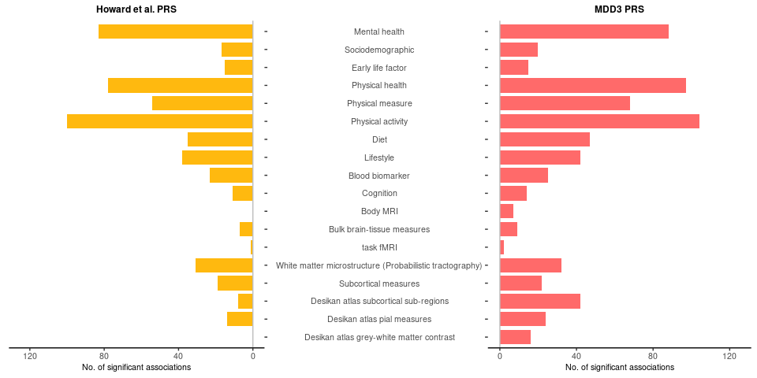
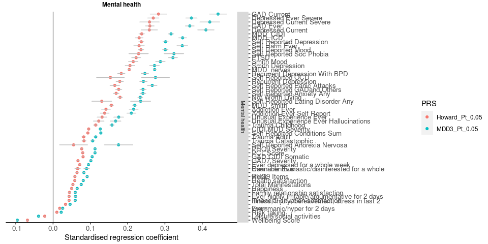
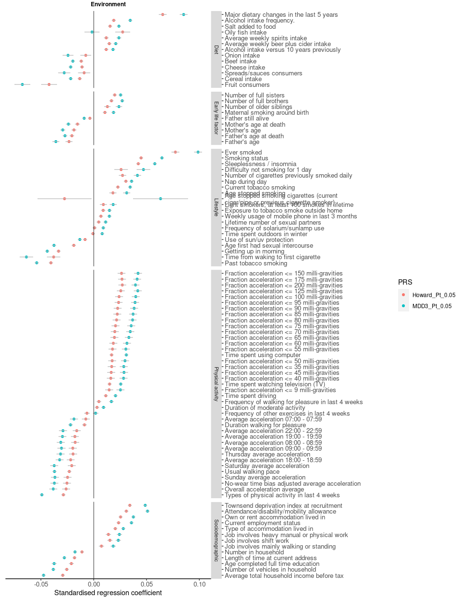
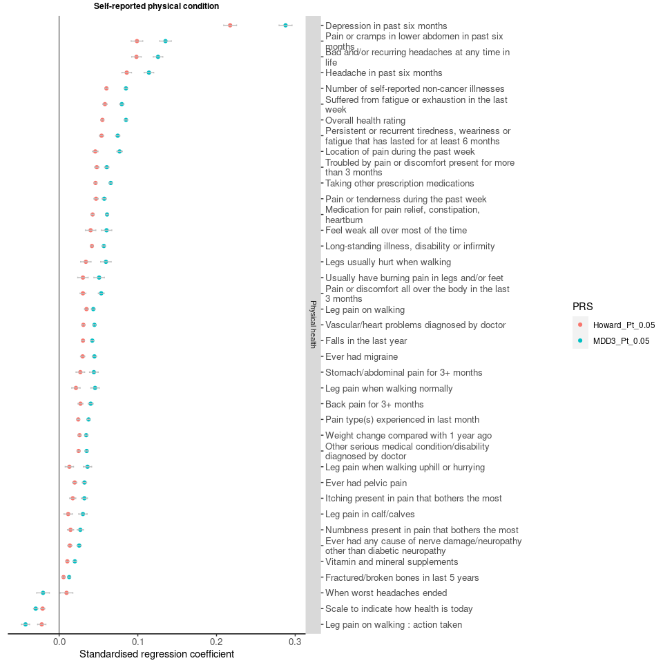
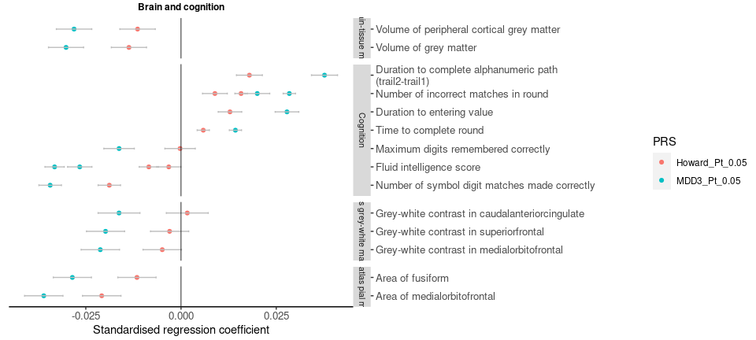
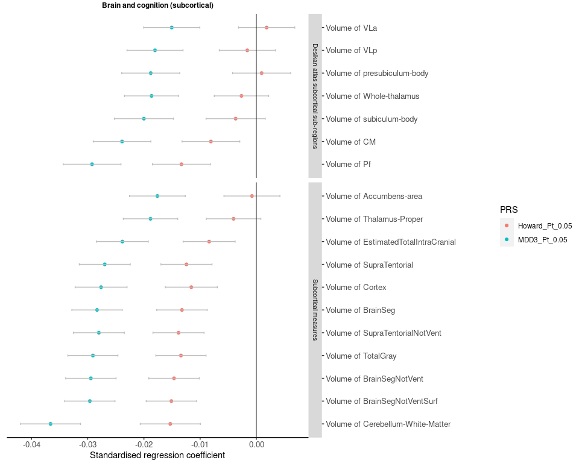

PRS Phewas result
================
X Shen
17 December, 2021

-----

-----

### Summary

At pT=0.05

  - Significant associations with the MDD3 PRS: 674

  - Significant associations with the Howard PRS: 534

<!-- -->

-----

### P-plots

#### MDD3

<!-- -->

#### Howard et al

<!-- -->

-----

### Comparison

Phenotypes are included if:

  - they are significantly associated with MDD3 PRS

and

  - CI for MDD3 PRS and Howard et al PRS do not overlap
    (CI=beta+/-1.5std)

#### Mental health

<!-- -->

#### Environment

<!-- -->

#### Self-reported physical condition

<!-- -->

#### Physical assessment

<!-- -->

#### Brain and cognition

<!-- -->

#### Brain and cognition (subcortical)

<!-- -->
