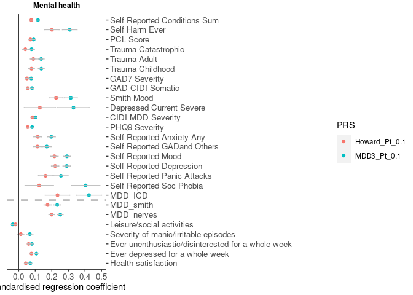
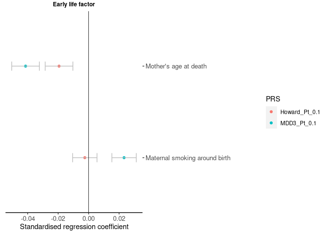
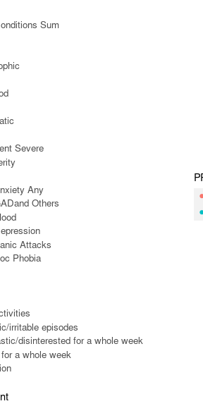
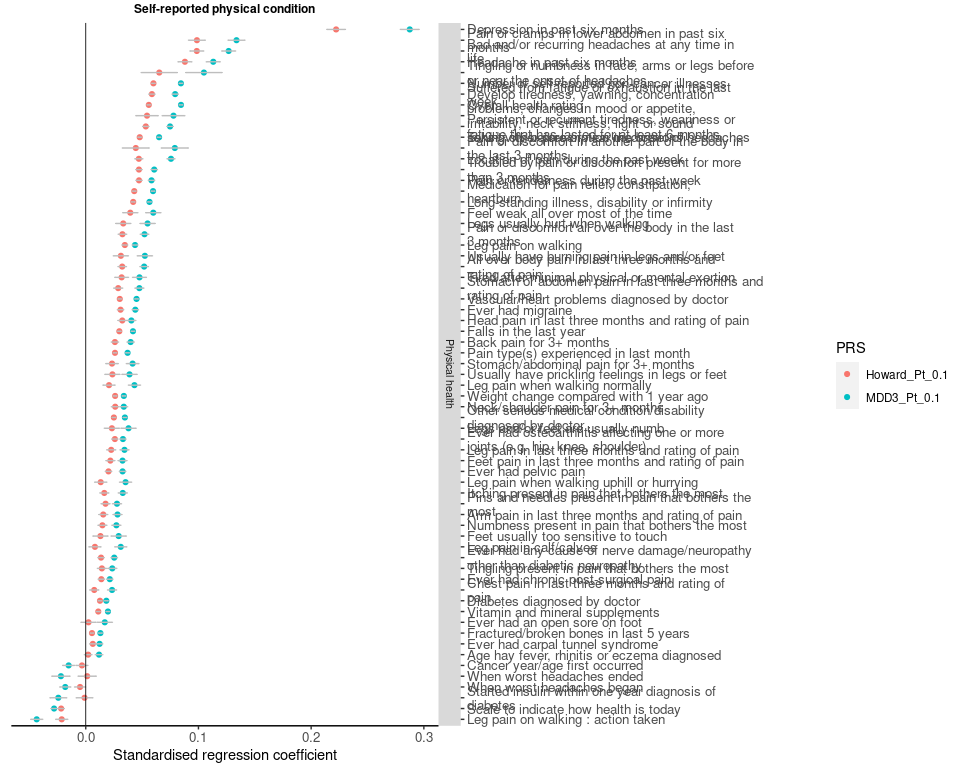
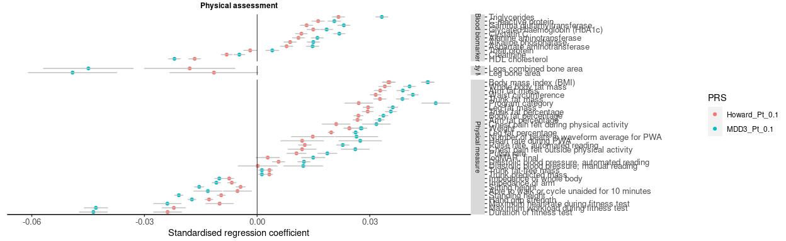
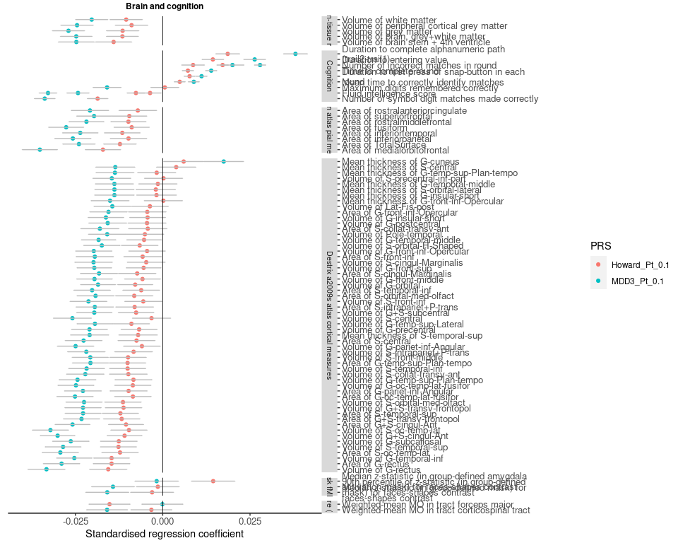

Phewas result
================
X Shen
11 August, 2021

-----

## Load data

Inputs:

``` r
f.dat_dir = '/exports/igmm/eddie/GenScotDepression/shen/ActiveProject/Collab/mdd-meta/results/phewas/phewas_out_Body_MRI.rds'
f.dic_dir = '/exports/igmm/eddie/GenScotDepression/shen/ActiveProject/Collab/mdd-meta/results/phewas/data_dictionary/fields.final.brain_imaging_QC_cov_phenotype.txt'
target.pT = '0.1'
f.category = '/exports/igmm/eddie/GenScotDepression/shen/ActiveProject/Collab/mdd-meta/data/phewas_categories.tsv'
```

### Summary

At pT=0.1

  - Significant associations with the MDD3 PRS: 320

  - Significant associations with the Howard PRS:
143

<table class=" lightable-material lightable-striped lightable-hover" style='font-family: "Source Sans Pro", helvetica, sans-serif; margin-left: auto; margin-right: auto;'>

<thead>

<tr>

<th style="text-align:left;">

category

</th>

<th style="text-align:right;">

Howard.Nsig

</th>

<th style="text-align:right;">

MDD3.Nsig

</th>

<th style="text-align:right;">

Npheno

</th>

</tr>

</thead>

<tbody>

<tr>

<td style="text-align:left;">

Mental health

</td>

<td style="text-align:right;">

45

</td>

<td style="text-align:right;">

50

</td>

<td style="text-align:right;">

90

</td>

</tr>

<tr>

<td style="text-align:left;">

Early life factor

</td>

<td style="text-align:right;">

2

</td>

<td style="text-align:right;">

8

</td>

<td style="text-align:right;">

22

</td>

</tr>

<tr>

<td style="text-align:left;">

Physical health

</td>

<td style="text-align:right;">

21

</td>

<td style="text-align:right;">

31

</td>

<td style="text-align:right;">

152

</td>

</tr>

<tr>

<td style="text-align:left;">

Physical activity

</td>

<td style="text-align:right;">

33

</td>

<td style="text-align:right;">

55

</td>

<td style="text-align:right;">

128

</td>

</tr>

<tr>

<td style="text-align:left;">

Physical measure

</td>

<td style="text-align:right;">

13

</td>

<td style="text-align:right;">

26

</td>

<td style="text-align:right;">

134

</td>

</tr>

<tr>

<td style="text-align:left;">

Sociodemographic

</td>

<td style="text-align:right;">

4

</td>

<td style="text-align:right;">

6

</td>

<td style="text-align:right;">

27

</td>

</tr>

<tr>

<td style="text-align:left;">

Diet

</td>

<td style="text-align:right;">

2

</td>

<td style="text-align:right;">

4

</td>

<td style="text-align:right;">

137

</td>

</tr>

<tr>

<td style="text-align:left;">

Lifestyle

</td>

<td style="text-align:right;">

5

</td>

<td style="text-align:right;">

8

</td>

<td style="text-align:right;">

52

</td>

</tr>

<tr>

<td style="text-align:left;">

Cognition

</td>

<td style="text-align:right;">

1

</td>

<td style="text-align:right;">

4

</td>

<td style="text-align:right;">

18

</td>

</tr>

<tr>

<td style="text-align:left;">

Blood biomarker

</td>

<td style="text-align:right;">

0

</td>

<td style="text-align:right;">

6

</td>

<td style="text-align:right;">

30

</td>

</tr>

<tr>

<td style="text-align:left;">

Body MRI

</td>

<td style="text-align:right;">

0

</td>

<td style="text-align:right;">

2

</td>

<td style="text-align:right;">

53

</td>

</tr>

<tr>

<td style="text-align:left;">

Bulk brain-tissue measures

</td>

<td style="text-align:right;">

1

</td>

<td style="text-align:right;">

5

</td>

<td style="text-align:right;">

11

</td>

</tr>

<tr>

<td style="text-align:left;">

task fMRI

</td>

<td style="text-align:right;">

0

</td>

<td style="text-align:right;">

1

</td>

<td style="text-align:right;">

18

</td>

</tr>

<tr>

<td style="text-align:left;">

White matter microstructure (TBSS)

</td>

<td style="text-align:right;">

4

</td>

<td style="text-align:right;">

3

</td>

<td style="text-align:right;">

162

</td>

</tr>

<tr>

<td style="text-align:left;">

White matter microstructure (Probabilistic tractography)

</td>

<td style="text-align:right;">

1

</td>

<td style="text-align:right;">

1

</td>

<td style="text-align:right;">

90

</td>

</tr>

<tr>

<td style="text-align:left;">

Subcortical measures

</td>

<td style="text-align:right;">

3

</td>

<td style="text-align:right;">

20

</td>

<td style="text-align:right;">

68

</td>

</tr>

<tr>

<td style="text-align:left;">

Desikan atlas subcortical sub-regions

</td>

<td style="text-align:right;">

3

</td>

<td style="text-align:right;">

28

</td>

<td style="text-align:right;">

63

</td>

</tr>

<tr>

<td style="text-align:left;">

Desikan atlas cortical measures

</td>

<td style="text-align:right;">

2

</td>

<td style="text-align:right;">

27

</td>

<td style="text-align:right;">

101

</td>

</tr>

<tr>

<td style="text-align:left;">

Desikan atlas pial measures

</td>

<td style="text-align:right;">

2

</td>

<td style="text-align:right;">

18

</td>

<td style="text-align:right;">

66

</td>

</tr>

<tr>

<td style="text-align:left;">

Desikan atlas grey-white matter contrast

</td>

<td style="text-align:right;">

0

</td>

<td style="text-align:right;">

6

</td>

<td style="text-align:right;">

35

</td>

</tr>

<tr>

<td style="text-align:left;">

BA atlas cortical measures

</td>

<td style="text-align:right;">

1

</td>

<td style="text-align:right;">

11

</td>

<td style="text-align:right;">

45

</td>

</tr>

</tbody>

</table>

### P-plots

#### MDD3

<!-- -->

#### Howard et al

<!-- -->

### Comparison

Phenotypes are included if:

  - they are significantly associated with MDD3 PRS

and

  - CI for MDD3 PRS and Howard et al PRS do not overlap (CI=beta+/-std)

#### Mental health

``` r
figs[[1]]
```

    ## Warning: Width not defined. Set with `position_dodge(width = ?)`

<!-- -->

#### Early life factor

``` r
figs[[2]]
```

    ## Warning: Width not defined. Set with `position_dodge(width = ?)`

<!-- -->

#### 

``` r
figs[[1]]
```

    ## Warning: Width not defined. Set with `position_dodge(width = ?)`

<!-- -->

``` r
figs[[1]]
```

    ## Warning: Width not defined. Set with `position_dodge(width = ?)`

<!-- -->

``` r
figs[[1]]
```

    ## Warning: Width not defined. Set with `position_dodge(width = ?)`

<!-- -->

``` r
figs[[1]]
```

    ## Warning: Width not defined. Set with `position_dodge(width = ?)`

<!-- -->
