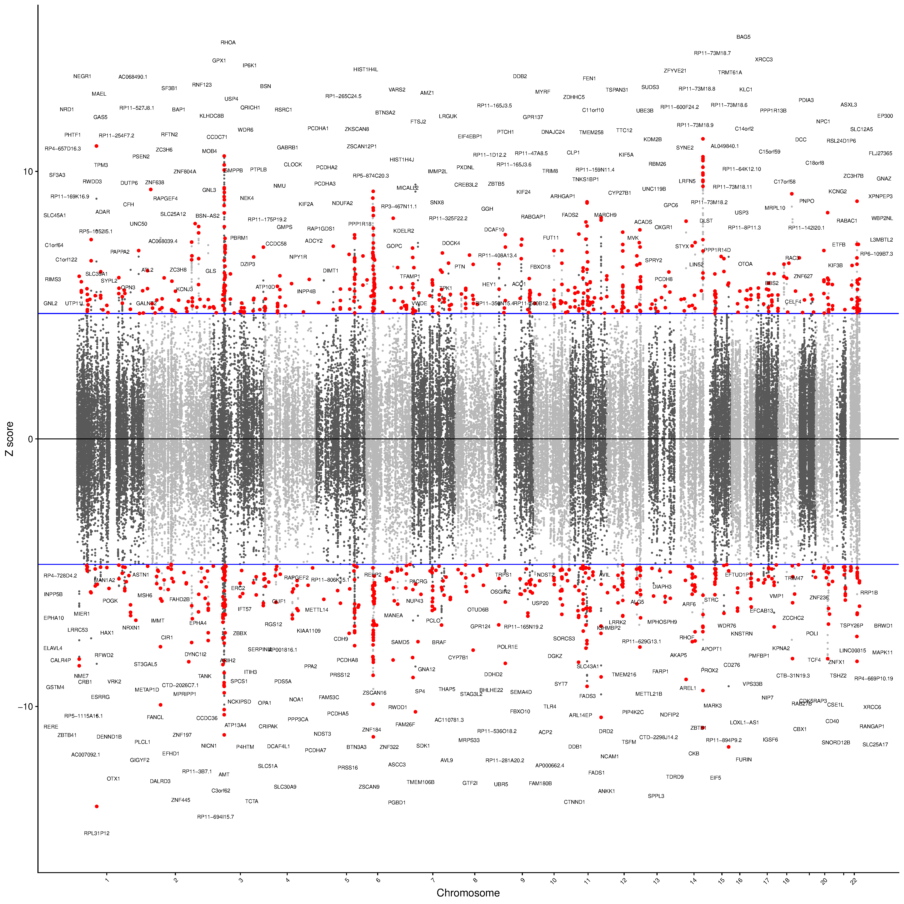

```{r setup, include=FALSE}
knitr::opts_chunk$set(echo = TRUE)

library(knitr)
library(data.table)
```

<style>
p.caption {
  font-size: 1.5em;
}
</style>

```{css, echo=F}
pre code, pre, code {
  white-space: pre !important;
  overflow-x: scroll !important;
  word-break: keep-all !important;
  word-wrap: initial !important;
}
```

***

This documents the Transcriptome-wide Association Study (TWAS) component of the PGC MDD3 study.

***

# Plan

The TWAS field is developing constantly, with new software and reference data being released regularly. My recommendations are broadly consistent with our recent MDD TWAS using Wray et al sumstats. A preprint is [here](https://www.biorxiv.org/content/10.1101/2020.03.24.004903v1), and a more recent version can be sent upon request.

I would suggest the following we perform the TWAS using [FUSION](http://gusevlab.org/projects/fusion/) software and a range of SNP-weight sets derived from brain, HPA and HPT axis tissues and blood. Although Blood is unlikely to be causal it can act as a proxy for other tissues but results should interpreted carefully. For brain tissues we can use PsychENCODE, CommonMind consoritium and GTEx references. Although CommonMind is within PsychENCODE, PsychENCODE SNP-weights were derived in a slightly different way to CommonMind which means I think they are both useful. For HPA and HPT axis tissues we can use GTEx data. And for Blood tissue we can use the Young Finns Study, Netherlands Twin registry and GTEx. Except PsychENCODE, all these SNP-weights were derived by FUSION authors and are avialable on the FUSION website. PsychENCODE SNP-weights are from the [PsychENCODE](http://resource.psychencode.org/) website which I have downloaded and formatted as required already.

I would suggest using a permutation procedure to estimate the study-specific transcriptome-wide significance threshold. This approach is similar to how genome-wide significance was calculated. More information in supplement of my ASD TWAS paper [more info](https://www.biologicalpsychiatryjournal.com/article/S0006-3223(19)31334-4/abstract). It accounts for the correlation between nearby genes within the same SNP-weight set (e.g. PsychENCODE), and it accounts for the correlation between features representing the same gene across SNP-weight sets (e.g. NEGR1 GTEx, NEGR1 PsychENCODE). The alternative is Bonferroni correction which is highly conservative by assuming all features are independent.

An important part of TWAS is distinguishing linkage from pleiotropy as this helps to confirm that gene expression differences will really occur in the depression cases. Colocalisation is the main approach used for this, and is performed within the FUSION software using the [coloc](https://journals.plos.org/plosgenetics/article?id=10.1371/journal.pgen.1004383) package. A limitation of this method is that it assumes a single causal variant underlies the association with both outcomes, which is inconsistent with the idea of TWAS which gains power by considering multiple eQTL effects for each gene. Another useful analysis to confirm pleiotropy, is software called [FOCUS](https://www.nature.com/articles/s41588-019-0367-1). FOCUS performs statistical finemapping of TWAS associations, providing PIP estimates of causality, and 90% credible sets. This analysis helps identify TWAS associations that colocalise with the GWAS phenotype (same causal variant) and helps idenitfy which gene/s are most likely causal within a locus. This is useful as there are often peaks of genes associated in TWAS, and sometime multiple genes colocalise.

People often want to test for gene-set enrichment withint he TWAS results. In the past I have used software that I wrote called [TWAS-GSEA](https://github.com/opain/TWAS-GSEA/blob/master/TWAS-GSEA.V1.2.R), which is similar to MAGMA in that it tests for enrichment using a linear mixed model with a gene-gene correlation matrix to account for the non-independence of nearby genes due to LD. However, a new method has been released called [MESC](https://www.nature.com/articles/s41588-020-0625-2) which I think is better as it distinguishes phenotypic variance mediated by cis-regulated expression, as opposed to linkage or pleitropy. Furthermore, this approach allows estimation of total phenotypic variance mediated by cis-regulated expression which may be of interest.

Lastly, it is nice to compare TWAS results with results from observed gene expression. We can do this using the largest depression gene expression study to date by [Jansen et al](https://pubmed.ncbi.nlm.nih.gov/26008736/) using the netherlands twin registry.

Apart from MESC, I have performed all of the above analyses before and interpreted the results.

***

# Methods 

***

## Estimating Transcriptome-wide Significance

```{r, eval=T, echo=F}
sig_thresh<-1.368572e-06
```

This study uses the same SNP-weights of gene expression as our previous MDD TWAS (Dall'Aglio et al. 2020, Bio. Psych.). We will use the same transcriptome-wide significance threshold as this previous study (p=`r sig_thresh`), estimated using a permutation based procedure, similar to that used to estimate the genome-wide significance threshold (Dudbridge et al. 2008. Genet. Epidemiol.). The code used by Dall'Aglio et al. can be found [here](https://opain.github.io/MDD-TWAS/MDD_TWAS.html#1_estimating_transcriptome-wide_significance_threshold).


***

## TWAS

We will perform a transcriptome-wide association study (TWAS) using the software called FUSION (Gusev et al. 2016, Nat. Genet.). This method integrate genome-wide association study (GWAS) summary statistics with SNP-based predictors (a.k.a. SNP-weights) of gene expression to infer differential gene expression associations with the GWAS phenotype. FUSION also performs colocalisation analysis using the coloc R package.

***

### GWAS sumstat preparation

The GWAS summary statistics were munged using the FOCUS software using default settings, using the effective sample size (Neff_half) as the sample size (N) column.

<details><summary>Show FOCUS munge log file</summary>
```{bash, eval=T, echo=F}
cat ../../results/twas/munged_gwas/daner_pgc_mdd_full_eur_hg19_v3.49.24.05.rp_munged.log
```
</details>

***

### SNP-weights of gene expression

In accordance with Dall'Aglio et al., we included SNP-weights of gene expression derived from tissues implicated in the aetiology of MDD, including brain tissues, HPA-axis tissues and HPT-axis tissues. In addition, we included blood based SNP-weights to act as a proxy for disease relvent tissues as sample sizes for blood expression are typically larger and cis-eQTL are moderately correlated between tissues (GTEx Consortium, 2017, Nature). SNP weights were downloaded via the TWAS FUSION website (http://gusevlab.org/projects/fusion/#reference-functional-data) after selection based on previous literature.

The weights pertained to the following 5 RNA reference samples: NTR (Netherlands Twin Register) and YFS (Young Finns Study), both of which provide information on blood tissue gene expression; CMC (CommonMind Consortium) and PsychENCODE Consortium, both of which assessed the DLPFC; and the GTEx Consortium, a state-of-the-art study in which expression in multiple brain and peripheral tissues was measured, although in a limited number of individuals (determining fewer heritable genes). The SNP-weights obtained from a given sample and tissue (e.g., GTEx thyroid, NTR peripheral blood) are called SNP-weight sets. Each gene within a given SNP-weight set is a feature, i.e., a gene that was examined within a given tissue and sample (e.g., NEGR1 GTEx thyroid).

<details><summary>Show a list of SNP-weight panels in the TWAS</summary>
```{r, eval=T, echo=F}
panels<-read.table('../../results/twas/list_of_weights.txt')
names(panels)<-'Panel'
kable(panels, row.names = FALSE, caption='SNP-weight panels used in MDD TWAS')
```
</details>

***

### LD reference

The 1000 Genomes Phase 3 European LD reference with MAF >1% (N = 503) was used as an LD reference. We did not use the FUSION provided LD reference (also 1KG Phase 3) as it is restricted to HapMap3 variants, and although GTEx, CMC, NTR, YFS SNP-weights are restricted to HapMap3 variants, the PsychENCODE SNP-weights are not.

***

### Conditional analysis

To determine whether 

***

## Additional analyses

***

### TWAS-based finemapping (FOCUS)

***

### Gene-set enrichment analysis

***

#### TWAS-GSEA

***

#### MESC

***

# Results

***

## TWAS

```{R, eval=T, echo=F}
process_twas_log<-readLines('../../logs/process_twas_')
res_twas<-fread('../../results/twas/twas_results/PGC_MDD3_twas_AllTissues_GW_TWSig.txt')
res_twas_nomhc<-res_twas[!(res_twas$CHR == 6 & res_twas$P0 > 26e6 & res_twas$P1 < 34e6),]
```

`r process_twas_log[grepl('features were',process_twas_log)]`.

<details><summary>Show number of features for each panel</summary>
```{R, echo=F, eval=T}
res<-read.csv('../../results/twas/twas_results/PGC_MDD3_twas_panel_N.csv')
kable(res, row.names = FALSE, caption='Number of features for each panel', digits = 32)
```

</details>

</br>

TWAS identified `r nrow(res_twas)` significant features, from `r nrow(res_twas[!duplicated(res_twas$ID),])` unique genes, which were differentially expressed (p < `r sig_thresh`) in MDD. The most significant feature was `r res_twas$ID[res_twas$TWAS.P == min(res_twas$TWAS.P)]` (`r res_twas$PANEL[res_twas$TWAS.P == min(res_twas$TWAS.P)]`) (z = `r res_twas$TWAS.Z[res_twas$TWAS.P == min(res_twas$TWAS.P)]`, p = `r res_twas$TWAS.P[res_twas$TWAS.P == min(res_twas$TWAS.P)]`).

After excluding the MHC region (Chr. 6, 26-34Mb), TWAS identified `r nrow(res_twas_nomhc)` significant features, from `r nrow(res_twas_nomhc[!duplicated(res_twas_nomhc$ID),])` unique genes, which were differentially expressed (p < `r sig_thresh`) in MDD.

<details><summary>Show transcriptome-wide significant table</summary>
```{R, echo=F, eval=T}
res_twas<-res_twas[order(res_twas$CHR, res_twas$P0),]
kable(res_twas, row.names = FALSE, caption='Transcriptome-wide significant associations with Major Depression', digits = 32)
```

</details>

<details><summary>Show Manhattan plots</summary>

```{bash, eval=T, echo=F}
cp ../../results/twas/twas_results/PGC_MDD3_twas_AllTissues_GW_Manhattan.png ../../docs/figures/
```

<center>



\center

</details>

***

## Colocalisation

```{R, echo=F, eval=T}
res_coloc<-read.csv('../../results/twas/twas_results/PGC_MDD3_TWAS_colocalisation.csv')
res_coloc_nomhc<-res_coloc[(res_coloc$ID %in% res_twas_nomhc$ID),]
```

Of the `r nrow(res_coloc)` (`r nrow(res_coloc[!duplicated(res_coloc$ID),])`) transcriptome-wide significant features, `r sum(res_coloc$Colocalised == 'Yes')` colocalised (`r length(unique(res_coloc$ID[res_coloc$Colocalised == 'Yes']))` unique in at least one SNP-weight set).

After excluding the MHC region, Of the `r nrow(res_coloc_nomhc)` (`r nrow(res_coloc_nomhc[!duplicated(res_coloc_nomhc$ID),])`) transcriptome-wide significant features, `r sum(res_coloc_nomhc$Colocalised == 'Yes')` colocalised (`r length(unique(res_coloc_nomhc$ID[res_coloc_nomhc$Colocalised == 'Yes']))` unique in at least one SNP-weight set).

<details><summary>Show colocalisation table</summary>
```{R, echo=F, eval=T}
kable(res_coloc, row.names = FALSE, caption='MDD TWAS Colocalisation Results', digits = 32)
```

</details>

***

## Conditional analysis

```{R, echo=F, eval=T}
process_conditional_log<-readLines('../../logs/process_conditional_')

res_cond_full<-read.csv('../../results/twas/conditional/PGC_MDD3_TWAS_Conditional_table_full.csv')
names(res_cond_full)<-c("CHR","BP","Jointly sign. Features (SNP-weight set)","Marginally sign. Features (SNP-weight set)","Top TWAS p-value","Top GWAS p-value","Variance Explained")

res_cond_brief<-read.csv('../../results/twas/conditional/PGC_MDD3_TWAS_Conditional_table_brief.csv')
names(res_cond_brief)<-c("CHR","BP","Jointly sign. Features (SNP-weight set)","N Marginal","Top TWAS p-value","Top GWAS p-value","Variance Explained")
```

We observed that multiple overlapping significant features resided within the same locus (defined 0.5Mb window), for a total of `r nrow(res_cond_full)` genomic regions. Of the `r nrow(res_twas)` significant features, conditional analysis identified `r gsub(' .*','',process_conditional_log[grepl('independent associations$',process_conditional_log)])`.

<details><summary>Show full conditional analysis table</summary>
```{R, echo=F, eval=T}
kable(res_cond_full, row.names = FALSE, caption='MDD TWAS Full Conditional Results', digits = 32)
```

</details>

<details><summary>Show brief conditional analysis table</summary>
```{R, echo=F, eval=T}
kable(res_cond_brief, row.names = FALSE, caption='MDD TWAS Brief Conditional Results', digits = 32)
```

</details>

</br>

Of the `r gsub(' .*','',process_conditional_log[grepl('independent associations$',process_conditional_log)])` independent associations, `r gsub('\\.','',gsub(' .*','',process_conditional_log[grepl('significant snp$',process_conditional_log)]))` were outside a genome-wide significant locus in the GWAS (>500 kb), `r gsub('\\.','',gsub(' .*','',process_conditional_log[grepl('with predicted expression <0.1$',process_conditional_log)]))` were within a genome-wide significant locus in the GWAS but were uncorrelated with the lead variant (R2 < 0.1). In total, `r gsub('\\.','',gsub(' .*','',process_conditional_log[grepl('independent novel associations$',process_conditional_log)]))` independent associations can be considered novel relative to the the genome-wide significant variation highlighted by the GWAS (based on >500 kb distance and R2 < .1).

Of the `r gsub('\\.','',gsub(' .*','',process_conditional_log[grepl('novel associations$',process_conditional_log)][2]))` novel features, `r gsub('\\.','',gsub(' .*','',process_conditional_log[grepl('novel associations colocalise$',process_conditional_log)]))` colocalised, and `r gsub('\\.','',gsub(' .*','',process_conditional_log[grepl('colocalise for joint genes$',process_conditional_log)]))` independent novel features colocalised.

<details><summary>Show novelty over GWAS table</summary>
```{R, echo=F, eval=T}
res<-read.csv('../../results/twas/conditional/PGC_MDD3_TWAS_Conditional_table_novelty.csv')
res<-res[,c('CHR','BP','ID','PANEL_clean','WGT','TWAS.P','BEST.GWAS.P','TOP.SNP.COR','Type','Novel')]
names(res)<-c('CHR','BP','ID','PANEL','WGT','TWAS.P','BEST.GWAS.P','TOP.SNP.COR','TYPE','NOVEL')
res$BEST.GWAS.P<-format(res$BEST.GWAS.P, scientific = TRUE, digits = 3)
library(knitr)
kable(res, row.names = FALSE, caption='MDD TWAS Results Novelty compared to GWAS', digits = 32)
```

</details>

***

## FOCUS

```{R, echo=F, eval=T}
res_focus<-read.csv('../../results/twas/focus/p_1e-4/PGC_MDD3_TWAS.TWSig.FOCUS.results.csv')
res_focus_nomhc<-res_focus[(res_focus$ID %in% res_twas_nomhc$ID),]
```

FOCUS identified `r sum(res_focus$FOCUS_pip > 0.5, na.rm=T)` features with a PIP > 0.5 (`r length(unique(res_focus$ID[which(res_focus$FOCUS_pip > 0.5)]))` unique genes). After excluding the MHC region, FOCUS identified `r sum(res_focus_nomhc$FOCUS_pip > 0.5, na.rm=T)` features with a PIP > 0.5 (`r length(unique(res_focus_nomhc$ID[which(res_focus_nomhc$FOCUS_pip > 0.5)]))` unique genes).

<details><summary>Show FOCUS results for TW-sig features</summary>
```{R, echo=F, eval=T}
kable(res_focus, row.names = FALSE, caption='MDD TWAS Results with FOCUS', digits = 32)
```

</details>

***

## High-confidence associations

```{R, eval=T, echo=F}
high_conf_res<-fread('../../results/twas/PGC3_MDD_TWAS_HighConf_results.csv')
```

After filtering associations by TWAS.P < 3.685926e-08, colocalisation PP4 > 0.8, and PIP<0.5, `r nrow(high_conf_res)` associations are identified as high-confidence.

<details><summary>Show high-confidence associations</summary>
```{R, echo=F, eval=T}
high_conf_res_brief<-high_conf_res[,c('Location','SNP-weight Set','ID','TWAS.Z','TWAS.P','Novel','COLOC.PP4','FOCUS_pip')]
names(high_conf_res_brief)<-c('Location','Panel','ID','TWAS.Z','TWAS.P',"Novel (GWAS)", 'Colocalisation PP4','FOCUS PIP')

high_conf_res_brief$TWAS.Z<-round(high_conf_res_brief$TWAS.Z,3)

kable(high_conf_res_brief, row.names = FALSE, caption='MDD TWAS Results with FOCUS', digits = 32)
```

</details>

***

## MESC

```{R, echo=F, eval=T}
res_mesc<-fread('../../results/twas/mesc/PGC_MDD3_TWAS.MESC.all.h2med', data.table = F)

# Convert heritability estimates to the liability scale assuming population prevelance of 15%
h2l_R2 <- function(k, r2, p) {
  # K baseline disease risk
  # r2 from a linear regression model attributable to genomic profile risk score
  # P proportion of sample that are cases
  # calculates proportion of variance explained on the liability scale
  #from ABC at http://www.complextraitgenomics.com/software/
  #Lee SH, Goddard ME, Wray NR, Visscher PM. (2012) A better coefficient of determination for genetic profile analysis. Genet Epidemiol. 2012 Apr;36(3):214-24.
  x= qnorm(1-k)
  z= dnorm(x)
  i=z/k
  C= k*(1-k)*k*(1-k)/(z^2*p*(1-p))
  theta= i*((p-k)/(1-k))*(i*((p-k)/(1-k))-x)
  h2l_R2 = C*r2 / (1 + C*theta*r2)
}

se_h2l_R2 <- function(k,h2,se, p) {
  # K baseline disease risk
  # r2 from a linear regression model attributable to genomic profile risk score
  # P proportion of sample that are cases
  # calculates proportion of variance explained on the liability scale
  #from ABC at http://www.complextraitgenomics.com/software/
  #Lee SH, Goddard ME, Wray NR, Visscher PM. (2012) A better coefficient of determination for genetic profile analysis. Genet Epidemiol. 2012 Apr;36(3):214-24.

  #SE on the liability (From a Taylor series expansion)
  #var(h2l_r2) = [d(h2l_r2)/d(R2v)]^2*var(R2v) with d being calculus differentiation
  x= qnorm(1-k)
  z= dnorm(x)
  i=z/k
  C= k*(1-k)*k*(1-k)/(z^2*p*(1-p))
  theta= i*((p-k)/(1-k))*(i*((p-k)/(1-k))-x)
  se_h2l_R2 = C*(1-h2*theta)*se
}

# We use the Neff as N, so we should specify the sampling prevelance as 0.5.
res_mesc$Estimate_liab<-h2l_R2(k=0.15, r2=res_mesc$Estimate, p=0.5)
res_mesc$`SE(Estimate_liab)`<-se_h2l_R2(k=0.15, h2=res_mesc$Estimate, se=res_mesc$`SE(Estimate)`, p=0.5)

# Calculate heritability p-value using one-side test
res_mesc$`P(Estimate)`<-pnorm(-abs(res_mesc$Estimate/res_mesc$`SE(Estimate)`))
res_mesc$`P(Estimate_liab)`<-pnorm(-abs(res_mesc$Estimate_liab/res_mesc$`SE(Estimate_liab)`))
res_mesc$`P(Estimate_over_h2)`<-pnorm(-abs(res_mesc$Estimate_over_h2/res_mesc$`SE(Estimate_over_h2)`))

res_mesc<-res_mesc[,c("Quantity","Estimate","SE(Estimate)","P(Estimate)","Estimate_liab","SE(Estimate_liab)","P(Estimate_liab)","Estimate_over_h2","SE(Estimate_over_h2)","P(Estimate_over_h2)" )]
names(res_mesc)<-c("Quantity","Estimate","Estimate_SE","Estimate_P","Estimate_liab","Estimate_liab_SE","Estimate_liab_P","Estimate_over_h2","Estimate_over_h2_SE","Estimate_over_h2_P")

res_mesc[,!grepl('Quantity|_P', names(res_mesc))]<-round(res_mesc[,!grepl('Quantity|_P', names(res_mesc))], 3)
res_mesc$Estimate_P<-format(res_mesc$Estimate_P, scientific = TRUE, digits = 3)
res_mesc$Estimate_liab_P<-format(res_mesc$Estimate_liab_P, scientific = TRUE, digits = 3)
res_mesc$Estimate_over_h2_P<-format(res_mesc$Estimate_over_h2_P, scientific = TRUE, digits = 3)

```

MESC estimated the proportion of SNP-based heritability mediated by cis-regulated gene expression as `r res_mesc$Estimate_over_h2[res_mesc$Quantity == 'h2med']`(SE=`r res_mesc$Estimate_over_h2_SE[res_mesc$Quantity == 'h2med']`, p=`r res_mesc$Estimate_over_h2_P[res_mesc$Quantity == 'h2med']`). The total phenotypic variance mediated by cis-regulated expression is `r res_mesc$Estimate[res_mesc$Quantity == 'h2med']`(SE=`r res_mesc$Estimate_SE[res_mesc$Quantity == 'h2med']`, p=`r res_mesc$Estimate_P[res_mesc$Quantity == 'h2med']`).

<details><summary>Show MESC results </summary>

```{r, eval=T, echo=F}
kable(res_mesc, row.names = FALSE, caption='MESC results', digits = 32)
```

</details>

</br>

```{R, echo=F, eval=T}
res_mesc_set<-fread('../../results/twas/mesc/PGC_MDD3_TWAS.MESC.sets.categories.h2med', data.table = F)

res_mesc_set<-res_mesc_set[,c("Gene_category", "Num_genes", "h2med_enrichment", "SE(h2med_enrichment)", "h2med_enrichment_pvalue")]

res_mesc_set$h2med_enrichment_pvalue_fdr<-p.adjust(res_mesc_set$h2med_enrichment_pvalue, method='fdr')

res_mesc_set<-res_mesc_set[order(res_mesc_set$h2med_enrichment_pvalue),]
res_mesc_set_nom<-res_mesc_set[res_mesc_set$h2med_enrichment_pvalue < 0.05,]
res_mesc_set_sig<-res_mesc_set[res_mesc_set$h2med_enrichment_pvalue_fdr < 0.05,]
res_mesc_set_nom_pos<-res_mesc_set_nom[res_mesc_set_nom$h2med_enrichment > 0,]
res_mesc_set_sig_pos<-res_mesc_set_sig[res_mesc_set_sig$h2med_enrichment > 0,]

res_mesc_set_nom_pos[,!grepl('Gene_category|_pvalue$', names(res_mesc_set_nom_pos))]<-round(res_mesc_set_nom_pos[,!grepl('Gene_category|_pvalue$', names(res_mesc_set_nom_pos))], 3)
res_mesc_set_nom_pos$h2med_enrichment_pvalue<-format(res_mesc_set_nom_pos$h2med_enrichment_pvalue, scientific = TRUE, digits = 3)
names(res_mesc_set_nom_pos)<-c('Gene_category','N_genes','Enrichment','SE','P','P.FDR')

res_mesc_set_sig_pos[,!grepl('Gene_category|_pvalue$', names(res_mesc_set_sig_pos))]<-round(res_mesc_set_sig_pos[,!grepl('Gene_category|_pvalue$', names(res_mesc_set_sig_pos))], 3)
res_mesc_set_sig_pos$h2med_enrichment_pvalue<-format(res_mesc_set_sig_pos$h2med_enrichment_pvalue, scientific = TRUE, digits = 3)
names(res_mesc_set_sig_pos)<-c('Gene_category','N_genes','Enrichment','SE','P','P.FDR')

```

MESC identified `r nrow(res_mesc_set_sig_pos)` significantly enriched sets after FDR correction for multiple testing.

<details><summary>Show significant MESC gene-set enrichment results </summary>

```{r, eval=T, echo=F}
kable(res_mesc_set_sig_pos, row.names=F , caption='MESC results', digits = 32)
```

</details>

</br>

MESC identified `r nrow(res_mesc_set_sig_pos)` nominally enriched sets (uncorrected P<0.05). There are many nominally significant gene sets relating to neurons and synapses.

<details><summary>Show nominal MESC gene-set enrichment results </summary>

```{r, eval=T, echo=F}
kable(res_mesc_set_nom_pos, row.names = FALSE, caption='MESC results', digits = 32)
```

</details>
